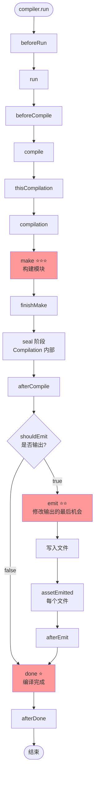

# Plugin 插件系统原理详解

> 基于 webpack 源码的深度剖析

---

## 📋 目录

1. [Plugin 的作用](#一plugin-的作用)
2. [涉及的核心文件](#二涉及的核心文件)
3. [Tapable 钩子系统原理](#三tapable-钩子系统原理)
4. [Plugin 注册与执行机制](#四plugin-注册与执行机制)
5. [Compiler 钩子详解](#五compiler-钩子详解)
6. [Compilation 钩子详解](#六compilation-钩子详解)
7. [实战案例](#七实战案例)
8. [源码运行原理](#八源码运行原理)

---

## 一、Plugin 的作用

### 1.1 什么是 Plugin？⭐⭐⭐

**Plugin 是 webpack 的灵魂！**

```javascript
// Plugin 的本质
Plugin = 一个具有 apply 方法的类或对象

// 核心能力
Plugin 可以：
1. 监听 webpack 编译流程中的各个事件（钩子）
2. 在特定时机执行自定义逻辑
3. 修改编译结果
4. 添加新的功能
```

### 1.2 为什么需要 Plugin？

**问题**：webpack 核心只做两件事
1. 构建依赖图（Make 阶段）
2. 生成输出文件（Seal + Emit 阶段）

**解决**：通过 Plugin 扩展功能
- 代码压缩（TerserPlugin）
- 生成 HTML（HtmlWebpackPlugin）
- 提取 CSS（MiniCssExtractPlugin）
- 代码分割（SplitChunksPlugin）
- 环境变量（DefinePlugin）
- ... 无限可能

### 1.3 Plugin vs Loader

| 对比项 | Plugin | Loader |
|--------|--------|--------|
| **作用范围** | 整个编译流程 | 单个模块的转换 |
| **工作时机** | 任何编译阶段 | 模块构建阶段 |
| **能力** | 可以做任何事情 | 只能转换模块内容 |
| **注册方式** | `plugins: [new Plugin()]` | `module.rules` |
| **接口** | `apply(compiler)` | `function(source)` |

**形象比喻**：
- **Loader**：装配线上的工人（处理原材料）
- **Plugin**：工厂的管理者（控制整个流程）

---

## 二、涉及的核心文件

### 2.1 文件结构

```
webpack/
├── lib/
│   ├── Compiler.js              ⭐⭐⭐ 编译器（定义全局钩子）
│   ├── Compilation.js           ⭐⭐⭐ 编译实例（定义编译钩子）
│   ├── webpack.js               ⭐⭐ webpack 入口（注册插件）
│   │
│   ├── WebpackOptionsApply.js   ⭐⭐ 应用内置插件
│   ├── EntryPlugin.js           入口插件
│   ├── RuntimePlugin.js         运行时插件
│   │
│   ├── optimize/                优化插件目录
│   │   ├── SplitChunksPlugin.js
│   │   ├── ModuleConcatenationPlugin.js
│   │   └── ...
│   │
│   ├── javascript/              JS 相关插件
│   │   ├── JavascriptModulesPlugin.js
│   │   └── ...
│   │
│   └── ...
│
└── node_modules/
    └── tapable/                 ⭐⭐⭐ 钩子系统核心库
        ├── Hook.js
        ├── SyncHook.js
        ├── AsyncSeriesHook.js
        └── ...
```

### 2.2 核心文件详解

#### Compiler.js（全局编译器）

```javascript
/**
 * 位置: lib/Compiler.js
 *
 * 【作用】
 * - webpack 的"大脑"
 * - 控制整个编译生命周期
 * - 定义 30+ 个全局钩子
 *
 * 【关键属性】
 * - hooks: 钩子对象（30+ 个钩子）
 * - options: webpack 配置
 * - inputFileSystem: 输入文件系统
 * - outputFileSystem: 输出文件系统
 * - cache: 缓存系统
 *
 * 【关键方法】
 * - run(): 单次编译
 * - watch(): 监听模式
 * - compile(): 创建 Compilation
 * - emitAssets(): 输出文件
 */
```

#### Compilation.js（编译实例）

```javascript
/**
 * 位置: lib/Compilation.js
 *
 * 【作用】
 * - 单次编译的管理者
 * - 包含模块、Chunk、资源
 * - 定义 50+ 个编译钩子
 *
 * 【关键属性】
 * - modules: 所有模块
 * - chunks: 所有 Chunk
 * - assets: 输出文件
 * - moduleGraph: 模块依赖图
 * - chunkGraph: Chunk 依赖图
 *
 * 【关键方法】
 * - addEntry(): 添加入口
 * - addModule(): 添加模块
 * - seal(): 封装阶段
 * - createChunkAssets(): 生成文件
 */
```

#### webpack.js（入口文件）

```javascript
/**
 * 位置: lib/webpack.js
 *
 * 【作用】
 * - webpack 的入口
 * - 创建 Compiler 实例
 * - 注册用户插件
 * - 应用内置插件
 *
 * 【核心流程】
 * createCompiler(options)
 *   1. 规范化配置
 *   2. 创建 Compiler
 *   3. 应用 Node 环境插件
 *   4. 注册用户插件 ⭐
 *   5. 应用默认配置
 *   6. 触发环境钩子
 *   7. 应用内置插件 ⭐
 *   8. 触发初始化钩子
 */
```

---

## 三、Tapable 钩子系统原理

### 3.1 Tapable 是什么？⭐⭐⭐

**Tapable** 是 webpack 的钩子系统核心库（独立 npm 包）

```javascript
const { SyncHook } = require('tapable');

// 1. 创建钩子
const hook = new SyncHook(['arg1', 'arg2']);

// 2. 注册监听器（插件）
hook.tap('Plugin1', (arg1, arg2) => {
  console.log('Plugin1:', arg1, arg2);
});

hook.tap('Plugin2', (arg1, arg2) => {
  console.log('Plugin2:', arg1, arg2);
});

// 3. 触发钩子（webpack 内部）
hook.call('value1', 'value2');

// 输出:
// Plugin1: value1 value2
// Plugin2: value1 value2
```

### 3.2 钩子类型详解

#### 同步钩子（Sync）

```javascript
// ===== SyncHook: 基本同步钩子 =====
/**
 * 【特点】
 * - 按注册顺序依次调用
 * - 不能中断
 * - 不接收返回值
 */
const hook = new SyncHook(['param']);

hook.tap('A', (param) => { console.log('A'); });
hook.tap('B', (param) => { console.log('B'); });

hook.call('test');
// 输出: A B

// ===== SyncBailHook: 熔断钩子 =====
/**
 * 【特点】
 * - 返回非 undefined 时停止
 * - 用于条件判断
 */
const bailHook = new SyncBailHook(['param']);

bailHook.tap('Check1', (param) => {
  if (param === 'stop') return true;  // ⭐ 返回值，停止
});

bailHook.tap('Check2', (param) => {
  console.log('Check2');  // 不会执行
});

bailHook.call('stop');  // 只执行 Check1

// ===== SyncWaterfallHook: 瀑布钩子 =====
/**
 * 【特点】
 * - 上一个的返回值传给下一个
 * - 用于值的传递和转换
 */
const waterfallHook = new SyncWaterfallHook(['value']);

waterfallHook.tap('Transform1', (value) => {
  return value + 1;  // 1 → 2
});

waterfallHook.tap('Transform2', (value) => {
  return value * 2;  // 2 → 4
});

const result = waterfallHook.call(1);
console.log(result);  // 4

// ===== SyncLoopHook: 循环钩子 =====
/**
 * 【特点】
 * - 返回非 undefined 时重新开始
 * - 直到所有返回 undefined
 */
const loopHook = new SyncLoopHook(['value']);

let count = 0;
loopHook.tap('Loop', (value) => {
  count++;
  if (count < 3) return true;  // 继续循环
  // 返回 undefined，停止
});

loopHook.call();  // 执行 3 次
```

#### 异步钩子（Async）

```javascript
// ===== AsyncSeriesHook: 异步串行钩子 =====
/**
 * 【特点】
 * - 依次异步调用
 * - 等待每个完成
 */
const asyncSeriesHook = new AsyncSeriesHook(['param']);

asyncSeriesHook.tapAsync('Async1', (param, callback) => {
  setTimeout(() => {
    console.log('Async1 done');
    callback();  // ⭐ 必须调用 callback
  }, 100);
});

asyncSeriesHook.tapAsync('Async2', (param, callback) => {
  console.log('Async2 done');
  callback();
});

asyncSeriesHook.callAsync('test', (err) => {
  console.log('All done');
});

// 输出顺序:
// Async1 done (100ms 后)
// Async2 done
// All done

// ===== Promise 方式 =====
asyncSeriesHook.tapPromise('Async3', async (param) => {
  await delay(100);
  console.log('Async3 done');
});

await asyncSeriesHook.promise('test');

// ===== AsyncParallelHook: 异步并行钩子 =====
/**
 * 【特点】
 * - 同时触发所有
 * - 等待全部完成
 */
const asyncParallelHook = new AsyncParallelHook(['param']);

asyncParallelHook.tapAsync('Parallel1', (param, callback) => {
  setTimeout(() => {
    console.log('Parallel1');
    callback();
  }, 200);
});

asyncParallelHook.tapAsync('Parallel2', (param, callback) => {
  setTimeout(() => {
    console.log('Parallel2');
    callback();
  }, 100);
});

asyncParallelHook.callAsync('test', () => {
  console.log('All done');
});

// 输出顺序（并行执行）:
// Parallel2 (100ms 后)
// Parallel1 (200ms 后)
// All done
```

### 3.3 钩子类型总结

| 钩子类型 | 执行方式 | 是否等待 | 返回值处理 | 使用场景 |
|---------|---------|---------|-----------|---------|
| **SyncHook** | 同步串行 | N/A | 忽略 | 简单通知 |
| **SyncBailHook** | 同步串行 | N/A | 中断 | 条件判断 |
| **SyncWaterfallHook** | 同步串行 | N/A | 传递 | 值转换 |
| **SyncLoopHook** | 同步循环 | N/A | 循环 | 重复执行 |
| **AsyncSeriesHook** | 异步串行 | 是 | 忽略 | 异步任务 |
| **AsyncSeriesBailHook** | 异步串行 | 是 | 中断 | 异步条件 |
| **AsyncSeriesWaterfallHook** | 异步串行 | 是 | 传递 | 异步转换 |
| **AsyncParallelHook** | 异步并行 | 是 | 忽略 | 并行任务 |
| **AsyncParallelBailHook** | 异步并行 | 是 | 中断 | 并行条件 |

---

## 四、Plugin 注册与执行机制

### 4.1 Plugin 的标准格式

```javascript
// ===== 方式1: 类形式（推荐）⭐⭐⭐ =====
class MyPlugin {
  // 可选：接收配置参数
  constructor(options = {}) {
    this.options = options;
  }

  // 必须：apply 方法
  apply(compiler) {
    // 在这里注册钩子
    compiler.hooks.make.tapAsync(
      'MyPlugin',  // 插件名称
      (compilation, callback) => {
        // 插件逻辑
        console.log('Make 阶段');
        callback();
      }
    );

    compiler.hooks.emit.tapAsync(
      'MyPlugin',
      (compilation, callback) => {
        // 修改输出资源
        compilation.assets['extra.txt'] = {
          source: () => 'Extra content',
          size: () => 13
        };
        callback();
      }
    );
  }
}

module.exports = MyPlugin;

// 使用
module.exports = {
  plugins: [
    new MyPlugin({ option: 'value' })
  ]
};

// ===== 方式2: 对象形式 =====
const myPlugin = {
  apply(compiler) {
    compiler.hooks.done.tap('MyPlugin', (stats) => {
      console.log('编译完成');
    });
  }
};

module.exports = {
  plugins: [myPlugin]
};

// ===== 方式3: 函数形式 =====
function myPlugin(compiler) {
  compiler.hooks.compile.tap('MyPlugin', (params) => {
    console.log('开始编译');
  });
}

module.exports = {
  plugins: [myPlugin]  // 不需要 new
};
```

### 4.2 Plugin 注册流程 ⭐⭐⭐

```javascript
/**
 * 源码位置: lib/webpack.js: createCompiler()
 */

// 步骤1: 创建 Compiler 实例
const compiler = new Compiler(context, options);

// 步骤2: 应用 Node 环境插件（注入文件系统）
new NodeEnvironmentPlugin().apply(compiler);

// 步骤3: 注册用户插件 ⭐⭐⭐
if (Array.isArray(options.plugins)) {
  for (const plugin of options.plugins) {
    if (typeof plugin === "function") {
      // 函数形式
      plugin.call(compiler, compiler);
    } else if (plugin) {
      // 对象/类形式（标准）
      plugin.apply(compiler);  // ⭐ 这里调用 apply
    }
  }
}

// 步骤4: 应用默认配置
applyWebpackOptionsDefaults(options);

// 步骤5: 触发环境钩子
compiler.hooks.environment.call();
compiler.hooks.afterEnvironment.call();

// 步骤6: 应用内置插件 ⭐⭐⭐
new WebpackOptionsApply().process(options, compiler);
/**
 * WebpackOptionsApply 会根据配置注册内置插件:
 * - EntryPlugin（处理入口）
 * - RuntimePlugin（生成运行时代码）
 * - InferAsyncModulesPlugin（推断异步模块）
 * - SplitChunksPlugin（代码分割）
 * - ... 等等
 */

// 步骤7: 触发初始化完成钩子
compiler.hooks.initialize.call();

// 此时所有插件已注册，compiler 准备就绪
```

### 4.3 Plugin 执行流程

```javascript
// ===== 编译开始 =====
compiler.run((err, stats) => {
  // 编译完成
});

// 内部执行流程：

// 1. beforeRun 钩子
compiler.hooks.beforeRun.callAsync(compiler, err => {
  // 所有注册在 beforeRun 的插件执行

  // 2. run 钩子
  compiler.hooks.run.callAsync(compiler, err => {

    // 3. compile 钩子（创建 Compilation）
    compiler.hooks.compile.call(params);

    const compilation = compiler.newCompilation(params);

    // 4. thisCompilation 钩子
    compiler.hooks.thisCompilation.call(compilation, params);

    // 5. compilation 钩子
    compiler.hooks.compilation.call(compilation, params);

    // 6. make 钩子（构建模块）⭐⭐⭐
    compiler.hooks.make.callAsync(compilation, err => {
      // EntryPlugin 在这里添加入口模块
      // 然后递归构建所有依赖

      // 7. finishMake 钩子
      compiler.hooks.finishMake.callAsync(compilation, err => {

        // 8. seal（封装阶段）
        compilation.seal(err => {
          // 生成 Chunk、优化、生成代码

          // 9. afterCompile 钩子
          compiler.hooks.afterCompile.callAsync(compilation, err => {

            // 10. shouldEmit 钩子（判断是否输出）
            if (compiler.hooks.shouldEmit.call(compilation)) {

              // 11. emit 钩子（输出前）⭐⭐
              compiler.hooks.emit.callAsync(compilation, err => {
                // 可以修改 compilation.assets

                // 12. 写入文件
                compiler.emitAssets(compilation, err => {

                  // 13. assetEmitted 钩子（每个文件）
                  // 14. afterEmit 钩子
                  compiler.hooks.afterEmit.callAsync(compilation, err => {

                    // 15. done 钩子 ⭐
                    compiler.hooks.done.callAsync(stats, err => {
                      // 编译完成
                    });
                  });
                });
              });
            }
          });
        });
      });
    });
  });
});
```

---

## 五、Compiler 钩子详解

### 5.1 完整的钩子列表（30+）

```javascript
/**
 * 源码位置: lib/Compiler.js: constructor()
 */
this.hooks = Object.freeze({
  // ===== 🔵 初始化阶段（3 个）=====

  initialize: new SyncHook([]),
  /**
   * 【时机】初始化完成（所有插件已注册）
   * 【用途】执行初始化后的设置
   */

  // ===== 🔵 运行前（4 个）=====

  beforeRun: new AsyncSeriesHook(["compiler"]),
  /**
   * 【时机】compiler.run() 调用后
   * 【用途】清理缓存、准备资源
   */

  run: new AsyncSeriesHook(["compiler"]),
  /**
   * 【时机】beforeRun 之后
   * 【用途】读取记录、初始化状态
   */

  watchRun: new AsyncSeriesHook(["compiler"]),
  /**
   * 【时机】watch 模式下，检测到文件变化
   * 【用途】记录变化的文件
   */

  normalModuleFactory: new SyncHook(["normalModuleFactory"]),
  /**
   * 【时机】NormalModuleFactory 创建后
   * 【用途】注册工厂的钩子（如修改 loader 规则）
   */

  contextModuleFactory: new SyncHook(["contextModuleFactory"]),
  /**
   * 【时机】ContextModuleFactory 创建后
   * 【用途】处理 require.context
   */

  // ===== 🟢 编译阶段（5 个）⭐⭐⭐ =====

  beforeCompile: new AsyncSeriesHook(["params"]),
  /**
   * 【时机】compile 之前
   * 【用途】修改编译参数
   */

  compile: new SyncHook(["params"]),
  /**
   * 【时机】开始编译
   * 【用途】准备编译资源
   */

  thisCompilation: new SyncHook(["compilation", "params"]),
  /**
   * 【时机】Compilation 创建
   * 【用途】注册 compilation 的钩子（早于 compilation 钩子）
   */

  compilation: new SyncHook(["compilation", "params"]),
  /**
   * 【时机】Compilation 准备完成
   * 【用途】注册 compilation 的钩子（主要使用这个）
   */

  make: new AsyncParallelHook(["compilation"]),
  /**
   * 【时机】开始构建模块 ⭐⭐⭐
   * 【用途】EntryPlugin 在这里添加入口
   * 【重要性】最核心的钩子之一
   */

  // ===== 🟢 构建完成（2 个）=====

  finishMake: new AsyncSeriesHook(["compilation"]),
  /**
   * 【时机】模块构建完成
   * 【用途】构建后的处理
   */

  afterCompile: new AsyncSeriesHook(["compilation"]),
  /**
   * 【时机】编译完成（包括 seal）
   * 【用途】记录统计信息
   */

  // ===== 🟡 输出阶段（4 个）⭐⭐⭐ =====

  shouldEmit: new SyncBailHook(["compilation"]),
  /**
   * 【时机】决定是否输出
   * 【用途】返回 false 跳过输出
   */

  emit: new AsyncSeriesHook(["compilation"]),
  /**
   * 【时机】写入文件前 ⭐⭐⭐
   * 【用途】修改 compilation.assets（最后机会）
   * 【重要性】修改输出的最后时机
   */

  afterEmit: new AsyncSeriesHook(["compilation"]),
  /**
   * 【时机】文件写入后
   * 【用途】上传到 CDN、通知服务器
   */

  assetEmitted: new AsyncSeriesHook(["file", "info"]),
  /**
   * 【时机】每个文件写入后
   * 【用途】记录文件信息
   */

  // ===== 🔴 完成阶段（3 个）⭐ =====

  done: new AsyncSeriesHook(["stats"]),
  /**
   * 【时机】编译完成 ⭐
   * 【用途】输出统计信息、通知构建完成
   * 【重要性】常用于输出结果
   */

  afterDone: new SyncHook(["stats"]),
  /**
   * 【时机】done 之后
   * 【用途】清理工作
   */

  failed: new SyncHook(["error"]),
  /**
   * 【时机】编译失败
   * 【用途】错误处理
   */

  // ===== 🔵 其他钩子（7 个）=====

  invalid: new SyncHook(["filename", "changeTime"]),
  watchClose: new SyncHook([]),
  infrastructureLog: new SyncBailHook(["origin", "type", "args"]),
  environment: new SyncHook([]),
  afterEnvironment: new SyncHook([]),
  afterPlugins: new SyncHook(["compiler"]),
  afterResolvers: new SyncHook(["compiler"]),

  // ... 还有一些实验性钩子
});
```

### 5.2 钩子执行顺序图



---

## 六、Compilation 钩子详解

### 6.1 核心钩子列表（50+）

```javascript
/**
 * 源码位置: lib/Compilation.js: constructor()
 */
this.hooks = Object.freeze({
  // ===== 🔵 构建阶段（模块）=====

  buildModule: new SyncHook(["module"]),
  /**
   * 【时机】开始构建单个模块
   * 【用途】记录构建开始
   */

  succeedModule: new SyncHook(["module"]),
  /**
   * 【时机】模块构建成功
   * 【用途】记录成功信息
   */

  failedModule: new SyncHook(["module", "error"]),
  /**
   * 【时机】模块构建失败
   * 【用途】错误处理
   */

  // ===== 🟢 Seal 阶段（优化）⭐⭐⭐ =====

  seal: new SyncHook([]),
  /**
   * 【时机】开始 seal
   * 【用途】准备优化
   */

  optimizeDependencies: new SyncBailHook(["modules"]),
  /**
   * 【时机】优化依赖
   * 【用途】删除未使用的依赖
   */

  afterOptimizeDependencies: new SyncHook(["modules"]),

  optimize: new SyncHook([]),
  /**
   * 【时机】开始优化
   */

  optimizeModules: new SyncBailHook(["modules"]),
  /**
   * 【时机】优化模块
   * 【用途】Tree Shaking
   */

  afterOptimizeModules: new SyncHook(["modules"]),

  optimizeChunks: new SyncBailHook(["chunks", "chunkGroups"]),
  /**
   * 【时机】优化 Chunk
   * 【用途】Code Splitting
   */

  afterOptimizeChunks: new SyncHook(["chunks", "chunkGroups"]),

  // ===== 🟢 Seal 阶段（资源处理）⭐⭐⭐ =====

  processAssets: new AsyncSeriesHook(["assets"]),
  /**
   * 【时机】处理资源 ⭐⭐⭐
   * 【用途】压缩、优化、修改资源
   * 【重要性】主要的资源处理时机
   * 【阶段】支持多个阶段（见下文）
   */

  afterProcessAssets: new SyncHook(["assets"]),

  // ===== 🟡 输出阶段 =====

  needAdditionalSeal: new SyncBailHook([]),
  /**
   * 【时机】是否需要额外 seal
   * 【用途】返回 true 重新 seal
   */

  afterSeal: new AsyncSeriesHook([]),
  /**
   * 【时机】seal 完成
   */

  // ... 还有 40+ 个钩子
});
```

### 6.2 processAssets 的多阶段 ⭐⭐⭐

```javascript
/**
 * processAssets 是最重要的资源处理钩子
 *
 * 【阶段常量】（按执行顺序）
 */
Compilation.PROCESS_ASSETS_STAGE_ADDITIONAL = -2000;
// 添加额外资源

Compilation.PROCESS_ASSETS_STAGE_PRE_PROCESS = -1000;
// 预处理

Compilation.PROCESS_ASSETS_STAGE_DERIVED = -200;
// 派生资源（如 SourceMap）

Compilation.PROCESS_ASSETS_STAGE_ADDITIONS = -100;
// 添加现有资源

Compilation.PROCESS_ASSETS_STAGE_NONE = 0;
// 默认阶段

Compilation.PROCESS_ASSETS_STAGE_OPTIMIZE = 100;
// 优化资源 ⭐

Compilation.PROCESS_ASSETS_STAGE_OPTIMIZE_COUNT = 200;
// 优化资源数量

Compilation.PROCESS_ASSETS_STAGE_OPTIMIZE_COMPATIBILITY = 300;
// 兼容性优化

Compilation.PROCESS_ASSETS_STAGE_OPTIMIZE_SIZE = 400;
// 优化大小（压缩）⭐⭐

Compilation.PROCESS_ASSETS_STAGE_DEV_TOOLING = 500;
// 开发工具

Compilation.PROCESS_ASSETS_STAGE_OPTIMIZE_INLINE = 700;
// 内联优化

Compilation.PROCESS_ASSETS_STAGE_SUMMARIZE = 1000;
// 总结

Compilation.PROCESS_ASSETS_STAGE_OPTIMIZE_HASH = 2500;
// 优化哈希

Compilation.PROCESS_ASSETS_STAGE_OPTIMIZE_TRANSFER = 3000;
// 优化传输（如 gzip）

Compilation.PROCESS_ASSETS_STAGE_ANALYSE = 4000;
// 分析

Compilation.PROCESS_ASSETS_STAGE_REPORT = 5000;
// 报告

/**
 * 【使用示例】
 */
compilation.hooks.processAssets.tap({
  name: 'MyPlugin',
  stage: Compilation.PROCESS_ASSETS_STAGE_OPTIMIZE_SIZE
}, (assets) => {
  // 在优化大小阶段处理资源
  for (const name in assets) {
    // 压缩代码
  }
});
```

---

## 七、实战案例

### 7.1 案例1: 输出文件列表插件

```javascript
/**
 * 功能：编译完成后输出所有文件的列表
 */
class FileListPlugin {
  apply(compiler) {
    // 监听 emit 钩子（输出前）
    compiler.hooks.emit.tapAsync(
      'FileListPlugin',
      (compilation, callback) => {
        // 获取所有文件名
        const fileList = Object.keys(compilation.assets);

        // 生成内容
        const content = `# 文件列表\n\n${fileList.map(f => `- ${f}`).join('\n')}`;

        // 添加到输出
        compilation.assets['filelist.md'] = {
          source: () => content,
          size: () => content.length
        };

        callback();
      }
    );
  }
}

module.exports = FileListPlugin;
```

### 7.2 案例2: 清理注释插件

```javascript
/**
 * 功能：删除 JS 文件中的注释
 */
class RemoveCommentsPlugin {
  apply(compiler) {
    compiler.hooks.compilation.tap(
      'RemoveCommentsPlugin',
      (compilation) => {
        // 使用 processAssets 钩子
        compilation.hooks.processAssets.tap(
          {
            name: 'RemoveCommentsPlugin',
            stage: compilation.PROCESS_ASSETS_STAGE_OPTIMIZE
          },
          (assets) => {
            // 遍历所有 JS 文件
            for (const name in assets) {
              if (name.endsWith('.js')) {
                // 获取源码
                const source = assets[name].source();

                // 删除注释（简单实现）
                const cleaned = source
                  .replace(/\/\*[\s\S]*?\*\//g, '')  // 多行注释
                  .replace(/\/\/.*/g, '');            // 单行注释

                // 更新资源
                assets[name] = {
                  source: () => cleaned,
                  size: () => cleaned.length
                };
              }
            }
          }
        );
      }
    );
  }
}

module.exports = RemoveCommentsPlugin;
```

### 7.3 案例3: 构建时间统计插件

```javascript
/**
 * 功能：统计编译耗时
 */
class TimingPlugin {
  apply(compiler) {
    let startTime;

    // 监听编译开始
    compiler.hooks.compile.tap('TimingPlugin', () => {
      startTime = Date.now();
      console.log('🚀 编译开始...');
    });

    // 监听编译完成
    compiler.hooks.done.tap('TimingPlugin', (stats) => {
      const duration = Date.now() - startTime;
      console.log(`✅ 编译完成！耗时: ${duration}ms`);

      // 输出统计信息
      const { errors, warnings } = stats.compilation;
      console.log(`   错误: ${errors.length}`);
      console.log(`   警告: ${warnings.length}`);
    });

    // 监听编译失败
    compiler.hooks.failed.tap('TimingPlugin', (error) => {
      console.log(`❌ 编译失败: ${error.message}`);
    });
  }
}

module.exports = TimingPlugin;
```

### 7.4 案例4: 自定义 Banner 插件

```javascript
/**
 * 功能：在每个文件开头添加版权信息
 */
class BannerPlugin {
  constructor(options) {
    this.banner = options.banner;
  }

  apply(compiler) {
    compiler.hooks.compilation.tap(
      'BannerPlugin',
      (compilation) => {
        compilation.hooks.processAssets.tap(
          {
            name: 'BannerPlugin',
            stage: compilation.PROCESS_ASSETS_STAGE_ADDITIONS
          },
          (assets) => {
            const banner = `/*!\n * ${this.banner}\n */\n`;

            for (const name in assets) {
              if (name.endsWith('.js')) {
                const original = assets[name].source();

                assets[name] = {
                  source: () => banner + original,
                  size: () => banner.length + original.length
                };
              }
            }
          }
        );
      }
    );
  }
}

// 使用
module.exports = {
  plugins: [
    new BannerPlugin({
      banner: 'Copyright 2024 MyCompany'
    })
  ]
};
```

### 7.5 案例5: 监听模块变化插件

```javascript
/**
 * 功能：watch 模式下，记录变化的文件
 */
class WatchLoggerPlugin {
  apply(compiler) {
    // watch 模式启动
    compiler.hooks.watchRun.tapAsync(
      'WatchLoggerPlugin',
      (compiler, callback) => {
        // 获取变化的文件
        const changedFiles = compiler.modifiedFiles || new Set();
        const removedFiles = compiler.removedFiles || new Set();

        if (changedFiles.size > 0) {
          console.log('📝 文件变化:');
          changedFiles.forEach(file => {
            console.log(`   - ${file}`);
          });
        }

        if (removedFiles.size > 0) {
          console.log('🗑️  文件删除:');
          removedFiles.forEach(file => {
            console.log(`   - ${file}`);
          });
        }

        callback();
      }
    );
  }
}

module.exports = WatchLoggerPlugin;
```

---

## 八、源码运行原理

### 8.1 完整的执行流程图

```mermaid
graph TD
    Start([webpack config]) --> CreateCompiler[创建 Compiler<br/>lib/webpack.js]

    CreateCompiler --> RegPlugins[注册用户插件<br/>plugin.apply compiler]

    RegPlugins --> ApplyBuiltin[应用内置插件<br/>WebpackOptionsApply]

    ApplyBuiltin --> Ready[Compiler 准备完成<br/>所有插件已注册]

    Ready --> Run[compiler.run]

    Run --> Hook1[触发: beforeRun]
    Hook1 --> Hook2[触发: run]
    Hook2 --> Hook3[触发: compile]

    Hook3 --> CreateComp[创建 Compilation]

    CreateComp --> Hook4[触发: thisCompilation]
    Hook4 --> Hook5[触发: compilation]

    Hook5 --> Hook6[触发: make ⭐⭐⭐]

    Hook6 --> EntryPlugin[EntryPlugin 执行<br/>添加入口模块]

    EntryPlugin --> BuildModules[构建所有模块<br/>递归处理依赖]

    BuildModules --> Hook7[触发: finishMake]

    Hook7 --> Seal[compilation.seal<br/>封装阶段]

    Seal --> SealHooks[Seal 阶段的钩子<br/>optimize, processAssets...]

    SealHooks --> Hook8[触发: afterCompile]

    Hook8 --> Hook9{触发: shouldEmit}

    Hook9 -->|true| Hook10[触发: emit ⭐⭐]
    Hook9 -->|false| Hook13

    Hook10 --> Modify[插件修改 assets<br/>最后机会]

    Modify --> WriteFiles[写入文件<br/>compiler.emitAssets]

    WriteFiles --> Hook11[触发: assetEmitted<br/>每个文件]

    Hook11 --> Hook12[触发: afterEmit]

    Hook12 --> Hook13[触发: done ⭐]

    Hook13 --> End([编译完成])

    style Hook6 fill:#ff9999
    style Hook10 fill:#ff9999
    style Hook13 fill:#ff9999
```



### 8.2 插件如何影响编译流程？

```javascript
/**
 * 示例：EntryPlugin 如何工作
 *
 * 源码位置: lib/EntryPlugin.js
 */
class EntryPlugin {
  constructor(context, entry, options) {
    this.context = context;
    this.entry = entry;
    this.options = options;
  }

  apply(compiler) {
    // 注册时（初始化阶段）
    compiler.hooks.compilation.tap(
      'EntryPlugin',
      (compilation, { normalModuleFactory }) => {
        // 注册依赖工厂（用于创建入口模块）
        compilation.dependencyFactories.set(
          EntryDependency,
          normalModuleFactory
        );
      }
    );

    // 触发时（make 阶段）⭐⭐⭐
    compiler.hooks.make.tapAsync(
      'EntryPlugin',
      (compilation, callback) => {
        // 创建入口依赖
        const dep = EntryPlugin.createDependency(
          this.entry,
          this.options
        );

        // 添加入口到编译
        compilation.addEntry(
          this.context,   // 上下文
          dep,            // 依赖对象
          this.options,   // 选项
          err => {
            // 入口添加完成（及其所有依赖）
            callback(err);
          }
        );
      }
    );
  }

  static createDependency(entry, options) {
    const dep = new EntryDependency(entry);
    dep.loc = { name: options.name };
    return dep;
  }
}

/**
 * 执行流程：
 *
 * 1. webpack 启动
 *    └─ new EntryPlugin('./src/index.js', {...}).apply(compiler)
 *       └─ 注册 make 钩子
 *
 * 2. compiler.run()
 *    └─ ... 一系列钩子
 *    └─ compiler.hooks.make.callAsync(compilation, ...)
 *       └─ EntryPlugin 的回调执行 ⭐
 *          └─ compilation.addEntry('./src/index.js', ...)
 *             └─ 创建入口模块
 *             └─ 构建入口模块
 *             └─ 递归构建所有依赖
 *
 * 3. make 完成
 *    └─ 所有模块构建完成
 *    └─ 进入 seal 阶段
 */
```

### 8.3 多个插件如何协同工作？

```javascript
/**
 * 示例：HtmlWebpackPlugin + MiniCssExtractPlugin
 */

// ===== MiniCssExtractPlugin =====
class MiniCssExtractPlugin {
  apply(compiler) {
    compiler.hooks.thisCompilation.tap(
      'MiniCssExtractPlugin',
      (compilation) => {
        // 在 processAssets 阶段提取 CSS
        compilation.hooks.processAssets.tapAsync(
          {
            name: 'MiniCssExtractPlugin',
            stage: compilation.PROCESS_ASSETS_STAGE_OPTIMIZE_INLINE
          },
          (assets, callback) => {
            // 从 JS 中提取 CSS
            // 生成 styles.css
            assets['styles.css'] = {
              source: () => extractedCSS,
              size: () => extractedCSS.length
            };

            callback();
          }
        );
      }
    );
  }
}

// ===== HtmlWebpackPlugin =====
class HtmlWebpackPlugin {
  apply(compiler) {
    compiler.hooks.thisCompilation.tap(
      'HtmlWebpackPlugin',
      (compilation) => {
        // 在 processAssets 的后期阶段生成 HTML
        compilation.hooks.processAssets.tapAsync(
          {
            name: 'HtmlWebpackPlugin',
            stage: compilation.PROCESS_ASSETS_STAGE_OPTIMIZE_INLINE + 1
          },
          (assets, callback) => {
            // 此时 assets 已包含 styles.css（MiniCssExtractPlugin 生成的）
            const cssFiles = Object.keys(assets).filter(f => f.endsWith('.css'));
            const jsFiles = Object.keys(assets).filter(f => f.endsWith('.js'));

            // 生成 HTML，引入所有资源
            const html = `
<!DOCTYPE html>
<html>
<head>
  ${cssFiles.map(f => `<link rel="stylesheet" href="${f}">`).join('\n  ')}
</head>
<body>
  ${jsFiles.map(f => `<script src="${f}"></script>`).join('\n  ')}
</body>
</html>
            `.trim();

            assets['index.html'] = {
              source: () => html,
              size: () => html.length
            };

            callback();
          }
        );
      }
    );
  }
}

/**
 * 执行顺序：
 *
 * compilation.hooks.processAssets.call(assets)
 *   ↓
 * 阶段 OPTIMIZE_INLINE (700):
 *   ├─ MiniCssExtractPlugin 执行
 *   │  └─ assets['styles.css'] = ...
 *   │
 * 阶段 OPTIMIZE_INLINE + 1 (701):
 *   └─ HtmlWebpackPlugin 执行
 *      └─ 读取 assets（包含 styles.css）
 *      └─ 生成 index.html
 *
 * 最终 assets:
 * {
 *   'main.js': ...,
 *   'styles.css': ...,  ← MiniCssExtractPlugin
 *   'index.html': ...   ← HtmlWebpackPlugin
 * }
 */
```

---

## 九、常见问题

### Q1: 如何选择合适的钩子？⭐⭐

```javascript
// 需求：修改输出文件内容
// 选择：emit 钩子（写入前）
compiler.hooks.emit.tapAsync('Plugin', (compilation, callback) => {
  // 修改 compilation.assets
});

// 需求：添加额外文件
// 选择：processAssets 钩子（ADDITIONAL 阶段）
compilation.hooks.processAssets.tap({
  name: 'Plugin',
  stage: Compilation.PROCESS_ASSETS_STAGE_ADDITIONAL
}, (assets) => {
  assets['extra.js'] = ...;
});

// 需求：压缩代码
// 选择：processAssets 钩子（OPTIMIZE_SIZE 阶段）
compilation.hooks.processAssets.tapAsync({
  name: 'Plugin',
  stage: Compilation.PROCESS_ASSETS_STAGE_OPTIMIZE_SIZE
}, (assets, callback) => {
  // 压缩 assets
});

// 需求：添加入口
// 选择：make 钩子
compiler.hooks.make.tapAsync('Plugin', (compilation, callback) => {
  compilation.addEntry(...);
});

// 需求：输出构建结果
// 选择：done 钩子
compiler.hooks.done.tap('Plugin', (stats) => {
  console.log('Build completed');
});
```

### Q2: tap vs tapAsync vs tapPromise？⭐

```javascript
// ===== tap: 同步钩子 =====
compiler.hooks.compile.tap('Plugin', (params) => {
  // 同步执行
  console.log('Compiling...');
  // 不需要回调
});

// ===== tapAsync: 异步回调 =====
compiler.hooks.emit.tapAsync('Plugin', (compilation, callback) => {
  // 异步执行
  setTimeout(() => {
    console.log('Done');
    callback();  // ⭐ 必须调用 callback
  }, 1000);
});

// ===== tapPromise: Promise =====
compiler.hooks.emit.tapPromise('Plugin', async (compilation) => {
  // 异步执行（Promise）
  await doSomethingAsync();
  console.log('Done');
  // 自动等待 Promise 完成
});

// 规则：
// - 同步钩子（SyncHook）只能用 tap
// - 异步钩子（AsyncSeriesHook）可以用 tap/tapAsync/tapPromise
// - tap 会阻塞（同步等待）
// - tapAsync/tapPromise 真正异步
```

### Q3: 如何在插件间传递数据？⭐

```javascript
// 方式1: 使用 compilation 属性
class Plugin1 {
  apply(compiler) {
    compiler.hooks.thisCompilation.tap('Plugin1', (compilation) => {
      // 存储数据
      compilation.myPluginData = { foo: 'bar' };
    });
  }
}

class Plugin2 {
  apply(compiler) {
    compiler.hooks.compilation.tap('Plugin2', (compilation) => {
      // 读取数据
      console.log(compilation.myPluginData);  // { foo: 'bar' }
    });
  }
}

// 方式2: 使用自定义钩子
class Plugin1 {
  apply(compiler) {
    compiler.hooks.compilation.tap('Plugin1', (compilation) => {
      // 创建自定义钩子
      compilation.hooks.myCustomHook = new SyncHook(['data']);
    });

    compiler.hooks.make.tap('Plugin1', (compilation) => {
      // 触发自定义钩子
      compilation.hooks.myCustomHook.call({ foo: 'bar' });
    });
  }
}

class Plugin2 {
  apply(compiler) {
    compiler.hooks.compilation.tap('Plugin2', (compilation) => {
      // 监听自定义钩子
      compilation.hooks.myCustomHook.tap('Plugin2', (data) => {
        console.log(data);  // { foo: 'bar' }
      });
    });
  }
}

// 方式3: 使用闭包
const sharedData = {};

class Plugin1 {
  apply(compiler) {
    compiler.hooks.make.tap('Plugin1', () => {
      sharedData.foo = 'bar';
    });
  }
}

class Plugin2 {
  apply(compiler) {
    compiler.hooks.make.tap('Plugin2', () => {
      console.log(sharedData.foo);  // 'bar'
    });
  }
}
```

---

## 十、总结

### 核心要点

**Plugin 的本质**：
```
Plugin = apply 方法 + 钩子注册
```

**工作原理**：
```
1. 创建 Compiler
2. 注册插件（apply）
3. 编译流程触发钩子
4. 插件逻辑执行
5. 影响编译结果
```

**关键钩子**：
- `make`: 构建模块（添加入口）
- `processAssets`: 处理资源（压缩、优化）
- `emit`: 输出前（修改最后机会）
- `done`: 编译完成（输出结果）

**设计优势**：
- ✅ 高度可扩展（通过钩子）
- ✅ 职责分离（每个插件做一件事）
- ✅ 灵活组合（插件可以协同）
- ✅ 不侵入核心（通过钩子，不修改源码）

---

## 附录：相关源码文件

```
✅ 核心文件（已有详细注释）:
   lib/Compiler.js          - 编译器主类
   lib/Compilation.js       - 编译实例
   lib/webpack.js           - 入口文件

✅ 插件示例:
   lib/EntryPlugin.js       - 入口插件
   lib/RuntimePlugin.js     - 运行时插件
   lib/optimize/SplitChunksPlugin.js  - 代码分割

✅ 钩子系统:
   node_modules/tapable/    - Tapable 库

✅ 文档:
   学习文档/06-初始化与插件系统详解.md
   学习文档/07-Compiler钩子系统详解.md
```

**通过这份文档，你应该完全掌握 webpack 的 Plugin 系统了！** 🎉
