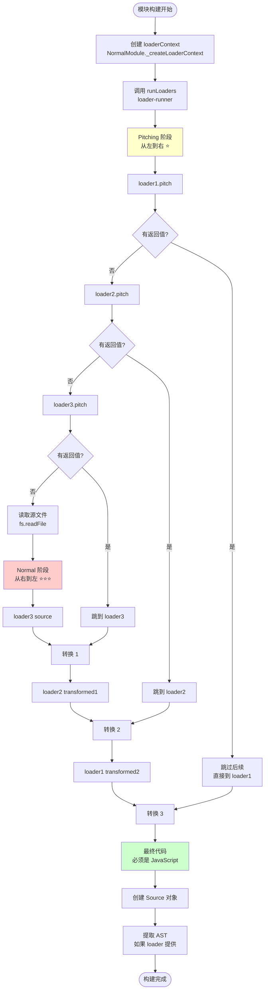

# Loader 加载器原理详解

> 基于 webpack 源码的深度剖析

---

## 📋 目录

1. [Loader 的作用](#一loader-的作用)
2. [涉及的核心文件](#二涉及的核心文件)
3. [Loader 执行原理](#三loader-执行原理)
4. [Loader 的配置与匹配](#四loader-的配置与匹配)
5. [loaderContext API](#五loadercontext-api)
6. [实战案例](#六实战案例)
7. [源码运行原理](#七源码运行原理)

---

## 一、Loader 的作用

### 1.1 什么是 Loader？⭐⭐⭐

**Loader 是模块转换器！**

```javascript
// Loader 的本质
Loader = 接收源码，返回转换后代码的函数

// 核心能力
Loader 可以：
1. 转换文件内容（ES6 → ES5、TS → JS、SCSS → CSS）
2. 将非 JS 文件转为 JS 模块（CSS、图片、字体）
3. 添加额外功能（注入代码、添加 polyfill）
4. 链式调用（多个 loader 组合）
```

### 1.2 为什么需要 Loader？

**问题**：webpack 原生只能处理 JavaScript 和 JSON
```javascript
// webpack 原生支持
import data from './data.json';      // ✅ 支持
import utils from './utils.js';      // ✅ 支持

// webpack 原生不支持
import styles from './style.css';    // ❌ 不支持
import logo from './logo.png';       // ❌ 不支持
import App from './App.tsx';         // ❌ 不支持
```

**解决**：通过 Loader 转换
```javascript
// 配置 loader
module.exports = {
  module: {
    rules: [
      { test: /\.css$/,  use: ['style-loader', 'css-loader'] },
      { test: /\.png$/,  use: ['file-loader'] },
      { test: /\.tsx?$/, use: ['ts-loader'] }
    ]
  }
};

// 现在都可以 import 了
import styles from './style.css';    // ✅ css-loader 转换
import logo from './logo.png';       // ✅ file-loader 转换
import App from './App.tsx';         // ✅ ts-loader 转换
```

### 1.3 Loader vs Plugin

| 对比项 | Loader | Plugin |
|--------|--------|--------|
| **本质** | 转换函数 | 具有 apply 方法的类 |
| **作用范围** | 单个模块 | 整个编译流程 |
| **输入输出** | 源码 → 转换后代码 | 通过钩子影响流程 |
| **执行时机** | 模块构建时 | 任何编译阶段 |
| **配置方式** | `module.rules` | `plugins` |
| **接口** | `function(source)` | `apply(compiler)` |

**形象比喻**：
- **Loader**：装配线上的工人（处理每个零件）
- **Plugin**：工厂的管理者（控制整个流程）

---

## 二、涉及的核心文件

### 2.1 文件结构

```
webpack/
├── lib/
│   ├── NormalModule.js          ⭐⭐⭐ 模块构建（执行 loader）
│   ├── NormalModuleFactory.js   ⭐⭐⭐ 模块工厂（匹配 loader）
│   ├── RuleSet.js               ⭐⭐ 规则匹配
│   ├── ModuleTypeConstants.js   模块类型常量
│   │
│   └── ...
│
└── node_modules/
    └── loader-runner/           ⭐⭐⭐ Loader 执行引擎
        ├── LoaderRunner.js      核心执行逻辑
        └── ...
```

### 2.2 核心文件详解

#### NormalModule.js（模块构建）

```javascript
/**
 * 位置: lib/NormalModule.js
 *
 * 【作用】
 * - 处理普通模块（JS、TS、CSS 等）
 * - 执行 loader 链
 * - 解析 AST 收集依赖
 *
 * 【关键方法】
 * - build(): 构建模块入口
 * - _doBuild(): 执行 loader ⭐⭐⭐
 * - _createLoaderContext(): 创建 loader 上下文
 *
 * 【执行流程】
 * build()
 *   └─ _doBuild()
 *       ├─ 创建 loaderContext
 *       ├─ runLoaders (loader-runner)
 *       │   ├─ 读取源文件
 *       │   ├─ 执行 loader 链
 *       │   └─ 返回转换后代码
 *       ├─ 创建 Source 对象
 *       └─ parser.parse() (解析 AST)
 */
```

#### NormalModuleFactory.js（模块工厂）

```javascript
/**
 * 位置: lib/NormalModuleFactory.js
 *
 * 【作用】
 * - 创建 NormalModule 实例
 * - 解析模块路径
 * - 匹配 loader 规则 ⭐⭐⭐
 *
 * 【关键方法】
 * - create(): 创建模块
 * - resolve(): 解析路径和匹配 loader
 * - ruleSet.exec(): 执行规则匹配
 *
 * 【Loader 匹配流程】
 * resolve()
 *   └─ ruleSet.exec(resource)
 *       ├─ 遍历 module.rules
 *       ├─ 检查 test、include、exclude
 *       ├─ 匹配成功，提取 use
 *       └─ 返回 loader 列表
 */
```

#### loader-runner（执行引擎）

```javascript
/**
 * 位置: node_modules/loader-runner/lib/LoaderRunner.js
 *
 * 【作用】
 * - 执行 loader 链的核心引擎（独立 npm 包）
 * - 处理 pitching 和 normal 阶段
 * - 管理 loaderContext
 *
 * 【关键函数】
 * - runLoaders(): 主函数 ⭐⭐⭐
 * - iteratePitchingLoaders(): pitching 阶段
 * - iterateNormalLoaders(): normal 阶段
 * - loadLoader(): 加载单个 loader
 * - runSyncOrAsync(): 执行 loader 函数
 *
 * 【执行流程】
 * runLoaders()
 *   ├─ iteratePitchingLoaders() (从左到右)
 *   ├─ 读取源文件
 *   └─ iterateNormalLoaders() (从右到左)
 */
```

---

## 三、Loader 执行原理

### 3.1 完整的执行流程图



### 3.2 Pitching 阶段详解 ⭐⭐

```javascript
/**
 * Pitching 阶段：从左到右执行 pitch 方法
 *
 * 【作用】
 * 1. 提前终止（返回值跳过后续 loader）
 * 2. 传递数据给 normal 阶段
 * 3. 性能优化（不需要读取文件就能处理）
 */

// ===== 示例1: 提前终止 =====
// style-loader.pitch
exports.pitch = function(remainingRequest, precedingRequest, data) {
  // remainingRequest: 剩余的 loader 请求
  // precedingRequest: 之前的 loader 请求
  // data: 与 normal 阶段共享的数据对象

  // 如果是服务端渲染，不需要注入样式
  if (isServer) {
    // ⭐ 返回值，跳过后续所有 loader
    return `module.exports = {};`;
  }

  // 返回 undefined，继续执行
};

// ===== 示例2: 传递数据 =====
// my-loader
exports.pitch = function(remainingRequest, precedingRequest, data) {
  // 存储数据
  data.value = 'shared data';
};

exports.normal = function(source) {
  // 读取数据
  const value = this.data.value;  // 'shared data'
  // ...
};

// ===== 执行流程 =====
/**
 * 配置: use: ['loader1', 'loader2', 'loader3']
 *
 * Pitching 阶段（从左到右）:
 *
 * loader1.pitch(remainingRequest, precedingRequest, data)
 *   remainingRequest = 'loader2!loader3!./file.js'
 *   precedingRequest = ''
 *   ↓ 返回 undefined
 *
 * loader2.pitch(remainingRequest, precedingRequest, data)
 *   remainingRequest = 'loader3!./file.js'
 *   precedingRequest = 'loader1'
 *   ↓ 返回 undefined
 *
 * loader3.pitch(remainingRequest, precedingRequest, data)
 *   remainingRequest = './file.js'
 *   precedingRequest = 'loader1!loader2'
 *   ↓ 返回 undefined
 *
 * → 读取文件
 * → Normal 阶段
 *
 * 如果 loader2.pitch 返回了值:
 *
 * loader1.pitch()
 *   ↓
 * loader2.pitch()  → 返回 'result'
 *   ↓ 跳过 loader3.pitch 和文件读取
 * loader2('result')  → 执行 loader2 的 normal
 *   ↓
 * loader1(transformed)  → 执行 loader1 的 normal
 *   ↓
 * 完成
 */
```

### 3.3 Normal 阶段详解 ⭐⭐⭐

```javascript
/**
 * Normal 阶段：从右到左执行主函数
 *
 * 【核心原理】
 * 函数组合（Compose）
 */

// ===== 为什么从右到左？=====
/**
 * 配置: use: ['loader1', 'loader2', 'loader3']
 *
 * 本质是函数组合:
 */
const loader1 = (source) => transform1(source);
const loader2 = (source) => transform2(source);
const loader3 = (source) => transform3(source);

// 执行:
const result = loader1(loader2(loader3(source)));

// 等价于:
source
  → loader3 处理
  → loader2 处理
  → loader1 处理
  → 最终结果

/**
 * 为什么这样设计？
 *
 * 1. 符合函数式编程思想
 * 2. 类似 Unix 管道: cat file | grep | wc
 * 3. 最右边的 loader 先接触原始内容
 * 4. 最左边的 loader 负责输出 JavaScript
 */

// ===== 实际示例 =====
/**
 * 配置:
 * {
 *   test: /\.scss$/,
 *   use: ['style-loader', 'css-loader', 'sass-loader']
 * }
 *
 * 执行顺序:
 */

// 1. sass-loader (最右边，最先执行)
function sassLoader(source) {
  // 输入: SCSS 代码
  const scss = `
    $color: red;
    body { color: $color; }
  `;

  // 输出: CSS 代码
  const css = sass.render(scss).css;
  // 'body { color: red; }'

  return css;
}

// 2. css-loader (中间)
function cssLoader(source) {
  // 输入: CSS 代码
  const css = 'body { color: red; }';

  // 输出: JavaScript 代码（导出 CSS 字符串）
  const js = `
    module.exports = "body { color: red; }";
  `;

  return js;
}

// 3. style-loader (最左边，最后执行)
function styleLoader(source) {
  // 输入: JavaScript 代码
  const cssModule = 'module.exports = "body { color: red; }";';

  // 输出: JavaScript 代码（注入样式）
  const js = `
    const css = require(${JSON.stringify(remainingRequest)});
    const style = document.createElement('style');
    style.innerHTML = css;
    document.head.appendChild(style);
    module.exports = css;
  `;

  return js;
}

// 最终结果: JavaScript 模块（可以被 webpack 处理）

// ===== 链式传递 =====
/**
 * 每个 loader 的输出是下一个 loader 的输入
 */

// 源文件: styles.scss
$color: red;
body { color: $color; }
  ↓
// sass-loader 输出: CSS
body { color: red; }
  ↓
// css-loader 输出: JS
module.exports = "body { color: red; }";
  ↓
// style-loader 输出: JS (注入样式)
const css = "body { color: red; }";
const style = document.createElement('style');
style.innerHTML = css;
document.head.appendChild(style);
```

### 3.4 为什么最终必须是 JavaScript？⭐⭐

```javascript
/**
 * 原因1: webpack 只能处理 JavaScript
 *
 * webpack 的 parser（JavascriptParser）只能解析 JS 代码
 */

// ❌ 如果 loader 返回 CSS
const css = `body { color: red; }`;
// parser.parse(css) → 语法错误！

// ✅ 必须转为 JS
const js = `module.exports = "body { color: red; }";`;
// parser.parse(js) → 成功！

/**
 * 原因2: 需要打包到 bundle
 *
 * 最终的 bundle 是一个 JavaScript 文件
 * 所有资源都需要转换为 JS 模块
 */

// bundle.js（最终输出）
(function(modules) {
  // webpack runtime

  // 模块 1: entry.js
  modules[1] = function(exports, require) {
    const styles = require(2);  // 引用 CSS 模块
  };

  // 模块 2: styles.css（已转为 JS）
  modules[2] = function(exports) {
    exports.default = "body { color: red; }";  // ✅ JS 代码
  };

})({...});

/**
 * 原因3: 模块系统需要统一接口
 *
 * import/require 只能加载 JS 模块
 */

// 源码
import styles from './styles.css';

// 转换后（必须是 JS 模块才能 import）
const styles = __webpack_require__(2);  // module 2 必须是 JS
```

---

## 四、Loader 的配置与匹配

### 4.1 配置方式

```javascript
// ===== 方式1: 对象形式（推荐）⭐⭐⭐ =====
module.exports = {
  module: {
    rules: [
      {
        test: /\.js$/,              // 正则匹配
        use: ['babel-loader'],      // loader 列表
        include: /src/,             // 包含的目录
        exclude: /node_modules/     // 排除的目录
      }
    ]
  }
};

// ===== 方式2: 字符串形式 =====
{
  test: /\.css$/,
  use: 'css-loader'  // 单个 loader
}

// ===== 方式3: 带选项的对象 =====
{
  test: /\.js$/,
  use: [
    {
      loader: 'babel-loader',
      options: {
        presets: ['@babel/preset-env'],
        plugins: ['@babel/plugin-proposal-class-properties']
      }
    }
  ]
}

// ===== 方式4: 函数形式 =====
{
  test: /\.js$/,
  use: (info) => {
    // info.resource: 文件路径
    // info.realResource: 真实路径
    // info.resourceQuery: 查询字符串

    return [
      {
        loader: 'babel-loader',
        options: {
          // 根据条件返回不同配置
          presets: info.resource.includes('legacy')
            ? ['@babel/preset-env', { targets: 'ie 11' }]
            : ['@babel/preset-env']
        }
      }
    ];
  }
}
```

### 4.2 Rule 对象详解

```javascript
{
  // ===== 匹配条件 =====

  test: /\.js$/,
  /**
   * 正则表达式匹配文件路径
   * test: /\.js$/ → 匹配 .js 结尾
   * test: /\.tsx?$/ → 匹配 .ts 和 .tsx
   */

  include: [
    path.resolve(__dirname, 'src'),
    path.resolve(__dirname, 'lib')
  ],
  /**
   * 包含的路径（数组或字符串）
   * 只处理这些路径下的文件
   */

  exclude: /node_modules/,
  /**
   * 排除的路径
   * 不处理这些路径下的文件
   * ⭐ exclude 优先级高于 include
   */

  resource: {
    test: /\.js$/,
    include: /src/,
    exclude: /node_modules/
  },
  /**
   * 匹配资源路径（组合条件）
   */

  resourceQuery: /inline/,
  /**
   * 匹配查询字符串
   * import './file.js?inline' → 匹配
   */

  // ===== Loader 配置 =====

  use: ['loader1', 'loader2'],
  /**
   * loader 列表（从右到左执行）
   */

  loader: 'babel-loader',
  options: { ... },
  /**
   * 单个 loader 的简写形式
   * 等价于: use: [{ loader: 'babel-loader', options: {...} }]
   */

  enforce: 'pre',
  /**
   * loader 类型
   * - 'pre': pre loader（最先执行）
   * - 'post': post loader（最后执行）
   * - 不设置: normal loader（正常顺序）
   */

  // ===== 其他选项 =====

  type: 'javascript/auto',
  /**
   * 模块类型
   * - 'javascript/auto': 自动检测（ESM/CommonJS）
   * - 'javascript/esm': 强制 ESM
   * - 'asset': 资源模块
   * - 'json': JSON 模块
   */

  parser: {
    amd: false,
    commonjs: true,
    harmony: true
  },
  /**
   * 解析器选项
   * 控制如何解析模块语法
   */

  generator: {
    filename: '[name].[hash][ext]'
  },
  /**
   * 生成器选项
   * 控制如何生成输出
   */

  sideEffects: true,
  /**
   * 副作用标记
   * false: 无副作用（可以 Tree Shaking）
   */
}
```

### 4.3 Loader 类型与执行顺序 ⭐⭐

```javascript
/**
 * Loader 分为 4 种类型，执行顺序:
 * pre → normal → inline → post
 */

module.exports = {
  module: {
    rules: [
      // Pre loader（最先执行）
      {
        test: /\.js$/,
        use: ['eslint-loader'],
        enforce: 'pre'  // ⭐ 标记为 pre
      },

      // Normal loader（正常顺序）
      {
        test: /\.js$/,
        use: ['babel-loader']
        // 不设置 enforce，默认 normal
      },

      // Post loader（最后执行）
      {
        test: /\.js$/,
        use: ['coverage-loader'],
        enforce: 'post'  // ⭐ 标记为 post
      }
    ]
  }
};

/**
 * 完整执行顺序:
 *
 * 1. Pre loaders (从右到左)
 *    eslint-loader
 *
 * 2. Normal loaders (从右到左)
 *    babel-loader
 *
 * 3. Inline loaders (从右到左)
 *    (在 import 语句中指定)
 *
 * 4. Post loaders (从右到左)
 *    coverage-loader
 */

// ===== Inline loader（内联 loader）=====
/**
 * 在 import 语句中指定
 */

// 基本语法
import styles from 'style-loader!css-loader!./styles.css';
// 相当于: use: ['style-loader', 'css-loader']

// 前缀语法
import json from '!!json-loader!./data.json';
/**
 * 前缀说明:
 *
 * !   : 跳过 normal loader
 *       只执行 inline、pre、post
 *
 * -!  : 跳过 pre 和 normal loader
 *       只执行 inline 和 post
 *
 * !!  : 只执行 inline loader
 *       跳过所有配置的 loader
 */

// 示例1: 跳过 normal loader
import styles from '!style-loader!css-loader!./styles.css';
// 不会执行配置中的 normal loader
// 只执行 inline + pre + post

// 示例2: 跳过所有配置的 loader
import raw from '!!raw-loader!./file.txt';
// 只执行 raw-loader
// 跳过所有配置的 loader

/**
 * 完整顺序（包含 inline）:
 *
 * 源文件
 *   ↓
 * Pre loaders
 *   ↓
 * Normal loaders
 *   ↓
 * Inline loaders
 *   ↓
 * Post loaders
 *   ↓
 * 最终代码
 */
```

### 4.4 匹配流程源码解析

```javascript
/**
 * 源码位置: lib/NormalModuleFactory.js: resolve hook
 */

// 触发 resolve 钩子
this.hooks.resolve.tapAsync('NormalModuleFactory', (data, callback) => {
  // data.request: './src/index.js'
  // data.context: '/project'

  // ===== 步骤1: 解析路径 =====
  resolver.resolve(
    data.context,
    data.request,
    (err, resource) => {
      // resource: '/project/src/index.js'

      // ===== 步骤2: 匹配 loader 规则 =====
      const result = ruleSet.exec({
        resource: resource,                    // 绝对路径
        realResource: resource,                // 真实路径
        resourceQuery: data.resourceQuery,     // 查询字符串
        resourceFragment: data.resourceFragment, // 片段
        mimetype: data.mimetype                // MIME 类型
      });

      /**
       * ruleSet.exec 匹配过程:
       *
       * for (const rule of this.rules) {
       *   // 检查 test
       *   if (rule.test && !rule.test.test(resource)) continue;
       *
       *   // 检查 include
       *   if (rule.include && !matchPath(resource, rule.include)) continue;
       *
       *   // 检查 exclude
       *   if (rule.exclude && matchPath(resource, rule.exclude)) continue;
       *
       *   // 匹配成功，提取 use
       *   matchedLoaders.push(...rule.use);
       * }
       */

      // ===== 步骤3: 分类 loader =====
      /**
       * result = {
       *   preLoaders: [{ loader: 'eslint-loader', options: {...} }],
       *   normalLoaders: [{ loader: 'babel-loader', options: {...} }],
       *   postLoaders: [{ loader: 'coverage-loader', options: {...} }]
       * }
       */

      // ===== 步骤4: 合并所有 loader =====
      const allLoaders = [
        ...result.preLoaders,
        ...result.normalLoaders,
        ...inlineLoaders,  // 从 request 中提取
        ...result.postLoaders
      ];

      // ===== 步骤5: 创建模块 =====
      const module = new NormalModule({
        resource: resource,
        loaders: allLoaders,  // ⭐ 传递给模块
        parser: result.parser,
        generator: result.generator,
        // ...
      });

      callback(null, module);
    }
  );
});
```

---

## 五、loaderContext API

### 5.1 什么是 loaderContext？⭐⭐⭐

```javascript
/**
 * loaderContext 是传递给 loader 的 this 对象
 * 提供丰富的 API 供 loader 使用
 *
 * 源码位置: lib/NormalModule.js: _createLoaderContext()
 */

// Loader 中访问
module.exports = function(source) {
  // this 就是 loaderContext
  console.log(this.resource);      // 文件路径
  console.log(this.resourcePath);  // 文件路径（无query）
  console.log(this.context);       // 文件目录

  return transform(source);
};
```

### 5.2 核心 API 列表

```javascript
/**
 * 完整的 loaderContext API
 */
const loaderContext = {
  // ===== 🔵 基本信息 =====

  version: 2,
  /**
   * loader-runner 版本
   */

  resource: '/path/to/file.js?query=1#hash',
  /**
   * 完整的资源路径（包含 query 和 hash）
   */

  resourcePath: '/path/to/file.js',
  /**
   * 资源路径（不含 query 和 hash）
   */

  resourceQuery: '?query=1',
  /**
   * 查询字符串
   */

  resourceFragment: '#hash',
  /**
   * 片段标识符
   */

  context: '/path/to',
  /**
   * 文件所在目录（绝对路径）
   */

  rootContext: '/project',
  /**
   * 项目根目录
   */

  request: 'babel-loader!/path/to/file.js',
  /**
   * 完整的 loader 请求字符串
   */

  loaders: [
    { path: '/node_modules/babel-loader/...', options: {...} },
    { path: '/node_modules/eslint-loader/...', options: {...} }
  ],
  /**
   * 所有 loader 的数组
   */

  loaderIndex: 0,
  /**
   * 当前 loader 在数组中的索引
   */

  // ===== 🟢 异步 API ⭐⭐⭐ =====

  async() {
    /**
     * 获取异步回调
     *
     * 【返回】callback(err, content, sourceMap, meta)
     *
     * 【示例】
     */
    const callback = this.async();

    fs.readFile('config.json', (err, data) => {
      if (err) return callback(err);

      const result = transform(source, JSON.parse(data));
      callback(null, result);
    });
  },

  callback(err, content, sourceMap, meta) {
    /**
     * 同步回调（返回多个值）
     *
     * 【参数】
     * - err: 错误对象（或 null）
     * - content: 转换后的内容（字符串或 Buffer）
     * - sourceMap: SourceMap 对象（可选）
     * - meta: 元数据（可选，传递给下一个 loader）
     *
     * 【示例】
     */
    const result = transform(source);
    const map = generateSourceMap(source, result);
    const meta = { webpackAST: ast };

    this.callback(null, result, map, meta);
    // 等价于 return，但可以返回多个值
  },

  // ===== 🟢 缓存 API =====

  cacheable(flag = true) {
    /**
     * 标记 loader 结果是否可缓存
     *
     * 【默认】true（可缓存）
     *
     * 【何时设为 false】
     * - 结果依赖外部因素（时间、随机数）
     * - 结果依赖未追踪的文件
     *
     * 【示例】
     */
    // 读取了配置文件
    const config = fs.readFileSync('config.json');
    this.addDependency('config.json');  // ⭐ 添加依赖
    this.cacheable(true);  // 可以缓存（因为已添加依赖）

    // 使用了当前时间
    const result = `const timestamp = ${Date.now()};`;
    this.cacheable(false);  // ⭐ 不能缓存（每次都不同）
  },

  // ===== 🟡 依赖 API ⭐⭐ =====

  addDependency(file) {
    /**
     * 添加文件依赖（用于 watch 模式）
     *
     * 【作用】
     * - watch 模式下，文件变化时重新构建
     * - 影响缓存有效性
     *
     * 【示例】
     */
    const configPath = path.resolve('./config.json');
    const config = fs.readFileSync(configPath);
    this.addDependency(configPath);  // ⭐ 告诉 webpack 监听这个文件
  },

  addContextDependency(dir) {
    /**
     * 添加目录依赖
     *
     * 【作用】
     * - 监听整个目录的变化
     * - 用于动态 import、glob 等场景
     *
     * 【示例】
     */
    const localesDir = path.resolve('./locales');
    this.addContextDependency(localesDir);  // 监听目录

    // 读取目录下所有文件
    const files = fs.readdirSync(localesDir);
  },

  addMissingDependency(file) {
    /**
     * 添加缺失的依赖
     *
     * 【作用】
     * - 监听不存在的文件
     * - 文件创建时触发重新构建
     *
     * 【示例】
     */
    const optionalConfig = path.resolve('./config.optional.json');
    if (!fs.existsSync(optionalConfig)) {
      this.addMissingDependency(optionalConfig);  // ⭐ 监听不存在的文件
    }
  },

  clearDependencies() {
    /**
     * 清除所有依赖
     */
    this.clearDependencies();
  },

  dependency(file) {
    /**
     * addDependency 的别名（已废弃）
     */
  },

  // ===== 🟡 输出 API =====

  emitFile(name, content, sourceMap) {
    /**
     * 输出额外文件
     *
     * 【作用】
     * - 输出除当前模块外的其他文件
     * - 如图片、字体、SourceMap 等
     *
     * 【示例】
     */
    // file-loader 的实现
    const url = loaderUtils.interpolateName(
      this,
      '[hash].[ext]',
      { content }
    );

    this.emitFile(url, content);  // ⭐ 输出文件

    return `module.exports = ${JSON.stringify(url)}`;
  },

  // ===== 🟡 日志 API =====

  emitWarning(warning) {
    /**
     * 发出警告
     *
     * 【示例】
     */
    if (hasDeprecatedAPI) {
      this.emitWarning(new Error('使用了已废弃的 API'));
    }
  },

  emitError(error) {
    /**
     * 发出错误（不会中断编译）
     *
     * 【示例】
     */
    if (syntaxError) {
      this.emitError(new Error('语法错误'));
    }
  },

  getLogger(name) {
    /**
     * 获取日志记录器
     *
     * 【示例】
     */
    const logger = this.getLogger('my-loader');
    logger.info('开始处理');
    logger.warn('发现问题');
    logger.error('出错了');
  },

  // ===== 🔵 工具 API =====

  getOptions(schema) {
    /**
     * 获取 loader 的 options
     *
     * 【参数】
     * - schema: JSON Schema（可选，用于验证）
     *
     * 【示例】
     */
    const options = this.getOptions({
      type: 'object',
      properties: {
        name: { type: 'string' },
        value: { type: 'number' }
      }
    });

    // options = { name: 'test', value: 123 }
  },

  resolve(context, request, callback) {
    /**
     * 解析模块路径
     *
     * 【示例】
     */
    this.resolve(this.context, './utils', (err, result) => {
      // result: '/project/src/utils.js'
    });
  },

  // ===== 🔵 高级 API =====

  utils: {
    /**
     * 工具函数集合
     */

    contextify(context, request) {
      /**
       * 将绝对路径转为相对路径
       *
       * 【示例】
       */
      const relative = this.utils.contextify(
        '/project',
        '/project/src/index.js'
      );
      // 'src/index.js'
    },

    absolutify(context, request) {
      /**
       * 将相对路径转为绝对路径
       *
       * 【示例】
       */
      const absolute = this.utils.absolutify(
        '/project',
        './src/index.js'
      );
      // '/project/src/index.js'
    },

    createHash(type) {
      /**
       * 创建哈希对象
       *
       * 【示例】
       */
      const hash = this.utils.createHash('md5');
      hash.update(content);
      const digest = hash.digest('hex');
    }
  },

  // ===== 🔵 数据共享 =====

  data: {},
  /**
   * 与 pitch 阶段共享的数据对象
   *
   * 【示例】
   */
  // pitch 阶段
  exports.pitch = function(remainingRequest, precedingRequest, data) {
    data.value = 'shared';
  };

  // normal 阶段
  exports.normal = function(source) {
    console.log(this.data.value);  // 'shared'
  },

  // ===== 🔵 其他属性 =====

  hot: true,
  /**
   * 是否启用 HMR
   */

  mode: 'production',
  /**
   * 编译模式
   */

  target: 'web',
  /**
   * 编译目标
   */

  webpack: true,
  /**
   * 是否在 webpack 中运行
   */

  _compiler: compilerInstance,
  /**
   * Compiler 实例（内部使用）
   */

  _compilation: compilationInstance,
  /**
   * Compilation 实例（内部使用）
   */

  _module: moduleInstance,
  /**
   * Module 实例（内部使用）
   */
};
```

---

## 六、实战案例

### 6.1 案例1: 简单的替换 Loader

```javascript
/**
 * replace-loader.js
 *
 * 功能：替换源码中的特定字符串
 */
module.exports = function(source) {
  // 获取 options
  const options = this.getOptions({
    type: 'object',
    properties: {
      search: { type: 'string' },
      replace: { type: 'string' }
    },
    required: ['search', 'replace']
  });

  // 执行替换
  const result = source.replace(
    new RegExp(options.search, 'g'),
    options.replace
  );

  // 返回结果
  return result;
};

// 使用
module.exports = {
  module: {
    rules: [
      {
        test: /\.js$/,
        use: [
          {
            loader: path.resolve(__dirname, 'replace-loader.js'),
            options: {
              search: '__VERSION__',
              replace: '1.0.0'
            }
          }
        ]
      }
    ]
  }
};

// 源码
const version = '__VERSION__';

// 转换后
const version = '1.0.0';
```

### 6.2 案例2: 异步 Loader（读取配置）

```javascript
/**
 * config-loader.js
 *
 * 功能：根据配置文件转换源码
 */
const fs = require('fs');
const path = require('path');

module.exports = function(source) {
  // ⭐ 获取异步回调
  const callback = this.async();

  // 配置文件路径
  const configPath = path.resolve(this.context, 'config.json');

  // ⭐ 添加文件依赖（watch 模式）
  this.addDependency(configPath);

  // 异步读取配置
  fs.readFile(configPath, 'utf8', (err, data) => {
    if (err) {
      // 如果文件不存在，使用默认配置
      if (err.code === 'ENOENT') {
        // ⭐ 添加缺失依赖
        this.addMissingDependency(configPath);
        const result = transform(source, {});
        return callback(null, result);
      }
      return callback(err);
    }

    try {
      const config = JSON.parse(data);
      const result = transform(source, config);

      // ⭐ 调用回调返回结果
      callback(null, result);
    } catch (e) {
      callback(e);
    }
  });
};

function transform(source, config) {
  // 根据配置转换源码
  return source.replace(/__CONFIG__/g, JSON.stringify(config));
}

// 使用
module.exports = {
  module: {
    rules: [
      {
        test: /\.js$/,
        use: [path.resolve(__dirname, 'config-loader.js')]
      }
    ]
  }
};
```

### 6.3 案例3: Pitch Loader（样式注入）

```javascript
/**
 * style-inject-loader.js
 *
 * 功能：注入样式到 DOM（类似 style-loader）
 */

// Pitching 阶段
exports.pitch = function(remainingRequest) {
  // remainingRequest: 'css-loader!./styles.css'

  // ⭐ 返回代码，跳过文件读取
  return `
    // 导入 CSS（由后续 loader 处理）
    const css = require(${JSON.stringify(remainingRequest)});

    // 创建 style 标签
    const style = document.createElement('style');
    style.type = 'text/css';
    style.appendChild(document.createTextNode(css));

    // 注入到 head
    document.head.appendChild(style);

    // 导出 CSS 内容
    module.exports = css;
  `;
};

// Normal 阶段（不会执行，因为 pitch 返回了值）
exports.normal = function(source) {
  // 不会执行
};

// 使用
module.exports = {
  module: {
    rules: [
      {
        test: /\.css$/,
        use: [
          path.resolve(__dirname, 'style-inject-loader.js'),
          'css-loader'
        ]
      }
    ]
  }
};

/**
 * 执行流程:
 *
 * 1. Pitching 阶段
 *    style-inject-loader.pitch()
 *      → 返回代码
 *      → 跳过 css-loader.pitch 和文件读取
 *
 * 2. Normal 阶段
 *    css-loader(source) ← 处理 require('./styles.css')
 *      → 返回 CSS 字符串
 *
 * 3. 最终代码
 *    const css = "body { color: red; }";
 *    const style = document.createElement('style');
 *    ...
 */
```

### 6.4 案例4: SourceMap Loader

```javascript
/**
 * banner-loader.js
 *
 * 功能：添加文件头注释，并保持 SourceMap
 */
const { SourceMapConsumer, SourceMapGenerator } = require('source-map');

module.exports = function(source, inputSourceMap) {
  // 获取 options
  const options = this.getOptions();
  const banner = `/*!\n * ${options.banner}\n */\n`;

  // 添加 banner
  const result = banner + source;

  // ⭐ 处理 SourceMap
  if (inputSourceMap) {
    // 更新 SourceMap（偏移行号）
    const consumer = new SourceMapConsumer(inputSourceMap);
    const generator = new SourceMapGenerator({
      file: consumer.file
    });

    consumer.eachMapping((mapping) => {
      generator.addMapping({
        source: mapping.source,
        original: {
          line: mapping.originalLine,
          column: mapping.originalColumn
        },
        generated: {
          line: mapping.generatedLine + banner.split('\n').length - 1,  // 偏移
          column: mapping.generatedColumn
        },
        name: mapping.name
      });
    });

    const outputSourceMap = generator.toJSON();

    // ⭐ 返回代码和 SourceMap
    this.callback(null, result, outputSourceMap);
  } else {
    // 没有 SourceMap，直接返回
    return result;
  }
};

// 使用
module.exports = {
  module: {
    rules: [
      {
        test: /\.js$/,
        use: [
          {
            loader: path.resolve(__dirname, 'banner-loader.js'),
            options: {
              banner: 'Copyright 2024'
            }
          },
          'babel-loader'  // 生成 SourceMap
        ]
      }
    ]
  },
  devtool: 'source-map'  // 启用 SourceMap
};
```

### 6.5 案例5: 文件输出 Loader

```javascript
/**
 * file-output-loader.js
 *
 * 功能：输出文件并返回文件路径（类似 file-loader）
 */
const loaderUtils = require('loader-utils');

module.exports = function(content) {
  // 获取 options
  const options = this.getOptions() || {};

  // 生成文件名
  const name = options.name || '[contenthash].[ext]';
  const url = loaderUtils.interpolateName(this, name, {
    context: this.rootContext,
    content: content
  });

  // ⭐ 输出文件
  this.emitFile(url, content);

  // 返回 JS 代码（导出文件路径）
  return `module.exports = ${JSON.stringify(url)};`;
};

// ⭐ 标记为原始 loader（接收 Buffer）
module.exports.raw = true;

// 使用
module.exports = {
  module: {
    rules: [
      {
        test: /\.(png|jpg|gif)$/,
        use: [
          {
            loader: path.resolve(__dirname, 'file-output-loader.js'),
            options: {
              name: 'images/[name].[hash:8].[ext]'
            }
          }
        ]
      }
    ]
  }
};

// 源码
import logo from './logo.png';

// 转换后
const logo = 'images/logo.a1b2c3d4.png';

// 输出文件
// dist/images/logo.a1b2c3d4.png
```

---

## 七、源码运行原理

### 7.1 完整的执行流程

```javascript
/**
 * 从模块构建到 loader 执行的完整流程
 */

// ===== 1. 创建模块 =====
/**
 * 位置: lib/NormalModuleFactory.js: create()
 */
normalModuleFactory.create({
  context: '/project',
  dependencies: [dependency],
  ...
}, (err, module) => {
  // module 是 NormalModule 实例
  // module.loaders = [{ loader: 'babel-loader', options: {...} }]
});

// ===== 2. 构建模块 =====
/**
 * 位置: lib/NormalModule.js: build()
 */
module.build(options, compilation, resolver, fs, (err) => {
  // 构建完成
});

// build() 内部调用 _doBuild()

// ===== 3. 执行 loader =====
/**
 * 位置: lib/NormalModule.js: _doBuild()
 */
_doBuild(options, compilation, resolver, fs, hooks, callback) {
  // 步骤1: 创建 loaderContext
  const loaderContext = this._createLoaderContext(
    resolver,
    options,
    compilation,
    fs,
    hooks
  );

  // 步骤2: 初始化依赖集合
  this.buildInfo.fileDependencies = new LazySet();
  this.buildInfo.contextDependencies = new LazySet();
  this.buildInfo.missingDependencies = new LazySet();

  // 步骤3: 调用 loader-runner ⭐⭐⭐
  runLoaders(
    {
      resource: this.resource,     // '/project/src/index.js'
      loaders: this.loaders,       // [{ loader: '...', options: {...} }]
      context: loaderContext,      // loader 的 this
      processResource: (loaderContext, resourcePath, callback) => {
        // 自定义资源读取
        const scheme = getScheme(resourcePath);
        hooks.readResource
          .for(scheme)
          .callAsync(loaderContext, callback);
      }
    },
    (err, result) => {
      // ===== loader 执行完成 =====

      if (err) {
        return callback(new ModuleBuildError(err));
      }

      // 提取结果
      const source = result.result[0];      // 转换后的代码
      const sourceMap = result.result[1];   // SourceMap
      const extraInfo = result.result[2];   // 额外信息

      // 验证结果
      if (!Buffer.isBuffer(source) && typeof source !== "string") {
        return callback(new Error("Loader must return Buffer or String"));
      }

      // 创建 Source 对象
      this._source = this.createSource(
        options.context,
        source,
        sourceMap
      );

      // 提取 AST（如果 loader 提供）
      this._ast = extraInfo?.webpackAST || null;

      // 收集依赖（用于 watch）
      this.buildInfo.fileDependencies.addAll(result.fileDependencies);
      this.buildInfo.contextDependencies.addAll(result.contextDependencies);

      callback();
    }
  );
}

// ===== 4. loader-runner 执行过程 =====
/**
 * 位置: node_modules/loader-runner/lib/LoaderRunner.js
 */
function runLoaders(options, callback) {
  const resource = options.resource;  // '/project/src/index.js'
  const loaders = options.loaders;    // loader 列表
  const loaderContext = options.context;  // loader 上下文

  // 初始化 loaderContext
  loaderContext.resource = resource;
  loaderContext.loaders = loaders;
  loaderContext.loaderIndex = 0;  // 当前 loader 索引

  // 步骤1: Pitching 阶段（从左到右）⭐
  iteratePitchingLoaders(loaderContext, (err) => {
    if (err) return callback(err);

    // 步骤2: 读取源文件
    const resource = loaderContext.resource;
    options.processResource(loaderContext, resource, (err, buffer) => {
      if (err) return callback(err);

      // 保存源文件内容
      loaderContext.resourceBuffer = buffer;

      // 步骤3: Normal 阶段（从右到左）⭐⭐⭐
      loaderContext.loaderIndex = loaders.length - 1;  // 从最后一个开始
      iterateNormalLoaders(loaderContext, [buffer], callback);
    });
  });
}

// ===== 5. Pitching 阶段 =====
function iteratePitchingLoaders(loaderContext, callback) {
  // 如果超出范围，进入 normal 阶段
  if (loaderContext.loaderIndex >= loaderContext.loaders.length) {
    return callback();
  }

  const currentLoader = loaderContext.loaders[loaderContext.loaderIndex];

  // 加载 loader
  loadLoader(currentLoader, (err) => {
    if (err) return callback(err);

    const pitchFn = currentLoader.pitch;

    // 如果没有 pitch 方法，跳到下一个
    if (!pitchFn) {
      loaderContext.loaderIndex++;
      return iteratePitchingLoaders(loaderContext, callback);
    }

    // 执行 pitch 方法
    runSyncOrAsync(
      pitchFn,
      loaderContext,
      [
        remainingRequest,  // 剩余请求
        precedingRequest,  // 之前的请求
        currentLoader.data = {}  // 共享数据
      ],
      (err, ...args) => {
        if (err) return callback(err);

        // ⭐ 如果有返回值，跳过后续 loader
        if (args.length > 0 && args[0] !== undefined) {
          // 开始 normal 阶段（从当前 loader）
          return iterateNormalLoaders(loaderContext, args, callback);
        }

        // 继续下一个 pitch
        loaderContext.loaderIndex++;
        iteratePitchingLoaders(loaderContext, callback);
      }
    );
  });
}

// ===== 6. Normal 阶段 =====
function iterateNormalLoaders(loaderContext, args, callback) {
  // 如果索引 < 0，所有 loader 执行完成
  if (loaderContext.loaderIndex < 0) {
    return callback(null, args);
  }

  const currentLoader = loaderContext.loaders[loaderContext.loaderIndex];
  const loaderFn = currentLoader.normal;

  // 执行 loader
  runSyncOrAsync(
    loaderFn,
    loaderContext,
    args,  // 上一个 loader 的输出
    (err, ...args) => {
      if (err) return callback(err);

      // 继续上一个 loader
      loaderContext.loaderIndex--;
      iterateNormalLoaders(loaderContext, args, callback);
    }
  );
}

// ===== 7. 执行单个 loader =====
function runSyncOrAsync(fn, context, args, callback) {
  let isDone = false;
  let isSync = true;

  // 提供异步回调
  context.async = () => {
    isSync = false;
    return callback;
  };

  // 提供同步回调
  context.callback = (...args) => {
    isDone = true;
    callback(null, ...args);
  };

  // 执行 loader 函数
  const result = fn.apply(context, args);

  // 如果是同步
  if (isSync) {
    isDone = true;
    if (result === undefined) {
      return callback();
    }
    return callback(null, result);
  }
}
```

### 7.2 执行流程可视化

```
┌──────────────────────────────────────────────────────────┐
│  模块构建流程                                              │
└──────────────────────────────────────────────────────────┘

1. compilation.buildModule(module)
     ↓
2. module.build()
     ↓
3. module._doBuild()
     ├─ 创建 loaderContext
     ├─ 初始化依赖集合
     └─ runLoaders() ⭐⭐⭐
          ↓
┌─────────────────────────────────────────────────────────┐
│  loader-runner 执行流程                                   │
└─────────────────────────────────────────────────────────┘

4. iteratePitchingLoaders() (从左到右)
     ├─ loader1.pitch()
     │   ↓ 返回 undefined
     ├─ loader2.pitch()
     │   ↓ 返回 undefined
     └─ loader3.pitch()
         ↓ 返回 undefined

5. 读取源文件
     fs.readFile(resource) → Buffer

6. iterateNormalLoaders() (从右到左)
     ├─ loader3(source) → transformed1
     ├─ loader2(transformed1) → transformed2
     └─ loader1(transformed2) → finalCode ⭐
         ↓
7. 返回结果
     {
       result: [code, sourceMap, meta],
       fileDependencies: [...],
       contextDependencies: [...]
     }
     ↓
8. module._doBuild() 继续
     ├─ 创建 Source 对象
     ├─ 提取 AST
     └─ 收集依赖
     ↓
9. parser.parse(finalCode) → 解析 AST，识别依赖
     ↓
10. 模块构建完成
```

---

## 八、常见问题

### Q1: 如何编写一个 loader？⭐⭐

```javascript
// 最简单的 loader
module.exports = function(source) {
  // source: 源码字符串

  // 转换
  const result = transform(source);

  // 返回
  return result;
};

// 异步 loader
module.exports = function(source) {
  const callback = this.async();

  doAsyncWork(source, (err, result) => {
    callback(err, result);
  });
};

// 返回多个值
module.exports = function(source) {
  const result = transform(source);
  const sourceMap = generateSourceMap(source, result);

  this.callback(null, result, sourceMap);
};

// 原始 loader（接收 Buffer）
module.exports = function(content) {
  // content: Buffer

  return transform(content);
};
module.exports.raw = true;
```

### Q2: loader 和 plugin 如何选择？⭐⭐

```javascript
// 使用 loader 的场景：
// - 转换单个文件内容
// - 文件类型转换
// - 编译/转译代码

{
  test: /\.ts$/,
  use: ['ts-loader']  // ✅ 转换 TS → JS
}

{
  test: /\.scss$/,
  use: ['sass-loader']  // ✅ 转换 SCSS → CSS
}

// 使用 plugin 的场景：
// - 影响整个编译流程
// - 处理多个文件
// - 生成额外文件
// - 优化输出

new HtmlWebpackPlugin()  // ✅ 生成 HTML
new TerserPlugin()       // ✅ 压缩所有 JS
new DefinePlugin()       // ✅ 定义全局变量

// 组合使用：
module.exports = {
  module: {
    rules: [
      { test: /\.css$/, use: ['style-loader', 'css-loader'] }  // loader
    ]
  },
  plugins: [
    new MiniCssExtractPlugin()  // plugin：提取 CSS 到单独文件
  ]
};
```

### Q3: 如何调试 loader？⭐

```javascript
// 方法1: console.log
module.exports = function(source) {
  console.log('=== Loader 执行 ===');
  console.log('Resource:', this.resource);
  console.log('Source length:', source.length);
  console.log('Source preview:', source.substring(0, 100));

  const result = transform(source);

  console.log('Result length:', result.length);
  console.log('Result preview:', result.substring(0, 100));

  return result;
};

// 方法2: 使用 logger
module.exports = function(source) {
  const logger = this.getLogger('my-loader');

  logger.info('开始处理');
  logger.debug('Source length:', source.length);

  const result = transform(source);

  logger.info('处理完成');

  return result;
};

// 方法3: 断点调试
// 1. 在 loader 文件中设置断点
// 2. 使用 Node.js 调试模式运行 webpack
//    node --inspect-brk ./node_modules/webpack/bin/webpack.js
// 3. 在 Chrome DevTools 或 VS Code 中连接调试器

// 方法4: 单元测试
const loader = require('./my-loader');
const loaderContext = {
  resource: '/path/to/file.js',
  getOptions: () => ({ option: 'value' }),
  callback: (err, result) => {
    console.log('Result:', result);
  }
};

const source = 'const foo = 1;';
const result = loader.call(loaderContext, source);
```

---

## 九、总结

### 核心要点

**Loader 的本质**：
```
Loader = 接收源码，返回转换后代码的函数
```

**工作原理**：
```
1. webpack 匹配 loader 规则
2. 创建 loaderContext
3. loader-runner 执行
   ├─ Pitching 阶段（从左到右）
   ├─ 读取源文件
   └─ Normal 阶段（从右到左）⭐
4. 返回最终代码（必须是 JavaScript）
5. parser 解析 AST
```

**关键概念**：
- **从右到左**：函数组合（Compose）
- **Pitching**：提前终止优化
- **loaderContext**：提供丰富的 API
- **最终必须是 JS**：webpack 只能处理 JavaScript

**设计优势**：
- ✅ 职责单一（一个 loader 做一件事）
- ✅ 可组合（多个 loader 链式调用）
- ✅ 可复用（同一个 loader 用于不同规则）
- ✅ 灵活（支持同步/异步、pitching）

---

## 附录：相关源码文件

```
✅ 核心文件（已有详细注释）:
   lib/NormalModule.js          - 模块构建
   lib/NormalModuleFactory.js   - 模块工厂
   lib/RuleSet.js               - 规则匹配

✅ Loader 执行引擎:
   node_modules/loader-runner/ - 执行引擎

✅ 文档:
   学习文档/08-编译模块详解-Loader与递归构建.md
```

**通过这份文档，你应该完全掌握 webpack 的 Loader 系统了！** 🎉
