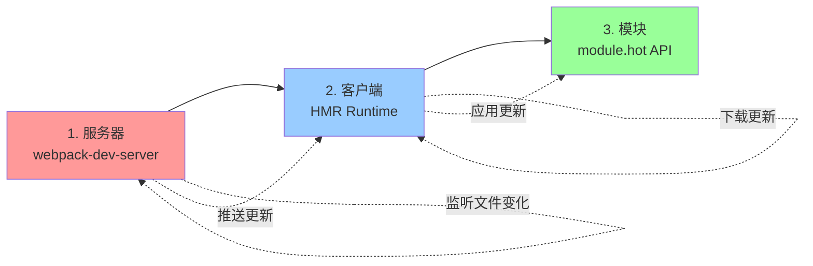

# HMR 热更新原理详解

> Hot Module Replacement - 不刷新页面更新模块

---

## 📋 目录

1. [HMR 概述](#一hmr-概述)
2. [核心架构](#二核心架构)
3. [完整工作流程](#三完整工作流程)
4. [服务器端实现](#四服务器端实现)
5. [客户端实现](#五客户端实现)
6. [module.hot API](#六modulehot-api)
7. [实战案例](#七实战案例)
8. [源码运行原理](#八源码运行原理)

---

## 一、HMR 概述

### 1.1 什么是 HMR？⭐⭐⭐

**HMR（Hot Module Replacement）= 热模块替换**

```javascript
// 传统开发流程
修改代码 → 保存 → 浏览器全页刷新 → 状态丢失 ❌

// HMR 流程
修改代码 → 保存 → 只更新改变的模块 → 状态保留 ✅
```

### 1.2 HMR 的优势

**问题**：传统开发方式的痛点
```javascript
// 场景1: 表单填写
// 1. 用户填写了复杂的表单
// 2. 开发者修改样式
// 3. 页面刷新
// 4. 表单数据丢失 ❌

// 场景2: 调试特定状态
// 1. 通过多个步骤进入特定状态
// 2. 修改代码
// 3. 页面刷新
// 4. 需要重新操作进入状态 ❌
```

**解决**：HMR 的优势
```javascript
✅ 保留应用状态（不刷新页面）
✅ 只更新变化的模块
✅ 即时反馈（秒级更新）
✅ 提升开发效率
✅ 更好的开发体验
```

### 1.3 HMR 三要素



---

## 二、核心架构

### 2.1 完整架构图

```
┌─────────────────────────────────────────────────────────────┐
│                         开发环境                              │
└─────────────────────────────────────────────────────────────┘

┌─────────────────────┐          ┌─────────────────────┐
│   webpack Compiler   │          │  webpack-dev-server │
│                      │          │                      │
│  1. 监听文件变化     │◄─────────│  1. 启动服务器      │
│  2. 重新编译         │          │  2. 监听文件系统    │
│  3. 生成更新文件     │          │  3. WebSocket 服务器│
│                      │          │                      │
│  输出:                │          │                      │
│  - [hash].hot-update.json     │                      │
│  - [hash].hot-update.js       │                      │
└──────────┬──────────┘          └──────────┬──────────┘
           │                                 │
           │ 生成更新文件                    │ 推送更新通知
           ↓                                 ↓
┌─────────────────────────────────────────────────────────────┐
│                         网络传输                              │
│  WebSocket: { type: 'hash', data: 'abc123' }                │
│  HTTP GET: /abc123.hot-update.json                          │
│  HTTP GET: /abc123.hot-update.js                            │
└─────────────────────────────────────────────────────────────┘
           │                                 │
           │ 接收更新                        │ 下载更新文件
           ↓                                 ↓
┌─────────────────────┐          ┌─────────────────────┐
│   浏览器端 (Bundle)  │          │   HMR Runtime       │
│                      │          │                      │
│  - 应用代码          │          │  1. 接收 WebSocket  │
│  - HMR Runtime       │◄─────────│  2. 下载更新清单    │
│  - module.hot API    │          │  3. 下载更新模块    │
│                      │          │  4. 应用更新        │
└──────────┬──────────┘          └─────────────────────┘
           │
           │ 调用 module.hot.accept()
           ↓
┌─────────────────────────────────────────────────────────────┐
│                         应用模块                              │
│                                                               │
│  if (module.hot) {                                           │
│    module.hot.accept('./component', () => {                 │
│      // 更新组件                                             │
│    });                                                        │
│  }                                                            │
└─────────────────────────────────────────────────────────────┘
```

### 2.2 涉及的核心文件

```
webpack/ (核心文件)
├── lib/
│   ├── HotModuleReplacementPlugin.js    ⭐⭐⭐ 核心插件
│   │   ├─ 监听编译变化
│   │   ├─ 生成更新清单 (hot-update.json)
│   │   └─ 生成更新模块 (hot-update.js)
│   │
│   ├── hmr/
│   │   ├── HotModuleReplacementRuntimeModule.js  运行时模块
│   │   └── HotModuleReplacement.runtime.js       ⭐⭐⭐ 运行时代码
│   │       ├─ module.hot API 实现
│   │       ├─ hotCheck() - 检查更新
│   │       └─ hotApply() - 应用更新
│   │
│   └── HotUpdateChunk.js                特殊的 Chunk 类型
│
├── hot/                                 客户端运行时
│   ├── dev-server.js                    ⭐⭐⭐ 开发服务器客户端
│   │   ├─ 连接 WebSocket
│   │   ├─ 接收更新通知
│   │   └─ 触发更新检查
│   │
│   ├── poll.js                          轮询模式
│   ├── signal.js                        信号模式
│   ├── emitter.js                       事件发射器
│   └── log.js                           日志工具
│
webpack-dev-server/ (独立包)
├── lib/
│   ├── Server.js                        ⭐⭐⭐ 开发服务器
│   │   ├─ Express 服务器
│   │   ├─ WebSocket 服务器
│   │   └─ 文件监听
│   │
│   └── utils/
│       └── getSocketClientPath.js       WebSocket 客户端路径
```

---

## 三、完整工作流程

### 3.1 完整流程图 ⭐⭐⭐

```mermaid
graph TD
    Start([开发者修改代码]) --> Save[保存文件]

    Save --> Watch[webpack 监听到变化<br/>webpack-dev-middleware]

    Watch --> Compile[重新编译<br/>compilation.run]

    Compile --> Plugin[HotModuleReplacementPlugin<br/>处理]

    Plugin --> Compare[对比前后编译结果<br/>records.chunkModuleHashes]

    Compare --> FindChanged[找出变化的模块<br/>updatedModules]

    FindChanged --> GenManifest[生成更新清单<br/>hash.hot-update.json]

    GenManifest --> ManifestContent["清单内容:<br/>{<br/>  c: [更新的chunk],<br/>  r: [删除的chunk],<br/>  m: [删除的module]<br/>}"]

    ManifestContent --> GenChunk[生成更新模块<br/>hash.hot-update.js]

    GenChunk --> ChunkContent["模块内容:<br/>webpackHotUpdate(chunkId, {<br/>  moduleId: function(module) {<br/>    // 新的模块代码<br/>  }<br/>})"]

    ChunkContent --> EmitWS[WebSocket 推送<br/>{ type: 'hash', data: hash }]

    EmitWS --> ClientRecv[浏览器接收通知<br/>hot/dev-server.js]

    ClientRecv --> CheckHash{hash 不同?}

    CheckHash -->|否| Wait[等待下次更新]
    CheckHash -->|是| CheckStatus{状态是 idle?}

    CheckStatus -->|否| Wait
    CheckStatus -->|是| HotCheck[module.hot.check<br/>⭐ 检查更新]

    HotCheck --> DownloadManifest[下载更新清单<br/>GET /hash.hot-update.json]

    DownloadManifest --> ParseManifest[解析清单<br/>获取 updatedChunks]

    ParseManifest --> DownloadChunks[下载更新模块<br/>GET /hash.hot-update.js]

    DownloadChunks --> LoadChunks[加载更新模块<br/>JSONP 或 import]

    LoadChunks --> HotApply[module.hot.apply<br/>⭐⭐⭐ 应用更新]

    HotApply --> Step1[步骤1: dispose 阶段<br/>调用旧模块的 dispose 回调]

    Step1 --> Step2[步骤2: 删除过期模块<br/>delete moduleCache]

    Step2 --> Step3[步骤3: 添加新模块<br/>执行新模块代码]

    Step3 --> Step4[步骤4: accept 阶段<br/>调用 accept 回调]

    Step4 --> CheckAccept{所有模块都<br/>被 accept?}

    CheckAccept -->|否| Reload[全页刷新<br/>window.location.reload]
    CheckAccept -->|是| UpdateUI[UI 更新完成<br/>状态保留 ✅]

    UpdateUI --> End([HMR 完成])
    Reload --> End

    style HotCheck fill:#ff9999
    style HotApply fill:#ff9999
    style UpdateUI fill:#99ff99
```

### 3.2 关键步骤详解

#### 步骤1: 文件监听与编译

```javascript
/**
 * 位置: webpack-dev-middleware
 */

// 1. webpack 开启 watch 模式
compiler.watch(watchOptions, (err, stats) => {
  // 编译完成
});

// 2. 文件变化触发重新编译
// 监听 → 编译 → 生成 stats

// 3. HotModuleReplacementPlugin 介入
compiler.hooks.compilation.tap('HMR', (compilation) => {
  // 注册钩子，对比前后编译结果
});
```

#### 步骤2: 对比变化 ⭐⭐

```javascript
/**
 * 位置: lib/HotModuleReplacementPlugin.js
 */

compilation.hooks.fullHash.tap('HMR', (hash) => {
  const records = compilation.records;  // 上次编译记录

  // 对比每个 chunk 的每个模块
  for (const chunk of compilation.chunks) {
    for (const module of chunkGraph.getChunkModules(chunk)) {
      const key = `${chunk.id}|${module.identifier()}`;
      const oldHash = records.chunkModuleHashes[key];
      const newHash = getModuleHash(module);

      if (oldHash !== newHash) {
        // ⭐ 模块发生变化
        updatedModules.add(module, chunk);
      }
    }
  }
});
```

#### 步骤3: 生成更新文件 ⭐⭐⭐

```javascript
/**
 * 位置: lib/HotModuleReplacementPlugin.js
 */

compilation.hooks.processAssets.tap('HMR', () => {
  // 1. 生成更新清单: abc123.hot-update.json
  const hotUpdateMainJson = {
    c: [1, 2],           // 更新的 chunk ID
    r: [],               // 删除的 chunk ID
    m: [10, 11]          // 删除的 module ID
  };

  compilation.emitAsset(
    `${hash}.hot-update.json`,
    new RawSource(JSON.stringify(hotUpdateMainJson))
  );

  // 2. 生成更新模块: abc123.hot-update.js
  const hotUpdateChunk = new HotUpdateChunk();
  hotUpdateChunk.id = chunkId;
  chunkGraph.attachModules(hotUpdateChunk, updatedModules);

  // 渲染成 JS 文件
  const source = renderChunk(hotUpdateChunk);
  compilation.emitAsset(
    `${chunkId}.${hash}.hot-update.js`,
    source
  );
});
```

#### 步骤4: WebSocket 推送

```javascript
/**
 * 位置: webpack-dev-server/lib/Server.js
 */

// webpack 编译完成
compiler.hooks.done.tap('webpack-dev-server', (stats) => {
  const hash = stats.hash;

  // 通过 WebSocket 推送给所有客户端
  this.sockWrite(this.sockets, 'hash', hash);
  this.sockWrite(this.sockets, 'ok');
});

/**
 * WebSocket 消息:
 *
 * { type: 'hash', data: 'abc123' }
 * { type: 'ok' }
 */
```

#### 步骤5: 客户端接收并下载 ⭐⭐

```javascript
/**
 * 位置: hot/dev-server.js
 */

// 1. 接收 WebSocket 消息
hotEmitter.on('webpackHotUpdate', (currentHash) => {
  lastHash = currentHash;

  if (!upToDate() && module.hot.status() === 'idle') {
    // 触发更新检查
    check();
  }
});

// 2. 检查更新
function check() {
  module.hot.check(true).then((updatedModules) => {
    // 更新成功
  }).catch((err) => {
    // 更新失败，全页刷新
    window.location.reload();
  });
}
```

#### 步骤6: 下载更新文件

```javascript
/**
 * 位置: lib/hmr/HotModuleReplacement.runtime.js
 */

function hotCheck(applyOnUpdate) {
  setStatus('check');

  // 1. 下载更新清单
  return $hmrDownloadManifest$().then((update) => {
    // update = { c: [1], r: [], m: [] }

    if (!update) {
      setStatus('idle');
      return null;
    }

    setStatus('prepare');

    // 2. 下载所有更新的 chunk
    const promises = [];
    const chunkIds = update.c;

    chunkIds.forEach((chunkId) => {
      promises.push($hmrDownloadUpdateHandlers$[chunkId]());
    });

    return Promise.all(promises).then(() => {
      // 所有更新模块下载完成
      return update;
    });
  });
}
```

#### 步骤7: 应用更新 ⭐⭐⭐

```javascript
/**
 * 位置: lib/hmr/HotModuleReplacement.runtime.js
 */

function hotApply(options) {
  // 步骤1: Dispose 阶段
  // 调用旧模块的 dispose 回调
  for (const moduleId in $moduleCache$) {
    const module = $moduleCache$[moduleId];
    if (module.hot._disposeHandlers) {
      module.hot._disposeHandlers.forEach(handler => {
        handler(module.hot.data);
      });
    }
  }

  // 步骤2: 删除过期模块
  outdatedModules.forEach((moduleId) => {
    delete $moduleCache$[moduleId];
  });

  // 步骤3: 添加新模块
  // 执行新下载的模块代码
  appliedUpdate = {};
  for (const moduleId in hotUpdate) {
    // 新模块的代码已通过 JSONP 加载
    // 存储在 hotUpdate[moduleId]
    __webpack_require__.m[moduleId] = hotUpdate[moduleId];
  }

  // 步骤4: Accept 阶段
  // 调用 accept 回调，重新执行模块
  for (const moduleId of outdatedModules) {
    const module = $moduleCache$[moduleId];

    if (module.hot._selfAccepted) {
      // 模块自己 accept 自己
      try {
        __webpack_require__(moduleId);  // 重新执行
      } catch (err) {
        // Accept 失败
        if (module.hot._selfAccepted) {
          module.hot._selfAccepted(err);
        }
      }
    }

    // 如果有父模块 accept 了这个模块
    const acceptedCallbacks = [];
    for (const parentId of module.parents) {
      const parent = $moduleCache$[parentId];
      if (parent.hot._acceptedDependencies[moduleId]) {
        acceptedCallbacks.push({
          callback: parent.hot._acceptedDependencies[moduleId],
          errorHandler: parent.hot._acceptedErrorHandlers[moduleId]
        });
      }
    }

    // 执行 accept 回调
    for (const { callback, errorHandler } of acceptedCallbacks) {
      try {
        callback([moduleId]);
      } catch (err) {
        if (errorHandler) {
          errorHandler(err, [moduleId]);
        }
      }
    }
  }

  // 步骤5: 完成
  setStatus('idle');
  return appliedUpdate;
}
```

---

## 四、服务器端实现

### 4.1 webpack-dev-server 架构

```javascript
/**
 * webpack-dev-server 是一个独立的 npm 包
 *
 * 【核心功能】
 * 1. Express 服务器 - 提供静态资源
 * 2. webpack-dev-middleware - 编译和提供 bundle
 * 3. WebSocket 服务器 - 推送更新通知
 * 4. 文件监听 - 监听源码变化
 */

const express = require('express');
const webpackDevMiddleware = require('webpack-dev-middleware');
const webpack = require('webpack');
const WebSocket = require('ws');

class Server {
  constructor(compiler, options) {
    // 1. 创建 Express 服务器
    this.app = express();

    // 2. 使用 webpack-dev-middleware
    this.middleware = webpackDevMiddleware(compiler, {
      publicPath: options.publicPath,
      stats: options.stats,
      ...
    });

    this.app.use(this.middleware);

    // 3. 创建 WebSocket 服务器
    this.setupWebSocketServer();

    // 4. 监听 webpack 编译
    this.setupHooks();
  }

  setupWebSocketServer() {
    this.socketServer = new WebSocket.Server({
      server: this.server
    });

    this.socketServer.on('connection', (socket) => {
      // 新客户端连接
      this.sockets.push(socket);

      // 发送当前 hash
      this.sockWrite([socket], 'hash', this.currentHash);
      this.sockWrite([socket], 'ok');
    });
  }

  setupHooks() {
    const { compiler } = this;

    // webpack 开始编译
    compiler.hooks.invalid.tap('webpack-dev-server', () => {
      this.sockWrite(this.sockets, 'invalid');
    });

    // webpack 编译完成
    compiler.hooks.done.tap('webpack-dev-server', (stats) => {
      this.currentHash = stats.hash;

      // ⭐⭐⭐ 推送更新通知
      this.sockWrite(this.sockets, 'hash', stats.hash);

      if (stats.hasErrors()) {
        this.sockWrite(this.sockets, 'errors', stats.compilation.errors);
      } else if (stats.hasWarnings()) {
        this.sockWrite(this.sockets, 'warnings', stats.compilation.warnings);
      } else {
        this.sockWrite(this.sockets, 'ok');
      }
    });
  }

  sockWrite(sockets, type, data) {
    sockets.forEach((socket) => {
      socket.send(JSON.stringify({ type, data }));
    });
  }
}
```

### 4.2 HotModuleReplacementPlugin 核心逻辑 ⭐⭐⭐

```javascript
/**
 * 位置: lib/HotModuleReplacementPlugin.js
 *
 * 【核心职责】
 * 1. 对比编译结果，找出变化的模块
 * 2. 生成更新清单 (hot-update.json)
 * 3. 生成更新模块 (hot-update.js)
 * 4. 注入 HMR Runtime
 */

class HotModuleReplacementPlugin {
  apply(compiler) {
    compiler.hooks.compilation.tap('HMR', (compilation) => {
      // 1. 记录上次编译的模块 hash
      const fullHashChunkModuleHashes = {};
      const chunkModuleHashes = {};

      compilation.hooks.record.tap('HMR', (compilation, records) => {
        // 保存当前编译结果到 records
        records.hash = compilation.hash;
        records.chunkModuleHashes = chunkModuleHashes;
        records.chunkHashes = {};

        for (const chunk of compilation.chunks) {
          records.chunkHashes[chunk.id] = chunk.hash;
        }
      });

      // 2. 对比模块 hash，找出变化
      const updatedModules = new TupleSet();

      compilation.hooks.fullHash.tap('HMR', (hash) => {
        const records = compilation.records;

        for (const chunk of compilation.chunks) {
          for (const module of chunkGraph.getChunkModules(chunk)) {
            const key = `${chunk.id}|${module.identifier()}`;
            const oldHash = records.chunkModuleHashes?.[key];
            const newHash = getModuleHash(module);

            if (oldHash !== newHash) {
              // ⭐ 模块发生变化
              updatedModules.add(module, chunk);
            }

            chunkModuleHashes[key] = newHash;
          }
        }

        // 更新 hotIndex（用于生成唯一的更新文件名）
        hotIndex = records.hotIndex || 0;
        if (updatedModules.size > 0) hotIndex++;
        hash.update(`${hotIndex}`);
      });

      // 3. 生成更新文件
      compilation.hooks.processAssets.tap('HMR', () => {
        const records = compilation.records;

        if (records.hash === compilation.hash) return;
        if (!records.chunkModuleHashes) return;

        // 创建更新清单
        const hotUpdateMainContentByRuntime = new Map();

        // 遍历所有 chunk，生成更新
        for (const key of Object.keys(records.chunkHashes)) {
          const currentChunk = find(
            compilation.chunks,
            chunk => `${chunk.id}` === key
          );

          if (currentChunk) {
            // Chunk 仍然存在，生成更新模块
            const newModules = chunkGraph
              .getChunkModules(currentChunk)
              .filter(module => updatedModules.has(module, currentChunk));

            if (newModules.length > 0) {
              // 创建 HotUpdateChunk
              const hotUpdateChunk = new HotUpdateChunk();
              hotUpdateChunk.id = currentChunk.id;
              hotUpdateChunk.runtime = currentChunk.runtime;

              chunkGraph.attachModules(hotUpdateChunk, newModules);

              // 渲染成 JS 文件
              const source = renderChunk(hotUpdateChunk);

              // 输出: [chunkId].[hash].hot-update.js
              compilation.emitAsset(
                `${hotUpdateChunk.id}.${records.hash}.hot-update.js`,
                source,
                { hotModuleReplacement: true }
              );

              // 记录到更新清单
              updatedChunkIds.add(currentChunk.id);
            }
          } else {
            // Chunk 被删除
            removedChunkIds.add(key);
          }
        }

        // 生成更新清单: [hash].hot-update.json
        const hotUpdateMainJson = {
          c: Array.from(updatedChunkIds),      // 更新的 chunk
          r: Array.from(removedChunkIds),      // 删除的 chunk
          m: Array.from(completelyRemovedModules)  // 删除的 module
        };

        compilation.emitAsset(
          `${records.hash}.hot-update.json`,
          new RawSource(JSON.stringify(hotUpdateMainJson)),
          { hotModuleReplacement: true }
        );
      });

      // 4. 注入 HMR Runtime
      compilation.hooks.additionalTreeRuntimeRequirements.tap('HMR',
        (chunk, runtimeRequirements) => {
          // 添加运行时需求
          runtimeRequirements.add(RuntimeGlobals.hmrDownloadManifest);
          runtimeRequirements.add(RuntimeGlobals.hmrDownloadUpdateHandlers);

          // 添加 HMR 运行时模块
          compilation.addRuntimeModule(
            chunk,
            new HotModuleReplacementRuntimeModule()
          );
        }
      );
    });
  }
}
```

---

## 五、客户端实现

### 5.1 hot/dev-server.js - WebSocket 客户端 ⭐⭐⭐

```javascript
/**
 * 位置: hot/dev-server.js
 *
 * 【作用】
 * 1. 连接到 webpack-dev-server 的 WebSocket
 * 2. 接收更新通知
 * 3. 触发更新检查
 */

if (module.hot) {
  var lastHash;  // 上次的 hash

  // 检查是否是最新版本
  var upToDate = function() {
    return lastHash.indexOf(__webpack_hash__) >= 0;
  };

  var log = require('./log');

  // 检查并应用更新
  var check = function() {
    // ⭐⭐⭐ 调用 module.hot.check
    module.hot
      .check(true)  // autoApply = true
      .then(function(updatedModules) {
        if (!updatedModules) {
          // 无法找到更新，需要全页刷新
          log('warning', '[HMR] Cannot find update.');
          if (typeof window !== 'undefined') {
            window.location.reload();
          }
          return;
        }

        // 检查是否还有更新
        if (!upToDate()) {
          check();  // 递归检查
        }

        // 输出更新结果
        require('./log-apply-result')(updatedModules, updatedModules);

        if (upToDate()) {
          log('info', '[HMR] App is up to date.');
        }
      })
      .catch(function(err) {
        var status = module.hot.status();

        if (['abort', 'fail'].indexOf(status) >= 0) {
          // HMR 失败，需要全页刷新
          log('warning', '[HMR] Cannot apply update.');
          if (typeof window !== 'undefined') {
            window.location.reload();
          }
        } else {
          log('warning', '[HMR] Update failed: ' + err);
        }
      });
  };

  // 事件发射器（用于与 WebSocket 客户端通信）
  var hotEmitter = require('./emitter');

  // ⭐⭐⭐ 监听更新通知
  hotEmitter.on('webpackHotUpdate', function(currentHash) {
    lastHash = currentHash;

    // 如果不是最新版本，且当前状态是 idle，则检查更新
    if (!upToDate() && module.hot.status() === 'idle') {
      log('info', '[HMR] Checking for updates on the server...');
      check();
    }
  });

  log('info', '[HMR] Waiting for update signal from WDS...');
} else {
  throw new Error('[HMR] Hot Module Replacement is disabled.');
}

/**
 * WebSocket 客户端代码（由 webpack-dev-server 注入）:
 *
 * const socket = new WebSocket('ws://localhost:8080');
 *
 * socket.onmessage = (event) => {
 *   const message = JSON.parse(event.data);
 *
 *   if (message.type === 'hash') {
 *     // ⭐ 接收到新的 hash
 *     hotEmitter.emit('webpackHotUpdate', message.data);
 *   }
 * };
 */
```

### 5.2 HMR Runtime - 核心更新逻辑 ⭐⭐⭐

```javascript
/**
 * 位置: lib/hmr/HotModuleReplacement.runtime.js
 *
 * 【核心功能】
 * 1. 实现 module.hot API
 * 2. hotCheck() - 检查和下载更新
 * 3. hotApply() - 应用更新
 */

module.exports = function() {
  var installedModules = $moduleCache$;

  // HMR 状态机
  var currentStatus = 'idle';
  // idle → check → prepare → dispose → apply → idle
  //                                            ↓ fail
  //                                          abort

  // 状态变化处理器
  var registeredStatusHandlers = [];

  function setStatus(newStatus) {
    currentStatus = newStatus;
    registeredStatusHandlers.forEach(handler => {
      handler.call(null, newStatus);
    });
  }

  // ===== 创建 module.hot 对象 =====
  function createModuleHotObject(moduleId, me) {
    var hot = {
      // 私有属性
      _acceptedDependencies: {},     // 接受的依赖
      _acceptedErrorHandlers: {},    // 错误处理器
      _declinedDependencies: {},     // 拒绝的依赖
      _selfAccepted: false,          // 是否自己接受自己
      _selfDeclined: false,          // 是否自己拒绝自己
      _disposeHandlers: [],          // dispose 回调

      // 公开属性
      active: true,

      // ===== module.hot.accept API ⭐⭐⭐ =====
      accept: function(dep, callback, errorHandler) {
        if (dep === undefined) {
          // accept() - 接受自己
          hot._selfAccepted = true;
        } else if (typeof dep === 'function') {
          // accept(callback) - 接受自己，带回调
          hot._selfAccepted = dep;
        } else if (typeof dep === 'object' && dep !== null) {
          // accept(['./a', './b'], callback) - 接受多个依赖
          for (var i = 0; i < dep.length; i++) {
            hot._acceptedDependencies[dep[i]] = callback || function() {};
            hot._acceptedErrorHandlers[dep[i]] = errorHandler;
          }
        } else {
          // accept('./a', callback) - 接受单个依赖
          hot._acceptedDependencies[dep] = callback || function() {};
          hot._acceptedErrorHandlers[dep] = errorHandler;
        }
      },

      // ===== module.hot.decline API =====
      decline: function(dep) {
        if (dep === undefined) {
          hot._selfDeclined = true;
        } else if (typeof dep === 'object' && dep !== null) {
          for (var i = 0; i < dep.length; i++) {
            hot._declinedDependencies[dep[i]] = true;
          }
        } else {
          hot._declinedDependencies[dep] = true;
        }
      },

      // ===== module.hot.dispose API =====
      dispose: function(callback) {
        hot._disposeHandlers.push(callback);
      },

      // ===== module.hot.check API ⭐⭐⭐ =====
      check: hotCheck,

      // ===== module.hot.apply API ⭐⭐⭐ =====
      apply: hotApply,

      // ===== module.hot.status API =====
      status: function(l) {
        if (!l) return currentStatus;
        registeredStatusHandlers.push(l);
      }
    };

    return hot;
  }

  // ===== hotCheck: 检查并下载更新 ⭐⭐⭐ =====
  function hotCheck(applyOnUpdate) {
    if (currentStatus !== 'idle') {
      throw new Error('[HMR] check() 只能在 idle 状态调用');
    }

    setStatus('check');

    // 1. 下载更新清单
    return $hmrDownloadManifest$().then(function(update) {
      if (!update) {
        // 无更新
        setStatus('idle');
        return null;
      }

      // update = { c: [1, 2], r: [], m: [] }

      setStatus('prepare');

      // 2. 下载所有更新的 chunk
      var promises = [];
      var chunkIds = update.c;

      chunkIds.forEach(function(chunkId) {
        // 调用下载处理器（由 JsonpChunkLoadingRuntimeModule 注入）
        promises.push($hmrDownloadUpdateHandlers$[chunkId]());
      });

      return Promise.all(promises).then(function() {
        // 3. 决定是否自动应用
        if (applyOnUpdate) {
          return hotApply({ ignoreUnaccepted: true });
        } else {
          return update;
        }
      });
    });
  }

  // ===== hotApply: 应用更新 ⭐⭐⭐ =====
  function hotApply(options) {
    if (currentStatus !== 'prepare') {
      throw new Error('[HMR] apply() 只能在 prepare 状态调用');
    }

    options = options || {};

    setStatus('dispose');

    // ===== 步骤1: 找出需要更新的模块 =====
    var outdatedModules = [];
    var outdatedDependencies = {};

    // hotUpdate 是通过 JSONP 或 import() 加载的更新模块
    // 格式: { moduleId: function(module, exports, require) {...} }
    var queue = Object.keys(hotUpdate);

    while (queue.length > 0) {
      var moduleId = queue.pop();
      var module = installedModules[moduleId];

      if (!module) continue;

      // 检查模块是否被 accept
      if (module.hot._selfDeclined) {
        // 模块 decline 了自己，需要全页刷新
        return Promise.reject(
          new Error('[HMR] Self declined: ' + moduleId)
        );
      }

      if (module.hot._selfAccepted) {
        // 模块 accept 了自己
        outdatedModules.push({
          module: moduleId,
          require: false,
          errorHandler: module.hot._selfAccepted
        });
      }

      // 检查父模块是否 accept 了这个模块
      var parents = module.parents.slice();
      for (var i = 0; i < parents.length; i++) {
        var parentId = parents[i];
        var parent = installedModules[parentId];

        if (!parent) continue;

        if (parent.hot._declinedDependencies[moduleId]) {
          // 父模块 decline 了这个模块
          return Promise.reject(
            new Error('[HMR] Declined by parent: ' + parentId)
          );
        }

        if (parent.hot._acceptedDependencies[moduleId]) {
          // 父模块 accept 了这个模块
          if (!outdatedDependencies[parentId]) {
            outdatedDependencies[parentId] = [];
          }
          outdatedDependencies[parentId].push({
            module: moduleId,
            callback: parent.hot._acceptedDependencies[moduleId],
            errorHandler: parent.hot._acceptedErrorHandlers[moduleId]
          });
        }
      }
    }

    // ===== 步骤2: Dispose 阶段 =====
    // 调用旧模块的 dispose 回调
    queue = outdatedModules.slice();
    while (queue.length > 0) {
      var item = queue.pop();
      var module = installedModules[item.module];

      if (!module) continue;

      // 保存数据到 module.hot.data
      module.hot.data = {};

      // 调用 dispose 回调
      var disposeHandlers = module.hot._disposeHandlers;
      for (var j = 0; j < disposeHandlers.length; j++) {
        disposeHandlers[j].call(null, module.hot.data);
      }

      // 停用模块
      module.hot.active = false;
    }

    setStatus('apply');

    // ===== 步骤3: 删除过期模块 =====
    queue = outdatedModules.slice();
    while (queue.length > 0) {
      var item = queue.pop();
      var moduleId = item.module;

      // 删除缓存
      delete installedModules[moduleId];
    }

    // ===== 步骤4: 应用新模块 =====
    // 将新模块代码添加到模块系统
    for (var moduleId in hotUpdate) {
      if (Object.prototype.hasOwnProperty.call(hotUpdate, moduleId)) {
        __webpack_require__.m[moduleId] = hotUpdate[moduleId];
      }
    }

    // ===== 步骤5: Accept 阶段 =====
    // 执行 accept 回调
    var error = null;
    var reportError = function(err) {
      if (!error) error = err;
    };

    // 执行自己 accept 自己的模块
    queue = outdatedModules.slice();
    while (queue.length > 0) {
      var item = queue.pop();
      var moduleId = item.module;

      try {
        // ⭐ 重新执行模块
        __webpack_require__(moduleId);
      } catch (err) {
        if (typeof item.errorHandler === 'function') {
          try {
            item.errorHandler(err, { moduleId: moduleId });
          } catch (err2) {
            reportError(err2);
          }
        } else {
          reportError(err);
        }
      }
    }

    // 执行父模块 accept 的回调
    for (var parentId in outdatedDependencies) {
      var deps = outdatedDependencies[parentId];
      var moduleOutdatedDependencies = [];

      for (var i = 0; i < deps.length; i++) {
        var dep = deps[i];

        try {
          // 调用 accept 回调
          dep.callback([dep.module]);
        } catch (err) {
          if (typeof dep.errorHandler === 'function') {
            try {
              dep.errorHandler(err, { moduleId: dep.module, dependencyId: parentId });
            } catch (err2) {
              reportError(err2);
            }
          } else {
            reportError(err);
          }
        }

        moduleOutdatedDependencies.push(dep.module);
      }
    }

    // ===== 步骤6: 完成 =====
    if (error) {
      setStatus('fail');
      return Promise.reject(error);
    }

    setStatus('idle');
    return Promise.resolve(outdatedModules);
  }

  return {
    createModuleHotObject: createModuleHotObject,
    hotCheck: hotCheck,
    hotApply: hotApply
  };
};
```

---

## 六、module.hot API

### 6.1 API 完整列表

```javascript
/**
 * module.hot API 详解
 */

if (module.hot) {
  // ===== 1. module.hot.accept ⭐⭐⭐ =====
  /**
   * 接受模块更新
   *
   * 【语法】
   * module.hot.accept()                      // 接受自己
   * module.hot.accept(callback)              // 接受自己，带回调
   * module.hot.accept(dependencies, callback)  // 接受依赖
   */

  // 方式1: 接受自己（无回调）
  module.hot.accept();
  // 含义：这个模块更新时，自动重新执行，不需要通知父模块

  // 方式2: 接受自己（有回调）
  module.hot.accept((err) => {
    if (err) {
      console.error('[HMR] 更新失败', err);
    }
  });

  // 方式3: 接受单个依赖
  module.hot.accept('./component.js', () => {
    // component.js 更新时，执行这个回调
    const Component = require('./component.js');
    // 重新渲染
    render(Component);
  });

  // 方式4: 接受多个依赖
  module.hot.accept(['./a.js', './b.js'], () => {
    // a.js 或 b.js 更新时执行
  });

  // 方式5: 接受依赖，带错误处理
  module.hot.accept(
    './component.js',
    () => {
      // 成功回调
    },
    (err) => {
      // 错误处理
      console.error('[HMR] 更新失败', err);
    }
  );

  // ===== 2. module.hot.decline =====
  /**
   * 拒绝模块更新
   *
   * 【用途】
   * - 标记模块不可热更新
   * - 模块更新时，强制全页刷新
   */

  // 拒绝自己
  module.hot.decline();

  // 拒绝某个依赖
  module.hot.decline('./legacy.js');

  // ===== 3. module.hot.dispose ⭐⭐ =====
  /**
   * 注册 dispose 回调
   *
   * 【时机】
   * 模块被替换前调用
   *
   * 【用途】
   * - 清理副作用（定时器、事件监听）
   * - 保存状态到 data
   */

  module.hot.dispose((data) => {
    // 保存状态
    data.value = currentValue;

    // 清理副作用
    clearInterval(timer);
    element.removeEventListener('click', handler);
  });

  // 读取上次保存的状态
  if (module.hot.data) {
    currentValue = module.hot.data.value;
  }

  // ===== 4. module.hot.check ⭐ =====
  /**
   * 手动检查更新
   *
   * 【参数】
   * autoApply: boolean - 是否自动应用更新
   *
   * 【返回】
   * Promise<updatedModules[]>
   */

  module.hot.check(true).then((updatedModules) => {
    if (!updatedModules) {
      console.log('[HMR] 无更新');
    } else {
      console.log('[HMR] 更新的模块:', updatedModules);
    }
  });

  // ===== 5. module.hot.apply =====
  /**
   * 手动应用更新
   *
   * 【用途】
   * 与 check(false) 配合使用，先检查后手动应用
   */

  module.hot.check(false).then((update) => {
    if (update) {
      // 先做一些准备
      prepareUpdate();

      // 再应用更新
      return module.hot.apply({
        ignoreUnaccepted: true,  // 忽略未 accept 的模块
        onUnaccepted: (data) => {
          console.warn('[HMR] 未 accept:', data.chain);
        }
      });
    }
  });

  // ===== 6. module.hot.status =====
  /**
   * 获取或监听 HMR 状态
   *
   * 【状态】
   * - idle: 空闲
   * - check: 检查更新中
   * - prepare: 准备更新（下载中）
   * - dispose: dispose 阶段
   * - apply: 应用更新中
   * - abort: 更新中止
   * - fail: 更新失败
   */

  // 获取当前状态
  const status = module.hot.status();
  console.log('[HMR] 当前状态:', status);

  // 监听状态变化
  module.hot.status((status) => {
    console.log('[HMR] 状态变化:', status);
  });

  // ===== 7. module.hot.addStatusHandler =====
  /**
   * 添加状态处理器（别名）
   */
  module.hot.addStatusHandler((status) => {
    console.log('[HMR] 状态:', status);
  });

  // ===== 8. module.hot.removeStatusHandler =====
  /**
   * 移除状态处理器
   */
  const handler = (status) => { ... };
  module.hot.addStatusHandler(handler);
  module.hot.removeStatusHandler(handler);

  // ===== 9. module.hot.data ⭐ =====
  /**
   * 模块数据对象
   *
   * 【用途】
   * 在 dispose 和新模块之间传递数据
   */

  // 旧模块: 保存状态
  module.hot.dispose((data) => {
    data.count = count;
  });

  // 新模块: 读取状态
  if (module.hot.data) {
    count = module.hot.data.count || 0;
  }

  // ===== 10. module.hot.active =====
  /**
   * 模块是否激活
   */
  if (module.hot.active) {
    // HMR 激活，可以注册回调
  }
}
```

### 6.2 常见使用模式

#### 模式1: React 组件热更新

```javascript
// App.jsx
import React from 'react';
import Component from './Component';

function App() {
  return <Component />;
}

export default App;

// ⭐⭐⭐ React HMR
if (module.hot) {
  module.hot.accept('./Component', () => {
    // Component 更新时，重新渲染
    const NextComponent = require('./Component').default;
    // 这里通常由 react-hot-loader 或 react-refresh 处理
  });
}
```

#### 模式2: CSS 热更新

```javascript
// index.js
import './styles.css';

// ⭐⭐⭐ CSS HMR
if (module.hot) {
  module.hot.accept('./styles.css', () => {
    // CSS 更新时，style-loader 会自动替换
    // 不需要手动处理
  });
}

/**
 * style-loader 的实现:
 *
 * 1. 第一次加载时，创建 <style> 标签
 * 2. HMR 更新时，更新 <style> 的内容
 * 3. 无需刷新页面，CSS 立即生效
 */
```

#### 模式3: 保存状态

```javascript
// counter.js
let count = 0;

// 从上次保存的数据恢复
if (module.hot && module.hot.data) {
  count = module.hot.data.count || 0;
}

export function increment() {
  count++;
}

export function getCount() {
  return count;
}

// ⭐⭐⭐ 保存状态
if (module.hot) {
  module.hot.dispose((data) => {
    // 保存当前 count
    data.count = count;
  });

  module.hot.accept();
}
```

#### 模式4: 清理副作用

```javascript
// timer.js
let interval;

function startTimer() {
  interval = setInterval(() => {
    console.log('Tick');
  }, 1000);
}

// ⭐⭐⭐ 清理副作用
if (module.hot) {
  module.hot.dispose(() => {
    // 清理定时器
    if (interval) {
      clearInterval(interval);
    }
  });

  module.hot.accept();
}

startTimer();
```

#### 模式5: 条件热更新

```javascript
// config.js
const config = {
  apiUrl: 'https://api.example.com',
  timeout: 5000
};

// ⭐⭐⭐ 只在开发环境启用 HMR
if (process.env.NODE_ENV === 'development' && module.hot) {
  module.hot.accept();
}

export default config;
```

---

## 七、实战案例

### 7.1 案例1: Vue 组件 HMR

```javascript
// MyComponent.vue
<template>
  <div>{{ message }}</div>
</template>

<script>
export default {
  data() {
    return {
      message: 'Hello'
    };
  }
};
</script>

// ⭐⭐⭐ vue-loader 自动注入 HMR 代码
if (module.hot) {
  const api = require('vue-hot-reload-api');
  api.install(require('vue'));

  if (api.compatible) {
    module.hot.accept();

    if (!api.isRecorded('MyComponent')) {
      api.createRecord('MyComponent', module.exports.default);
    } else {
      api.reload('MyComponent', module.exports.default);
    }
  }
}
```

### 7.2 案例2: Redux Store HMR

```javascript
// store.js
import { createStore } from 'redux';
import rootReducer from './reducers';

const store = createStore(rootReducer);

// ⭐⭐⭐ Redux HMR
if (module.hot) {
  module.hot.accept('./reducers', () => {
    // reducers 更新时，替换 reducer
    const nextRootReducer = require('./reducers').default;
    store.replaceReducer(nextRootReducer);
  });
}

export default store;
```

### 7.3 案例3: 路由 HMR

```javascript
// router.js
import { createRouter } from './router-lib';
import routes from './routes';

const router = createRouter(routes);

// ⭐⭐⭐ 路由 HMR
if (module.hot) {
  module.hot.accept('./routes', () => {
    // routes 更新时，重新加载路由配置
    const nextRoutes = require('./routes').default;
    router.replaceRoutes(nextRoutes);
  });
}

export default router;
```

### 7.4 案例4: API Mock HMR

```javascript
// mocks.js
const mocks = {
  '/api/users': [{ id: 1, name: 'Alice' }],
  '/api/posts': [{ id: 1, title: 'Post 1' }]
};

function applyMocks() {
  // 应用 mock
  Object.keys(mocks).forEach(url => {
    mockServer.register(url, mocks[url]);
  });
}

applyMocks();

// ⭐⭐⭐ Mock 数据 HMR
if (module.hot) {
  module.hot.dispose(() => {
    // 清理旧的 mock
    mockServer.clear();
  });

  module.hot.accept(() => {
    // 重新应用 mock
    applyMocks();
  });
}
```

---

## 八、源码运行原理

### 8.1 更新文件格式

#### hot-update.json 格式

```json
{
  "c": [1, 2],        // 更新的 chunk ID 列表
  "r": [],            // 删除的 chunk ID 列表
  "m": [10, 11]       // 删除的 module ID 列表
}
```

#### hot-update.js 格式

```javascript
// main.abc123.hot-update.js

// JSONP 格式（传统）
webpackHotUpdate("main", {
  // 模块 ID: 新的模块函数
  "./src/App.js": (function(module, __webpack_exports__, __webpack_require__) {
    "use strict";
    __webpack_require__.r(__webpack_exports__);

    // 新的模块代码
    function App() {
      return React.createElement("div", null, "Updated!");
    }

    __webpack_exports__["default"] = App;
  })
});

// ESM 格式（现代）
import.meta.webpackHot.accept(
  __webpack_require__.u(chunkId),
  () => {
    return {
      "./src/App.js": newModule
    };
  }
);
```

### 8.2 HMR 状态机

```
状态转换图:

    ┌──────┐
    │ idle │  ← 初始状态
    └───┬──┘
        │ check()
        ↓
    ┌───────┐
    │ check │  ← 检查更新中
    └───┬───┘
        │ 下载清单
        ↓
   ┌──────────┐
   │ prepare  │  ← 准备更新（下载模块中）
   └─────┬────┘
         │ apply()
         ↓
   ┌──────────┐
   │ dispose  │  ← 清理旧模块
   └─────┬────┘
         │
         ↓
   ┌──────────┐
   │  apply   │  ← 应用新模块
   └─────┬────┘
         │
         ├─────→ ┌──────┐
         │       │ fail │  ← 更新失败
         │       └──────┘
         │
         ├─────→ ┌───────┐
         │       │ abort │  ← 更新中止
         │       └───────┘
         │
         ↓
    ┌──────┐
    │ idle │  ← 更新完成
    └──────┘
```

### 8.3 完整的数据流

```
┌─────────────────────────────────────────────────────────┐
│  1. 开发者修改 src/App.js                                 │
└─────────────────────────────────────────────────────────┘
                        ↓
┌─────────────────────────────────────────────────────────┐
│  2. webpack 监听到文件变化                                │
│     → compilation.records.chunkModuleHashes 对比          │
│     → 发现 App.js 模块 hash 变化                          │
└─────────────────────────────────────────────────────────┘
                        ↓
┌─────────────────────────────────────────────────────────┐
│  3. HotModuleReplacementPlugin 生成更新文件               │
│     → abc123.hot-update.json                             │
│     → main.abc123.hot-update.js                          │
└─────────────────────────────────────────────────────────┘
                        ↓
┌─────────────────────────────────────────────────────────┐
│  4. webpack-dev-server 推送 WebSocket 消息                │
│     → { type: 'hash', data: 'abc123' }                   │
│     → { type: 'ok' }                                      │
└─────────────────────────────────────────────────────────┘
                        ↓
┌─────────────────────────────────────────────────────────┐
│  5. 浏览器端 hot/dev-server.js 接收消息                   │
│     → lastHash = 'abc123'                                │
│     → 触发 check()                                        │
└─────────────────────────────────────────────────────────┘
                        ↓
┌─────────────────────────────────────────────────────────┐
│  6. module.hot.check() 下载更新清单                       │
│     → GET /abc123.hot-update.json                        │
│     → 解析: { c: ['main'], r: [], m: [] }               │
└─────────────────────────────────────────────────────────┘
                        ↓
┌─────────────────────────────────────────────────────────┐
│  7. 下载更新模块                                          │
│     → GET /main.abc123.hot-update.js                     │
│     → JSONP 加载: webpackHotUpdate("main", {...})       │
└─────────────────────────────────────────────────────────┘
                        ↓
┌─────────────────────────────────────────────────────────┐
│  8. module.hot.apply() 应用更新                          │
│     → dispose 阶段: 清理旧模块                            │
│     → delete __webpack_require__.c['./src/App.js']      │
│     → __webpack_require__.m['./src/App.js'] = 新模块     │
│     → accept 阶段: 执行回调                               │
└─────────────────────────────────────────────────────────┘
                        ↓
┌─────────────────────────────────────────────────────────┐
│  9. 应用层重新渲染                                        │
│     → module.hot.accept('./App.js', () => {             │
│         ReactDOM.render(<App />, root);                 │
│       })                                                 │
└─────────────────────────────────────────────────────────┘
                        ↓
┌─────────────────────────────────────────────────────────┐
│  10. UI 更新完成，状态保留 ✅                              │
└─────────────────────────────────────────────────────────┘
```

---

## 九、常见问题

### Q1: HMR 失败为什么会全页刷新？⭐⭐

```javascript
/**
 * HMR 失败的原因:
 *
 * 1. 模块没有 accept
 *    - 模块自己没调用 module.hot.accept()
 *    - 父模块也没 accept 这个模块
 *    → 无法安全更新，需要全页刷新
 *
 * 2. 模块 decline 了
 *    - 模块调用了 module.hot.decline()
 *    → 明确拒绝热更新
 *
 * 3. Accept 回调抛出错误
 *    - accept 回调执行失败
 *    → 应用状态可能不一致，全页刷新恢复
 *
 * 4. 更新链断裂
 *    - 更新冒泡到入口模块还没被 accept
 *    → 无法安全更新
 */

// 示例: 更新链
entry.js
  ↓ import
App.js (没有 accept)
  ↓ import
Component.js (修改了这个文件)

// 更新冒泡:
Component.js 更新
  → App.js 需要 accept Component.js (❌ 没有)
  → entry.js 需要 accept App.js (❌ 没有)
  → 到达入口，无法继续
  → 全页刷新
```

### Q2: 如何调试 HMR？⭐

```javascript
// 方法1: 查看 HMR 日志
// hot/dev-server.js 会输出日志
[HMR] Waiting for update signal from WDS...
[HMR] Checking for updates on the server...
[HMR] Updated modules:
[HMR]  - ./src/App.js
[HMR] App is up to date.

// 方法2: 监听 HMR 状态
if (module.hot) {
  module.hot.status((status) => {
    console.log('[HMR] 状态:', status);
  });
}

// 方法3: 查看更新清单
// 浏览器 Network 面板
// - abc123.hot-update.json (更新清单)
// - main.abc123.hot-update.js (更新模块)

// 方法4: 断点调试
// 在 lib/hmr/HotModuleReplacement.runtime.js
// hotCheck() 和 hotApply() 设置断点
```

### Q3: HMR 与生产环境？⭐

```javascript
/**
 * HMR 只用于开发环境！
 *
 * 原因:
 * 1. 需要 webpack-dev-server (生产环境不需要)
 * 2. 需要 WebSocket 连接 (生产环境不需要)
 * 3. HMR Runtime 会增加 bundle 大小
 * 4. 生产环境不需要热更新
 */

// webpack.config.js
module.exports = (env) => {
  const isDev = env.mode === 'development';

  return {
    mode: env.mode,
    plugins: [
      // ⭐ 只在开发环境启用
      isDev && new webpack.HotModuleReplacementPlugin()
    ].filter(Boolean)
  };
};
```

---

## 十、总结

### 核心要点

**HMR 工作原理**：
```
1. 服务器监听文件变化
2. 重新编译，对比找出变化的模块
3. 生成更新文件（hot-update.json + hot-update.js）
4. WebSocket 推送更新通知
5. 客户端下载更新文件
6. 应用更新（dispose → 删除旧模块 → 添加新模块 → accept）
7. UI 重新渲染，状态保留
```

**关键组件**：
- **服务器端**: HotModuleReplacementPlugin + webpack-dev-server
- **客户端**: hot/dev-server.js + HMR Runtime
- **应用层**: module.hot API (accept、dispose)

**成功条件**：
- ✅ 模块或父模块调用 module.hot.accept()
- ✅ Accept 回调正确处理更新
- ✅ 没有模块 decline

**失败处理**：
- ❌ 无法 accept → 全页刷新
- ❌ Accept 失败 → 全页刷新
- ❌ 更新链断裂 → 全页刷新

---

## 附录：相关源码文件

```
✅ 核心文件（接下来会添加详细注释）:
   lib/HotModuleReplacementPlugin.js
   lib/hmr/HotModuleReplacementRuntimeModule.js
   lib/hmr/HotModuleReplacement.runtime.js
   hot/dev-server.js

✅ 文档:
   学习文档/13-HMR热更新原理详解.md (本文档)
```

**通过这份文档，你应该完全理解 webpack 的 HMR 原理了！** 🎉🔥
