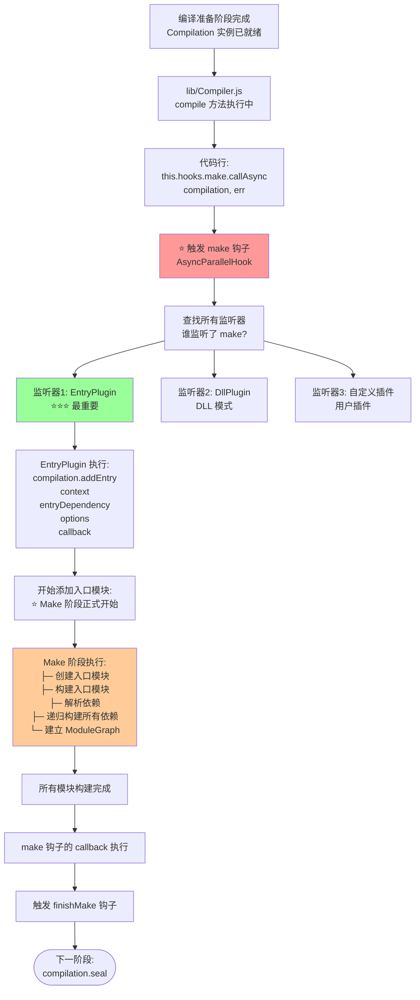

好的！让我详细解答这两个关键问题：

---

## 🎯 问题1：编译准备 → Make 阶段的触发机制

### 触发时机和方式 ⭐⭐⭐

```
编译准备阶段完成后:
  ↓
lib/Compiler.js: compile() 方法中
  ↓
const compilation = this.newCompilation(params);
  ↓ Compilation 实例已创建并就绪
  ↓
⭐⭐⭐ 关键：触发 make 钩子
  ↓
this.hooks.make.callAsync(compilation, err => {
  // Make 阶段在这里执行
  // 钩子的监听器会被依次调用
});
```

### 详细触发流程图



### 关键代码位置

```javascript
/**
 * lib/Compiler.js: compile() 方法
 */
compile(callback) {
  // 1. 创建参数
  const params = this.newCompilationParams();

  // 2. beforeCompile 钩子
  this.hooks.beforeCompile.callAsync(params, err => {

    // 3. compile 钩子
    this.hooks.compile.call(params);

    // 4. 创建 Compilation
    const compilation = this.newCompilation(params);

    const logger = compilation.getLogger("webpack.Compiler");

    // ⭐⭐⭐ 5. 触发 make 钩子（Make 阶段开始）
    logger.time("make hook");
    this.hooks.make.callAsync(compilation, err => {
      logger.timeEnd("make hook");
      // Make 阶段完成

      // 6. finishMake 钩子
      this.hooks.finishMake.callAsync(compilation, err => {
        // 7. 进入 Seal 阶段
        compilation.seal(callback);
      });
    });
  });
}

/**
 * lib/EntryPlugin.js: apply() 方法
 */
class EntryPlugin {
  apply(compiler) {
    // ⭐ 监听 make 钩子
    compiler.hooks.make.tapAsync(
      'EntryPlugin',
      (compilation, callback) => {
        // Make 阶段的执行入口
        const { entry, options, context } = this;
        const dep = EntryPlugin.createDependency(entry, options);

        // ⭐⭐⭐ 添加入口模块（Make 阶段真正开始）
        compilation.addEntry(context, dep, options, err => {
          callback(err);
        });
      }
    );
  }
}
```

---

## 🎯 问题2：Make 阶段的完整工作内容

### Make 阶段总览

```
Make 阶段的核心任务：
从入口依赖开始，递归构建所有模块，建立完整的 ModuleGraph

输入: Compilation（空的容器和图）
输出: ModuleGraph（完整的依赖图）

工作内容（7 大任务）：
1. ✅ 添加入口模块
2. ✅ 创建模块实例（factorize）
3. ✅ 添加模块到编译（去重）
4. ✅ 构建模块（执行 loader + 解析 AST）
5. ✅ 建立 ModuleGraph 连接
6. ✅ 处理模块依赖（递归）
7. ✅ 完成依赖图构建
```

### 文字版详细流程 ⭐⭐⭐

```
━━━━━━━━━━━━━━━━━━━━━━━━━━━━━━━━━━━━━━━━━━━━━━━━━━
Make 阶段启动
━━━━━━━━━━━━━━━━━━━━━━━━━━━━━━━━━━━━━━━━━━━━━━━━━━

触发: compiler.hooks.make.callAsync(compilation, callback)
  ↓
监听器: EntryPlugin
  ↓
调用: compilation.addEntry(context, entryDep, options, callback)

━━━━━━━━━━━━━━━━━━━━━━━━━━━━━━━━━━━━━━━━━━━━━━━━━━
任务1: 添加入口模块 ⭐⭐
━━━━━━━━━━━━━━━━━━━━━━━━━━━━━━━━━━━━━━━━━━━━━━━━━━

lib/Compilation.js: addEntry()
  ↓
步骤1: 规范化入口选项
  const options = {
    name: 'main',           // 入口名称
    runtime: undefined,     // 运行时名称
    dependOn: undefined,    // 依赖的其他入口
    layer: undefined,       // 图层
    ...
  }
  ↓
步骤2: 获取或创建入口数据
  let entryData = this.entries.get('main');

  if (!entryData) {
    // 首次添加
    entryData = {
      dependencies: [],         // 入口依赖列表
      includeDependencies: [],  // 强制包含的依赖
      options: { name: 'main', ... }
    };
    this.entries.set('main', entryData);
  }

  entryData.dependencies.push(entryDep);  // 添加依赖
  ↓
步骤3: 触发 addEntry 钩子
  this.hooks.addEntry.call(entry, options);
  ↓
步骤4: 调用 addModuleTree（开始构建）⭐⭐⭐
  this.addModuleTree({
    context: '/project',
    dependency: entryDep,  // EntryDependency('./src/index.js')
    contextInfo: { ... }
  }, callback)

━━━━━━━━━━━━━━━━━━━━━━━━━━━━━━━━━━━━━━━━━━━━━━━━━━
任务2: 查找依赖工厂 ⭐⭐
━━━━━━━━━━━━━━━━━━━━━━━━━━━━━━━━━━━━━━━━━━━━━━━━━━

lib/Compilation.js: addModuleTree()
  ↓
步骤1: 验证依赖对象
  if (!dependency || !dependency.constructor) {
    throw new Error('Invalid dependency');
  }
  ↓
步骤2: 根据依赖类型查找工厂 ⭐⭐⭐
  const Dep = dependency.constructor;  // EntryDependency
  const factory = this.dependencyFactories.get(Dep);

  查找过程:
    dependencyFactories = Map {
      EntryDependency => normalModuleFactory,  // ⭐ 找到了
      HarmonyImportDependency => normalModuleFactory,
      CommonJsRequireDependency => normalModuleFactory,
      // ... 100+ 映射
    }
  ↓
步骤3: 调用 handleModuleCreation ⭐⭐⭐
  this.handleModuleCreation({
    factory: normalModuleFactory,
    dependencies: [entryDep],
    originModule: null,  // 入口无源模块
    context: '/project'
  }, callback)

━━━━━━━━━━━━━━━━━━━━━━━━━━━━━━━━━━━━━━━━━━━━━━━━━━
任务3: 创建模块实例（Factorize）⭐⭐⭐
━━━━━━━━━━━━━━━━━━━━━━━━━━━━━━━━━━━━━━━━━━━━━━━━━━

lib/Compilation.js: handleModuleCreation()
  ↓
调用队列:
  this.factorizeModule({
    factory: normalModuleFactory,
    dependencies: [entryDep],
    ...
  }, callback)
    ↓
  factorizeQueue.add(options, callback)
    ↓ 队列处理（并行度 100）
  _factorizeModule(options, callback)
    ↓
调用工厂:
  factory.create({
    contextInfo: { issuer: '', ... },
    resolveOptions: { ... },
    context: '/project',
    dependencies: [entryDep]
  }, (err, result) => {
    // result = {
    //   module: NormalModule 实例,
    //   fileDependencies: Set([...]),
    //   contextDependencies: Set([...]),
    //   cacheable: true
    // }
  })
  ↓
工厂内部流程（lib/NormalModuleFactory.js）:

  步骤1: resolve 钩子 - 解析路径 ⭐⭐⭐
    './src/index.js'
      ↓ enhanced-resolve
    '/project/src/index.js' (绝对路径)

  步骤2: 匹配 loader 规则 ⭐⭐
    检查 module.rules:
      test: /\.js$/ → 匹配 ✅
      use: ['babel-loader']

    结果:
      loaders = [
        { loader: 'babel-loader', options: {...} }
      ]

  步骤3: afterResolve 钩子 - 解析完成

  步骤4: 创建模块 ⭐⭐⭐
    const module = new NormalModule({
      type: 'javascript/auto',
      resource: '/project/src/index.js',
      loaders: [{ loader: 'babel-loader', ... }],
      parser: JavascriptParser,
      generator: JavascriptGenerator,
      resolveOptions: { ... }
    })

  步骤5: module 钩子 - 模块创建完成

  步骤6: 返回结果
    return {
      module: module,
      fileDependencies: Set(['/project/src/index.js']),
      cacheable: true
    }

━━━━━━━━━━━━━━━━━━━━━━━━━━━━━━━━━━━━━━━━━━━━━━━━━━
任务4: 添加模块到编译（去重）⭐⭐⭐
━━━━━━━━━━━━━━━━━━━━━━━━━━━━━━━━━━━━━━━━━━━━━━━━━━

handleModuleCreation 继续:
  ↓
调用队列:
  this.addModule(module, callback)
    ↓
  addModuleQueue.add(module, callback)
    ↓
  _addModule(module, callback)
    ↓
步骤1: 生成唯一标识
  const identifier = module.identifier();
  // 'javascript/auto|/project/src/index.js'
  ↓
步骤2: 检查是否已存在 ⭐⭐⭐
  const existing = this._modules.get(identifier);

  if (existing) {
    // ✅ 模块已存在（去重）
    return callback(null, existing);
  }

  去重场景:
    a.js: import './common.js'  → 创建 common 模块
    b.js: import './common.js'  → 找到已存在的 common

    结果: common.js 只创建一次 ⭐
  ↓
步骤3: 尝试从持久化缓存恢复 ⭐⭐
  this._modulesCache.get(identifier, null, (err, cached) => {
    if (cached) {
      // 从缓存恢复
      cached.updateCacheModule(module);
      module = cached;  // 使用缓存的模块

      恢复的内容:
        ✅ buildInfo（构建信息）
        ✅ buildMeta（构建元数据）
        ✅ dependencies（依赖列表）
        ✅ hash（模块哈希）

      好处: 跳过 loader 执行和 AST 解析（快 10-100 倍）
    }
  })
  ↓
步骤4: 添加到集合
  this._modules.set(identifier, module);  // Map 映射
  this.modules.add(module);               // Set 集合
  ↓
步骤5: 返回模块
  callback(null, module);

━━━━━━━━━━━━━━━━━━━━━━━━━━━━━━━━━━━━━━━━━━━━━━━━━━
任务5: 建立 ModuleGraph 连接 ⭐⭐⭐
━━━━━━━━━━━━━━━━━━━━━━━━━━━━━━━━━━━━━━━━━━━━━━━━━━

handleModuleCreation 继续:
  ↓
步骤: 建立依赖图连接
  moduleGraph.setResolvedModule(
    originModule,  // 源模块（谁依赖）
    dependency,    // 依赖对象（依赖关系）
    module         // 目标模块（被依赖）
  )
  ↓
内部实现（lib/ModuleGraph.js）:

  步骤1: 创建连接对象
    const connection = new ModuleGraphConnection(
      originModule: originModule,
      resolvedOriginModule: originModule,
      dependency: dependency,
      module: module,
      resolvedModule: module,
      active: true
    )

  步骤2: 建立双向连接 ⭐⭐⭐
    // 获取或创建源模块的图节点
    const originModuleGraphModule =
      this._getOrCreateModuleGraphModule(originModule);

    // 获取或创建目标模块的图节点
    const targetModuleGraphModule =
      this._getOrCreateModuleGraphModule(module);

    // 添加出边（origin → target）
    originModuleGraphModule.outgoingConnections.add(connection);

    // 添加入边（target ← origin）
    targetModuleGraphModule.incomingConnections.add(connection);

  步骤3: 建立依赖映射
    this._dependencyMap.set(dependency, connection);

    作用: 通过依赖对象快速找到连接

  步骤4: 设置引入者（issuer）
    moduleGraph.setIssuerIfUnset(
      module,
      originModule  // 谁第一次引入了这个模块
    )

    用途: 错误报告时显示引用链

结果:
  ModuleGraph 中建立了连接:
    index.js --[HarmonyImportDep]--> app.js

  数据结构:
    _moduleMap = WeakMap {
      index.js => {
        outgoingConnections: Set([conn1]),  // index → app
        incomingConnections: Set([]),       // 无（入口）
      },
      app.js => {
        outgoingConnections: Set([]),
        incomingConnections: Set([conn1]),  // index → app
      }
    }

    _dependencyMap = WeakMap {
      HarmonyImportDep('./app.js') => conn1
    }

━━━━━━━━━━━━━━━━━━━━━━━━━━━━━━━━━━━━━━━━━━━━━━━━━━
任务6: 构建模块（最耗时！）⭐⭐⭐
━━━━━━━━━━━━━━━━━━━━━━━━━━━━━━━━━━━━━━━━━━━━━━━━━━

handleModuleCreation 继续:
  ↓
调用: _handleModuleBuildAndDependencies()
  ↓
调用队列:
  this.buildModule(module, callback)
    ↓
  buildQueue.add(module, callback)
    ↓ 队列处理（并行度 100）
  _buildModule(module, callback)
    ↓
步骤1: 检查是否需要构建 ⭐⭐
  module.needBuild({
    compilation: this,
    fileSystemInfo: this.fileSystemInfo
  }, (err, needBuild) => {

    needBuild 的判断逻辑:
      检查1: 文件时间戳是否变化
        buildInfo.timestamp vs 当前文件时间

      检查2: 依赖文件是否变化
        buildInfo.fileDependencies 中的文件时间

      检查3: 配置是否变化
        buildInfo.hash vs 当前配置 hash

      结果:
        - 都未变化 → needBuild = false（使用缓存）⭐
        - 有变化 → needBuild = true（重新构建）

    增量编译的关键 ⭐⭐:
      watch 模式下，大部分模块 needBuild = false
      只重建变化的模块，速度快 10-100 倍
  })
  ↓
步骤2: 如果不需要构建
  this.hooks.stillValidModule.call(module);
  return callback();  // 跳过构建，使用缓存 ✅
  ↓
步骤3: 如果需要构建 ⭐⭐⭐
  this.hooks.buildModule.call(module);  // 触发钩子
  this.builtModules.add(module);        // 标记已构建

  调用模块构建:
    module.build(
      this.options,           // webpack 配置
      this,                   // compilation
      resolver,               // 解析器
      this.inputFileSystem,   // 文件系统
      callback
    )
    ↓
  模块构建流程（lib/NormalModule.js）:

    3.1: 调用 _doBuild ⭐⭐⭐

      A. 创建 loaderContext
        loaderContext = {
          resource: '/project/src/index.js',
          context: '/project/src',
          loaders: [{ loader: 'babel-loader', ... }],

          // loader API:
          async: () => callback,
          callback: (err, content, sourceMap) => {},
          addDependency: (file) => {},
          emitFile: (name, content) => {},
          // ... 40+ API
        }

      B. 执行 loader 链 ⭐⭐⭐
        runLoaders({
          resource: '/project/src/index.js',
          loaders: [{ loader: 'babel-loader', ... }],
          context: loaderContext
        }, (err, result) => {

          loader 执行流程:
            步骤1: Pitching 阶段（从左到右）
              loader.pitch()
              → 如果返回值，跳过后续

            步骤2: 读取源文件
              fs.readFile('/project/src/index.js')
              → 读取原始代码

            步骤3: Normal 阶段（从右到左）⭐⭐⭐
              源码
                ↓ babel-loader
              转换后的代码（ES5）

              结果: JavaScript 代码（必须是 JS）

          result = {
            result: [code, sourceMap, meta],
            fileDependencies: Set([...]),  // loader 访问的文件
            cacheable: true
          }
        })

      C. 创建 Source 对象
        this._source = this.createSource(
          context,
          code,
          sourceMap
        )

      D. 提取 AST（如果 loader 提供）⭐
        this._ast = meta?.webpackAST || null;

        优化: 如果 babel-loader 提供了 AST
             跳过 acorn.parse（节省 20-30% 时间）

    3.2: 调用 parser.parse ⭐⭐⭐

      const parser = this.parser;  // JavascriptParser
      parser.parse(this._ast || this._source, {
        module: this,
        compilation: compilation
      })

      parser 内部流程（lib/javascript/JavascriptParser.js）:

        步骤1: 解析 AST
          if (typeof source === 'object') {
            ast = source;  // 使用 loader 提供的 AST
          } else {
            ast = acorn.parse(source);  // 解析源码
          }

        步骤2: 初始化作用域
          this.scope = {
            topLevelScope: true,
            definitions: new StackedMap(),
            isStrict: false
          }

        步骤3: 四轮遍历 AST ⭐⭐⭐

          第1轮: detectMode()
            检测严格模式

          第2轮: preWalkStatements()
            收集声明（解决变量提升）
            - import 声明
            - export 声明
            - 函数声明
            - 变量声明

          第3轮: blockPreWalkStatements()
            处理块级作用域

          第4轮: walkStatements() ⭐⭐⭐ 核心
            遍历 AST 识别依赖:

            遇到 import 语句:
              import { foo } from './app.js'
                ↓
              触发 hooks.import
                ↓
              HarmonyModulesPlugin 的监听器:
                创建 HarmonyImportDependency
                module.dependencies.push(dep)

            遇到 require 语句:
              const bar = require('./utils.js')
                ↓
              触发 hooks.call.for('require')
                ↓
              CommonJsPlugin 的监听器:
                创建 CommonJsRequireDependency
                module.dependencies.push(dep)

            遇到 import() 语句:
              import('./lazy.js').then(...)
                ↓
              触发 hooks.importCall
                ↓
              ImportPlugin 的监听器:
                创建 ImportDependency
                创建 AsyncDependenciesBlock
                module.blocks.push(block)

        步骤4: 完成解析
          module.dependencies = [
            HarmonyImportDep('./app.js'),
            CommonJsRequireDep('./utils.js')
          ]

          module.blocks = [
            AsyncDependenciesBlock {
              dependencies: [ImportDep('./lazy.js')]
            }
          ]

  步骤3: 缓存模块 ⭐
    this._modulesCache.store(
      module.identifier(),
      null,
      module,
      callback
    )

    缓存内容:
      - buildInfo
      - buildMeta
      - dependencies
      - blocks

    下次构建时直接恢复，跳过上述所有步骤

  步骤4: 触发 succeedModule 钩子
    this.hooks.succeedModule.call(module);

━━━━━━━━━━━━━━━━━━━━━━━━━━━━━━━━━━━━━━━━━━━━━━━━━━
任务7: 处理模块依赖（递归！）⭐⭐⭐
━━━━━━━━━━━━━━━━━━━━━━━━━━━━━━━━━━━━━━━━━━━━━━━━━━

_handleModuleBuildAndDependencies 继续:
  ↓
调用: processModuleDependencies(module, callback)
  ↓
调用队列:
  processDependenciesQueue.add(module, callback)
    ↓
  _processModuleDependencies(module, callback)
    ↓
步骤1: 遍历所有依赖块 ⭐⭐

  使用 BFS（广度优先）遍历:
    const queue = [module];

    while (queue.length > 0) {
      const block = queue.pop();

      // 处理块的直接依赖
      for (const dep of block.dependencies) {
        processDependency(dep);
      }

      // 添加嵌套块到队列
      for (const nestedBlock of block.blocks) {
        queue.push(nestedBlock);  // 异步块
      }
    }

  收集结果:
    module.dependencies = [dep1, dep2, ...]
    module.blocks[0].dependencies = [dep3, ...]
  ↓
步骤2: 依赖分组（性能优化）⭐⭐⭐

  将依赖按工厂和资源分组:

  原始依赖:
    [
      HarmonyImportDep('./app.js'),
      HarmonyImportDep('./utils.js'),
      CommonJsRequireDep('./config.js'),
      ImportDep('./lazy.js')
    ]

  分组后（sortedDependencies）:
    [
      {
        factory: normalModuleFactory,
        dependencies: [
          HarmonyImportDep('./app.js'),
          HarmonyImportDep('./utils.js'),
        ],
        context: '/project/src',
        originModule: module
      },
      {
        factory: normalModuleFactory,
        dependencies: [
          CommonJsRequireDep('./config.js'),
          ImportDep('./lazy.js')
        ],
        context: '/project/src',
        originModule: module
      }
    ]

  优化:
    - 减少工厂查找次数
    - 相同工厂的依赖一起处理
    - 三级缓存优化查找速度:
      1. 构造函数缓存（超快）
      2. 工厂实例缓存（快）
      3. Map 查找（慢）
  ↓
步骤3: 增加队列并行度
  this.processDependenciesQueue.increaseParallelism();

  原因: 即将递归调用，需要更多并行容量
  ↓
步骤4: 对每组依赖递归调用 handleModuleCreation ⭐⭐⭐

  for (const item of sortedDependencies) {
    // 🔄 递归调用（关键！）
    this.handleModuleCreation(item, callback);
      ↓
    handleModuleCreation 又会执行:
      ├─ factorizeModule（创建依赖的模块）
      ├─ addModule（添加依赖的模块）
      ├─ setResolvedModule（建立连接）
      ├─ buildModule（构建依赖的模块）
      └─ processModuleDependencies（处理依赖的依赖）🔄
  }

  递归结构:
    index.js
      ├─ handleModuleCreation(appDep) 🔄
      │   ├─ 创建 app.js 模块
      │   ├─ 构建 app.js
      │   └─ processModuleDependencies(app.js) 🔄
      │       └─ handleModuleCreation(componentDep) 🔄
      │           └─ ...
      │
      └─ handleModuleCreation(utilsDep) 🔄
          └─ ...

  停止条件:
    1. 模块无依赖（叶子模块）
    2. 模块已存在（去重）
    3. 所有依赖都已处理
  ↓
步骤5: 等待所有任务完成
  使用计数器跟踪:
    inProgressTransitive = 1（初始）

    每个 handleModuleCreation:
      开始: inProgressTransitive++
      完成: inProgressTransitive--

    当 inProgressTransitive === 0:
      → 所有依赖都已处理
      → 调用 callback
  ↓
步骤6: 恢复队列并行度
  this.processDependenciesQueue.decreaseParallelism();
  ↓
步骤7: 返回
  callback();  // 模块及其所有依赖都已完成

━━━━━━━━━━━━━━━━━━━━━━━━━━━━━━━━━━━━━━━━━━━━━━━━━━
Make 阶段完成
━━━━━━━━━━━━━━━━━━━━━━━━━━━━━━━━━━━━━━━━━━━━━━━━━━

结果:
  ✅ compilation.modules（所有模块）
     Set([index.js, app.js, utils.js, component.js, ...])

  ✅ compilation.moduleGraph（完整的依赖图）
     ModuleGraph {
       _moduleMap: WeakMap {
         index.js => {
           outgoing: [conn1, conn2],  // index → app, utils
           incoming: []                // 入口模块
         },
         app.js => {
           outgoing: [conn3],          // app → component
           incoming: [conn1]           // index → app
         },
         utils.js => {
           outgoing: [],
           incoming: [conn2]           // index → utils
         },
         component.js => {
           outgoing: [],
           incoming: [conn3]           // app → component
         }
       },

       _dependencyMap: WeakMap {
         HarmonyImportDep('./app.js') => conn1,
         HarmonyImportDep('./utils.js') => conn2,
         ImportDep('./component.js') => conn3
       }
     }

  ✅ 依赖图可视化:
     index.js (入口)
       ├─→ app.js
       │    └─→ component.js (异步)
       └─→ utils.js

  ⏭️ 准备进入 Seal 阶段
     - 将模块分配到 Chunk
     - 建立 ChunkGraph
```

---

## 🎯 完整流程图

```mermaid
graph TD
    Start[make 钩子触发] --> Entry[EntryPlugin<br/>监听器执行]

    Entry --> AddEntry["addEntry<br/>添加入口依赖"]

    AddEntry --> Tree["addModuleTree<br/>开始构建模块树"]

    Tree --> Find["查找依赖工厂<br/>EntryDep → NMF"]

    Find --> Handle["⭐⭐⭐ handleModuleCreation<br/>递归构建核心"]

    Handle --> Task1["任务1: factorizeModule<br/>创建模块实例"]

    Task1 --> Factory["NormalModuleFactory.create:<br/>├─ 解析路径<br/>├─ 匹配 loader<br/>└─ new NormalModule"]

    Factory --> Task2["任务2: addModule<br/>添加模块去重"]

    Task2 --> Check{模块已存在?}
    Check -->|是| UseExist[使用现有模块<br/>⭐ 去重]
    Check -->|否| AddNew[添加到 modules]

    UseExist --> Task3
    AddNew --> CacheCheck{有缓存?}
    CacheCheck -->|是| Restore[恢复 buildInfo<br/>⭐ 跳过构建]
    CacheCheck -->|否| Task3

    Restore --> Task3

    Task3["任务3: setResolvedModule<br/>⭐⭐⭐ 建立图连接"]

    Task3 --> Connect["创建 Connection:<br/>├─ origin → connection<br/>├─ target ← connection<br/>└─ dep → connection"]

    Connect --> Task4["任务4: buildModule<br/>⭐⭐⭐ 构建模块"]

    Task4 --> NeedBuild{needBuild?<br/>需要构建?}

    NeedBuild -->|否| UseCache[使用缓存<br/>⭐ 增量编译]
    NeedBuild -->|是| DoBuild["_doBuild:<br/>执行构建"]

    DoBuild --> Loader["runLoaders:<br/>├─ 读取文件<br/>├─ 执行 loader 链<br/>└─ 转换代码"]

    Loader --> Parse["parser.parse:<br/>├─ acorn.parse AST<br/>├─ 四轮遍历<br/>└─ 识别依赖"]

    Parse --> Deps["收集依赖:<br/>module.dependencies<br/>module.blocks"]

    Deps --> Cache2[缓存模块<br/>buildInfo 等]

    UseCache --> Task5
    Cache2 --> Task5

    Task5["任务5: processModuleDependencies<br/>⭐⭐⭐ 处理依赖"]

    Task5 --> Traverse["遍历依赖:<br/>BFS 遍历所有块"]

    Traverse --> Group["依赖分组:<br/>按工厂+资源分组<br/>⭐ 三级缓存优化"]

    Group --> Recurse{遍历每个依赖组}

    Recurse -->|每个| Handle2["🔄 递归 handleModuleCreation<br/>处理依赖的模块"]

    Handle2 --> Handle

    Recurse -->|全部完成| Done["Make 阶段完成<br/><br/>结果:<br/>✅ modules 集合已填充<br/>✅ ModuleGraph 已建立<br/>✅ 所有依赖已解析"]

    Done --> Callback[make 钩子 callback]

    Callback --> FinishMake[finishMake 钩子]

    FinishMake --> Next([下一阶段:<br/>Seal 封装])

    style Handle fill:#ff9999
    style Task3 fill:#ff9999
    style Task4 fill:#ff9999
    style Parse fill:#ffcc99
    style Task5 fill:#ffcc99
    style Handle2 fill:#ff9999
```



---

## 💡 源码中的精妙设计和隐藏知识点

### 知识点1: 队列系统的并行控制 ⭐⭐⭐

```
为什么需要队列？

问题场景（如果没有队列）:
  index.js 有 1000 个 import
    ↓
  同时创建 1000 个模块
    ↓
  每个模块又有依赖
    ↓
  并发数爆炸 → 内存爆炸 ❌

解决方案（使用队列）:
  factorizeQueue(parallelism: 100)
    ↓
  最多同时处理 100 个模块
    ↓
  队列自动调度:
    完成 1 个 → 从队列取出下一个
    ↓
  内存可控 ✅

性能对比:
  无限制并发: 10GB 内存，可能崩溃
  parallelism=100: 500MB 内存，稳定运行
```

### 知识点2: 三级缓存优化 ⭐⭐⭐

```
processDependencyForResolving 的三级缓存:

场景: 处理 1000 个依赖

级别1: 构造函数缓存（命中率 90%）
  if (factoryCacheKey === dep.constructor) {
    // 超快路径：构造函数相同
    // 耗时: ~0.001ms
    // 90% 的依赖走这个路径
  }

级别2: 工厂实例缓存（命中率 8%）
  if (factoryCacheKey2 === factory) {
    // 快路径：工厂相同
    // 耗时: ~0.01ms
    // 8% 的依赖走这个路径
  }

级别3: Map 查找（命中率 2%）
  const factory = dependencyFactories.get(constructor);
  // 慢路径：需要 Map 查找
  // 耗时: ~0.1ms
  // 2% 的依赖走这个路径

性能提升:
  无优化: 1000 * 0.1ms = 100ms
  三级缓存: 900*0.001ms + 80*0.01ms + 20*0.1ms = 3.7ms
  快 27 倍！⭐
```

### 知识点3: 不安全缓存机制 ⭐⭐

```
两种缓存策略:

安全缓存（默认）:
  1. 检查文件时间戳
  2. 检查文件内容 hash
  3. 时间戳或 hash 变化 → 重新构建

  特点: 准确但较慢

不安全缓存（可选）:
  1. 假设模块不变
  2. 直接复用上次的模块实例
  3. 不检查文件变化

  特点: 快但可能不准确

配置:
  module.exports = {
    module: {
      unsafeCache: true,  // 启用不安全缓存
      // 或函数形式（精细控制）
      unsafeCache: (module) => {
        // 只对 node_modules 启用
        return /node_modules/.test(module.resource);
      }
    }
  }

性能对比:
  安全缓存: 检查 1000 个文件 = 100ms
  不安全缓存: 直接复用 = 1ms
  快 100 倍！⭐

风险:
  文件外部修改但 webpack 不知道
  → 使用旧的模块代码
  → 结果不正确
```

### 知识点4: 增量构建的实现 ⭐⭐⭐

```
watch 模式的增量编译:

首次编译:
  index.js
    ├─ needBuild() → true（无缓存）
    ├─ 执行 loader
    ├─ 解析 AST
    └─ 缓存 buildInfo

  app.js
    ├─ needBuild() → true
    ├─ 执行 loader
    ├─ 解析 AST
    └─ 缓存 buildInfo

  utils.js
    ├─ needBuild() → true
    ├─ 执行 loader
    ├─ 解析 AST
    └─ 缓存 buildInfo

  耗时: 2000ms

文件变化（修改 app.js）:
  index.js
    ├─ needBuild() → false ⭐
    ├─ 时间戳未变
    ├─ hash 未变
    └─ 使用缓存 ✅（跳过构建）

  app.js
    ├─ needBuild() → true ⭐
    ├─ 时间戳变化了
    ├─ 需要重新构建
    ├─ 执行 loader
    ├─ 解析 AST
    └─ 更新缓存

  utils.js
    ├─ needBuild() → false ⭐
    └─ 使用缓存 ✅

  耗时: 200ms（快 10 倍）⭐

关键机制:
  buildInfo.hash = hash(文件内容 + 配置 + 依赖)

  每次构建前:
    oldHash = module.buildInfo.hash
    newHash = computeHash(module)

    if (oldHash === newHash) {
      return false;  // 不需要构建
    }

    return true;  // 需要构建
```

### 知识点5: parser 的四轮遍历 ⭐⭐

```
为什么需要四轮遍历 AST？

问题: JavaScript 的变量提升

源码:
  console.log(foo);  // 第1行
  var foo = 1;       // 第2行

如果只遍历一次:
  遍历第1行: 遇到 foo，作用域中没有 → 认为是自由变量 ❌
  遍历第2行: 遇到声明，但太晚了

解决: 四轮遍历

第1轮: detectMode()
  检测 'use strict'
  不处理变量

第2轮: preWalkStatements() ⭐
  收集所有声明:
    - import 声明
    - export 声明
    - var/let/const 声明
    - function 声明

  建立作用域表:
    scope.definitions.set('foo', ...)
    scope.definitions.set('bar', ...)

第3轮: blockPreWalkStatements()
  处理块级作用域
  { let x = 1; }

第4轮: walkStatements() ⭐⭐⭐
  识别依赖:
    遇到 foo → 查作用域表 → 找到了，是局部变量
    遇到 import './app' → 创建依赖

结果: 准确识别依赖和自由变量
```

### 知识点6: ModuleGraph 的 WeakMap 设计 ⭐⭐

```
为什么用 WeakMap？

_dependencyMap: WeakMap<Dependency, Connection>

原因1: 防止内存泄漏
  Dependency 对象可能被外部释放
  如果用 Map，会阻止 GC
  WeakMap 允许 Dependency 被回收

原因2: 自动清理
  Module 被删除 → Dependency 被删除
  → WeakMap 自动删除对应条目
  → 不需要手动清理

性能:
  Map: O(1) 查找 + 需要手动清理
  WeakMap: O(1) 查找 + 自动清理 ✅
```

### 知识点7: 错误的 stack 重赋值技巧 ⭐

```
为什么要 err.stack = err.stack？

问题: V8 的 Error 对象内存泄漏

Error 对象的内部结构:
  err.stack（字符串）
    ↓ V8 内部保持闭包引用
  调用栈上的所有函数
    ↓ 这些函数引用了
  Compilation 对象
    ↓ 导致
  Compilation 无法被 GC ❌

解决: 重新赋值 stack
  err.stack = err.stack;

  效果:
    - 生成新的 stack 字符串
    - 切断闭包引用链
    - Compilation 可以被 GC ✅

代码位置:
  if (err && this.bail) {
    err.stack = err.stack;  // ⭐ 关键行
    callback(err);
  }

内存节省:
  不处理: 每个错误保持 ~10MB Compilation
  处理后: 每个错误只保持 stack 字符串 ~1KB
```

---

## 📊 Make 阶段的性能数据

```
Make 阶段的耗时分布:

总耗时: 2000ms (60-70% 的编译时间)

├─ factorize（创建模块）: 5%
│   └─ 解析路径、匹配 loader
│
├─ build（构建模块）: 70% ⭐⭐⭐
│   ├─ loader 执行: 40%
│   ├─ AST 解析: 20%
│   └─ 依赖识别: 10%
│
├─ processDepe ndencies: 20%
│   └─ 依赖分组、递归调用
│
└─ 其他: 5%

优化建议:
  1. 限制 loader 范围（include/exclude）
  2. 启用缓存（cache: filesystem）
  3. 使用 thread-loader 并行
  4. 减少依赖深度
```

---

## 📋 Make 阶段为 Seal 阶段的铺垫

```
Make 阶段准备的数据（Seal 阶段使用）:

1. compilation.modules ⭐⭐⭐
   所有模块的集合

   Seal 使用:
     - 遍历所有模块
     - 优化模块（Tree Shaking）
     - 分配模块到 Chunk

2. compilation.moduleGraph ⭐⭐⭐
   模块依赖关系

   Seal 使用:
     - buildChunkGraph 遍历依赖图
     - 确定模块包含关系
     - Tree Shaking 分析使用情况

3. compilation.entrypoints
   入口点信息

   Seal 使用:
     - 为每个入口创建 Chunk
     - 作为 buildChunkGraph 的起点

4. module.dependencies
   每个模块的依赖

   Seal 使用:
     - 遍历依赖图
     - 分配模块到 Chunk
     - 建立 Chunk 间的关系

5. module.blocks（异步块）⭐⭐
   动态 import() 的信息

   Seal 使用:
     - 创建异步 Chunk
     - 代码分割的依据

6. module.buildInfo
   构建信息和元数据

   Seal 使用:
     - Tree Shaking（exports、sideEffects）
     - 哈希计算
     - 缓存判断

没有 Make 阶段的准备，Seal 阶段无法工作！
```

---

**Make 阶段 = 建立地基，Seal 阶段 = 建造房子！** 🏗️

核心要点：
1. ✅ make 钩子触发 → EntryPlugin 执行
2. ✅ 递归构建所有模块（核心）
3. ✅ 建立完整的 ModuleGraph
4. ✅ 为 Seal 阶段准备所有数据


非常好的总结！让我帮你修正和补充一些关键细节和源码中的隐藏知识点 ⭐

---

## 🔧 修正和补充的完整流程

### 📌 步骤1补充：添加入口模块的完整细节

你的总结缺少了 `_addEntryItem` 的关键逻辑：

```
lib/Compilation.js: addEntry()
  ↓
_addEntryItem(context, entry, "dependencies", options, callback)
  ↓
步骤1.1: 获取或创建入口数据 ⭐
  let entryData = this.entries.get('main');

  if (!entryData) {
    // 首次创建
    entryData = {
      dependencies: [],
      includeDependencies: [],
      options: { name: 'main', ... }
    };
    this.entries.set('main', entryData);
  }

  // ⭐ 重要：支持多次调用 addEntry 添加多个依赖
  entryData.dependencies.push(entry);
  ↓
步骤1.2: 合并选项（冲突检测）⭐⭐
  for (const key of Object.keys(options)) {
    if (entryData.options[key] !== options[key]) {
      // 检查冲突
      if (entryData.options[key] === undefined) {
        entryData.options[key] = options[key];  // 首次设置
      } else {
        throw new Error('Conflicting entry option');  // 冲突！
      }
    }
  }

  隐藏知识点 ⭐:
    同一个入口可以多次调用 addEntry
    例如:
      compilation.addEntry(ctx, depA, {name: 'main'})
      compilation.addEntry(ctx, depB, {name: 'main'})

    结果: main 入口包含两个依赖 [depA, depB]
  ↓
步骤1.3: 触发 addEntry 钩子
  this.hooks.addEntry.call(entry, options);
  ↓
步骤1.4: 调用 addModuleTree ⭐⭐⭐
  this.addModuleTree({ context, dependency: entry }, callback)
```

---

### 📌 步骤2补充：依赖工厂查找机制 ⭐⭐⭐

你漏掉了 `addModuleTree` 中的关键步骤：

```
lib/Compilation.js: addModuleTree()
  ↓
步骤2.1: 验证依赖对象
  if (!dependency || !dependency.constructor) {
    throw new Error('Invalid dependency');
  }
  ↓
步骤2.2: 查找依赖工厂 ⭐⭐⭐
  const Dep = dependency.constructor;  // EntryDependency 类
  const factory = this.dependencyFactories.get(Dep);

  查找逻辑:
    dependencyFactories = Map<依赖类, 工厂>

    例如:
      EntryDependency → normalModuleFactory
      HarmonyImportSideEffectDependency → normalModuleFactory
      CommonJsRequireDependency → normalModuleFactory
      ImportDependency → normalModuleFactory
      ContextDependency → contextModuleFactory
      DllEntryDependency → delegatedModuleFactory
      ExternalModuleDependency → externalModuleFactory
      ... 100+ 映射

  隐藏知识点 ⭐⭐:
    这个映射在哪里建立？
    → lib/Compilation.js: 构造函数中！
    → 由各个插件注册（HarmonyModulesPlugin、CommonJsPlugin 等）
    → 触发时机: compiler.hooks.compilation.call(compilation)

  如果找不到工厂:
    throw new Error(`No factory for ${Dep.name}`);
    → 说明缺少相应的插件
  ↓
步骤2.3: 调用 handleModuleCreation ⭐⭐⭐
  this.handleModuleCreation({
    factory,
    dependencies: [dependency],
    originModule: null,  // 入口无源模块
    context
  }, callback)
```

---

### 📌 步骤3补充：handleModuleCreation 的队列系统 ⭐⭐⭐

这是你总结中最大的缺失部分！

```
lib/Compilation.js: handleModuleCreation()
  ↓
【重要】这个方法协调了四个队列的工作 ⭐⭐⭐
  ↓
队列调用链（父子关系）:
  processDependenciesQueue
    ↑ parent
  addModuleQueue
    ↑ parent
  factorizeQueue
    ↑ parent
  buildQueue

父子关系的作用 ⭐⭐:
  - 子队列处理时，父队列会等待
  - 避免死锁
  - 控制并发流
  ↓
步骤3.1: factorizeQueue.add() ⭐⭐⭐
  this.factorizeModule({
    factory,
    dependencies,
    ...
  }, callback)
    ↓ 队列调度（并行度: 默认 100）
  _factorizeModule() 执行
    ↓
  factory.create({
    context,
    dependencies,
    ...
  }, (err, result) => {
    // result = {
    //   module: NormalModule,
    //   fileDependencies: Set([...]),  // ⭐ watch 依赖
    //   contextDependencies: Set([...]),
    //   cacheable: true
    // }
  })
    ↓
  工厂内部（lib/NormalModuleFactory.js）:

    A. beforeResolve 钩子
       - 可以修改请求
       - 可以返回 false 忽略

    B. factorize 钩子 → resolve 钩子 ⭐⭐⭐

       B1. 解析 inline loader
           'loader1!loader2!./file.js'
             ↓ 分割
           elements = [
             { loader: 'loader1', options: ... },
             { loader: 'loader2', options: ... }
           ]
           unresolvedResource = './file.js'

       B2. 解析资源路径 ⭐⭐
           使用 enhanced-resolve:
           './a.js'
             ↓ 解析相对路径
           '/project/src/a.js'

           'lodash'
             ↓ 查找 node_modules
             ↓ 检查 package.json
             ↓ 应用 alias
           '/project/node_modules/lodash/lodash.js'

           收集依赖:
             fileDependencies.add('/project/src/a.js')
             contextDependencies.add('/project/node_modules')

       B3. 匹配 loader 规则 ⭐⭐⭐
           ruleSet.exec({
             resource: '/project/src/a.js',
             dependency: 'esm',
             ...
           })
             ↓ 遍历 module.rules

           result = [
             { type: 'use', value: { loader: 'babel-loader' } },
             { type: 'type', value: 'javascript/auto' },
             { type: 'resolve', value: { ... } },
             { type: 'parser', value: { ... } },
             { type: 'generator', value: { ... } }
           ]

       B4. 合并所有 loader ⭐⭐
           最终 loader 链 = postLoaders + inlineLoaders + normalLoaders + preLoaders

           执行顺序（从右到左）:
             preLoaders → normalLoaders → inlineLoaders → postLoaders

       B5. 确定 parser 和 generator
           type = 'javascript/auto'
           parser = this.getParser(type)      → JavascriptParser
           generator = this.getGenerator(type) → JavascriptGenerator

    C. afterResolve 钩子
       - 可以修改 loader 列表
       - 可以修改解析结果

    D. createModule 钩子 → 创建模块 ⭐⭐

       如果没有插件处理:
         createdModule = new NormalModule({
           type: 'javascript/auto',
           resource: '/project/src/a.js',
           request: 'babel-loader!/project/src/a.js',
           userRequest: './a.js',
           rawRequest: './a.js',
           loaders: [...],
           parser,
           generator,
           resolveOptions,
           ...
         })

    E. module 钩子
       - 插件可以包装模块
       - 返回最终的模块
  ↓
步骤3.2: addModuleQueue.add() ⭐⭐⭐
  this.addModule(module, callback)
    ↓ 队列调度
  _addModule(module, callback)
    ↓
  const identifier = module.identifier();
  // 'javascript/auto|/project/src/a.js'
  ↓
  检查去重 ⭐⭐⭐:
    const existing = this._modules.get(identifier);
    if (existing) {
      return callback(null, existing);  // 复用！
    }

  隐藏知识点 ⭐⭐:
    去重的时机非常重要！

    场景1（同步依赖）:
      a.js: import common from './common'
      b.js: import common from './common'

      处理 a 时: 创建 common 模块
      处理 b 时: 发现 common 已存在，复用 ✅

    场景2（并行处理）:
      因为队列的 getKey: module => module.identifier()
      相同 identifier 的任务会被合并处理
      → 避免并发创建同一个模块
  ↓
  尝试从持久化缓存恢复 ⭐⭐:
    this._modulesCache.get(identifier, null, (err, cached) => {
      if (cached) {
        // 从磁盘或内存缓存恢复
        cached.updateCacheModule(module);
        module = cached;

        恢复的内容:
          ✅ buildInfo (构建信息)
          ✅ buildMeta (元数据)
          ✅ dependencies (依赖列表)
          ✅ hash (内容哈希)
          ✅ _source (源码)
          ✅ _ast (AST)  ← 关键！跳过解析

        性能对比:
          无缓存: 读文件 + loader + 解析 AST = 200ms
          有缓存: 反序列化 = 2ms
          快 100 倍！⭐
      }
    })
  ↓
  添加到集合:
    this._modules.set(identifier, module);  // Map 映射
    this.modules.add(module);               // Set 集合
  ↓
  返回模块:
    callback(null, module);
```

---

### 📌 步骤4补充：ModuleGraph 连接建立的细节 ⭐⭐⭐

```
handleModuleCreation 继续:
  ↓
步骤4.1: 建立连接（在 addModule 回调中）
  this.addModule(newModule, (err, module) => {
    // ⭐ module 可能不等于 newModule（去重）

    for (const dependency of dependencies) {
      moduleGraph.setResolvedModule(
        originModule,  // 源模块
        dependency,    // 依赖对象
        module         // 目标模块（可能是复用的）
      )
    }
  })
  ↓
步骤4.2: setResolvedModule 内部 ⭐⭐⭐
  (lib/ModuleGraph.js)

  A. 创建连接对象
     const connection = new ModuleGraphConnection(
       originModule,
       dependency,
       module,
       undefined,  // resolvedOriginModule
       dependency.weak,  // 弱依赖标记
       dependency.getCondition(this)  // 激活条件 ⭐
     )

     隐藏知识点 - 激活条件 ⭐⭐:
       某些依赖有激活条件！

       例如: HarmonyImportDependency
         dependency.getCondition() 返回:
           - false: 始终激活
           - RuntimeCondition: 特定运行时才激活

       用途:
         - 条件导入（不同环境导入不同模块）
         - 懒加载优化
         - Module Federation

  B. 添加入边（target ← origin）
     const targetMgm = this._getModuleGraphModule(module);
     targetMgm.incomingConnections.add(connection);

     数据结构 ⭐:
       使用 SortableSet 而不是 Set
       原因:
         - 需要排序（按 originModule）
         - 需要缓存（getFromUnorderedCache）
         - 性能优化

  C. 添加出边（origin → target）
     const originMgm = this._getModuleGraphModule(originModule);

     // ⭐ 懒创建出边集合
     if (originMgm.outgoingConnections === undefined) {
       originMgm.outgoingConnections = new SortableSet();
     }
     originMgm.outgoingConnections.add(connection);

     // ⭐⭐ 关键：添加到未分配连接列表
     if (originMgm._unassignedConnections === undefined) {
       originMgm._unassignedConnections = [];
     }
     originMgm._unassignedConnections.push(connection);

     隐藏知识点 - _unassignedConnections ⭐⭐:
       为什么需要这个列表？

       问题:
         依赖映射 (_dependencyMap) 何时建立？

       答案:
         - 不是立即建立！
         - 首次访问时才建立 （延迟建立）

       原因:
         - 减少 Map 操作
         - 批量处理依赖
         - 性能优化

       时机:
         第一次调用 getConnection(dependency) 时
         遍历 _unassignedConnections 建立映射

  D. 建立依赖映射（延迟）
     // 注意: 这里不立即设置！
     // this._dependencyMap.set(dependency, connection);

     // 在首次 getConnection() 时才设置:
     getConnection(dependency) {
       let conn = this._dependencyMap.get(dependency);
       if (conn === undefined) {
         // 处理未分配的连接
         const mgm = this._getModuleGraphModule(originModule);
         for (const c of mgm._unassignedConnections) {
           this._dependencyMap.set(c.dependency, c);  // ⭐ 批量建立
         }
         mgm._unassignedConnections.length = 0;  // 清空
       }
       return conn;
     }
  ↓
步骤4.3: 设置引入者（issuer）
  moduleGraph.setIssuerIfUnset(module, originModule);

  作用:
    记录谁第一次引入了这个模块
    用于错误报告时显示引用链
```

---

### 📌 步骤5补充：构建模块的完整流程 ⭐⭐⭐

```
_handleModuleBuildAndDependencies(originModule, module, recursive, callback)
  ↓
步骤5.1: 循环检测（非递归模式）⭐
  if (!recursive && buildQueue.isProcessing(originModule)) {
    // 在构建 origin 时创建了 module
    // 需要检测是否存在构建循环

    检测逻辑:
      creatingModuleDuringBuild = WeakMap<Module, Set<Module>>

      originModule 正在构建，记录它创建了 module:
        creatingModuleDuringBuild.get(origin).add(module)

      如果 module 也在构建，且它也创建了 origin:
        creatingModuleDuringBuild.get(module).has(origin)
          ↓
        检测到循环！抛出 BuildCycleError

    隐藏知识点 ⭐:
      为什么只在非递归模式检测？

      答案:
        递归模式（recursive=true）:
          A → B → C → A
          正常的循环依赖，JavaScript 可以处理

        非递归模式（recursive=false）:
          A 构建时创建 B，B 构建时创建 A
          构建级别的循环，会导致死锁！
  ↓
步骤5.2: buildQueue.add() ⭐⭐⭐
  this.buildModule(module, callback)
    ↓ 队列调度
  _buildModule(module, callback)
    ↓
  步骤5.2.1: needBuild 检查 ⭐⭐⭐
    module.needBuild({
      compilation,
      fileSystemInfo
    }, (err, needBuild) => {

      检查逻辑（lib/NormalModule.js）:

        1. 没有 buildInfo → 需要构建
           if (!this.buildInfo) return true;

        2. 文件时间戳变化 → 需要构建
           const timestamp = fileSystemInfo.getFileTimestamp(this.resource);
           if (timestamp > this.buildInfo.buildTimestamp) return true;

        3. 依赖文件变化 → 需要构建
           for (const file of this.buildInfo.fileDependencies) {
             if (fileSystemInfo.getFileTimestamp(file) > timestamp) {
               return true;
             }
           }

        4. 构建配置变化 → 需要构建
           const configHash = this._buildHash;
           if (configHash !== this.buildInfo.hash) return true;

        5. 都未变化 → 不需要构建 ✅
           return false;

      增量编译的关键 ⭐⭐⭐:
        watch 模式下，大部分模块 needBuild = false
        直接使用缓存的 buildInfo
        跳过 loader 和 AST 解析
        速度提升 10-100 倍！
    })
  ↓
  步骤5.2.2: 如果不需要构建
    this.hooks.stillValidModule.call(module);
    return callback();  // 直接返回 ✅
  ↓
  步骤5.2.3: 需要构建，执行 module.build() ⭐⭐⭐
    (lib/NormalModule.js)

    A. 触发 buildModule 钩子
       this.hooks.buildModule.call(module);

    B. 调用 _doBuild（执行 loader）⭐⭐⭐

       B1. 创建 loaderContext
           loaderContext = {
             // 核心属性
             resource: '/project/src/a.js',
             context: '/project/src',
             loaders: [...],
             loaderIndex: 0,

             // Loader API（40+ 方法）
             async: () => callback,
             callback: (err, content, sourceMap, meta) => {},
             cacheable: (flag) => {},
             addDependency: (file) => {},
             addContextDependency: (dir) => {},
             emitFile: (name, content) => {},
             emitWarning: (msg) => {},
             emitError: (msg) => {},
             resolve: (context, request, callback) => {},
             getResolve: (options) => {},

             // 特殊 API
             _compilation: compilation,
             _compiler: compiler,
             _module: module,

             // ... 更多 API
           }

       B2. 执行 loader 链 ⭐⭐⭐
           使用 loader-runner 库:

           runLoaders({
             resource: '/project/src/a.js',
             loaders: [
               { loader: 'babel-loader', options: {...} }
             ],
             context: loaderContext,
             readResource: fs.readFile.bind(fs)
           }, (err, result) => {

             执行流程（两阶段）⭐⭐:

               阶段1: Pitching（从左到右）
                 for (let i = 0; i < loaders.length; i++) {
                   const pitchResult = loaders[i].pitch();
                   if (pitchResult !== undefined) {
                     // ⭐ pitch 返回值，跳过后续 loader
                     return pitchResult;
                   }
                 }

               阶段2: Normal（从右到左）
                 读取文件:
                   source = fs.readFileSync('/project/src/a.js')

                 执行 loader:
                   for (let i = loaders.length - 1; i >= 0; i--) {
                     source = loaders[i].call(context, source);
                   }

                 结果: JavaScript 代码字符串

             result = {
               result: [code, sourceMap, meta],
               fileDependencies: Set([...]),  // ⭐ loader 访问的文件
               contextDependencies: Set([...]),
               cacheable: true
             }

             隐藏知识点 - meta.webpackAST ⭐⭐:
               如果 loader 返回了 AST:
                 meta = { webpackAST: ast }

               webpack 会直接使用这个 AST
               跳过 acorn.parse（节省 20-30% 时间）

               哪些 loader 支持？
                 - babel-loader（options.cacheDirectory）
                 - ts-loader
           })

       B3. 创建 Source 对象
           this._source = this.createSource(
             context,
             code,
             sourceMap
           )

       B4. 保存 AST（如果有）⭐
           this._ast = meta?.webpackAST || null;

    C. 调用 parser.parse（解析 AST）⭐⭐⭐
       (lib/javascript/JavascriptParser.js)

       C1. 获取或解析 AST
           if (this._ast) {
             ast = this._ast;  // 使用 loader 提供的 AST ⭐
           } else {
             ast = acorn.parse(this._source);  // 解析源码
           }

       C2. 初始化作用域
           this.scope = {
             topLevelScope: true,
             definitions: new StackedMap(),
             isStrict: false,
             isAsmJs: false,
             inTry: false
           }

       C3. 四轮遍历 AST ⭐⭐⭐

           第1轮: detectMode()
             检测:
               - 'use strict' → scope.isStrict = true
               - 'use asm' → scope.isAsmJs = true

           第2轮: preWalkStatements()
             收集所有声明（解决变量提升）:
               - import/export 声明
               - var/let/const 声明
               - function 声明
               - class 声明

             隐藏知识点 ⭐⭐:
               为什么需要预遍历？

               问题代码:
                 console.log(foo);  // 使用
                 var foo = 1;       // 声明（提升）

               如果只遍历一次:
                 遍历第1行: foo 未定义，认为是自由变量 ❌
                 遍历第2行: 发现声明，但太晚了

               解决:
                 第2轮: 收集所有声明 → 建立作用域表
                 第4轮: 使用时查表 → 知道是局部变量 ✅

           第3轮: blockPreWalkStatements()
             处理块级作用域:
               { let x = 1; }  // x 只在块内可见

           第4轮: walkStatements() ⭐⭐⭐ 核心！

             对每个语句调用对应的 walk 方法:

               遇到 ImportDeclaration:
                 walkStatement()
                   → blockPreWalkImportDeclaration()
                   → this.hooks.import.call(statement, source)
                   → HarmonyModulesPlugin 监听器:
                     const dep = new HarmonyImportSideEffectDependency(source);
                     module.addDependency(dep);

                   → this.hooks.importSpecifier.call(...)
                   → 创建具体的导入依赖:
                     import { foo } from './a'
                       → HarmonyImportSpecifierDependency

               遇到 CallExpression（可能是 require）:
                 walkCallExpression()
                   → 识别 callee.name === 'require'
                   → this.hooks.call.for('require').call(expr)
                   → CommonJsPlugin 监听器:
                     const param = this.evaluateExpression(expr.arguments[0]);
                     const dep = new CommonJsRequireDependency(param.string);
                     module.addDependency(dep);

               遇到 ImportExpression（动态导入）:
                 walkImportExpression()
                   → this.hooks.importCall.call(expr)
                   → ImportPlugin 监听器:
                     // ⭐⭐ 创建异步块
                     const block = new AsyncDependenciesBlock({
                       name: chunkName
                     });
                     const dep = new ImportDependency(request);
                     block.addDependency(dep);
                     module.addBlock(block);  // ⭐ 添加到 blocks，不是 dependencies

               遇到 ExportNamedDeclaration:
                 walkExportNamedDeclaration()
                   → this.hooks.export.call(statement)
                   → this.hooks.exportSpecifier.call(...)
                   → 记录导出信息:
                     module.buildMeta.exportsType = 'namespace'
                     module.buildMeta.providedExports = ['foo', 'bar']

             收集结果 ⭐:
               module.dependencies = [
                 HarmonyImportDep('./a.js'),
                 CommonJsRequireDep('./b.js'),
                 ...
               ]

               module.blocks = [
                 AsyncDependenciesBlock {
                   dependencies: [ImportDep('./lazy.js')]
                 }
               ]

               module.buildMeta = {
                 exportsType: 'namespace',
                 providedExports: ['foo', 'bar'],
                 sideEffectFree: false,
                 ...
               }

    D. 触发 succeedModule 钩子
       this.hooks.succeedModule.call(module);

    E. 缓存模块 ⭐
       this._modulesCache.store(
         module.identifier(),
         null,
         module,
         callback
       )

       缓存序列化的内容:
         - buildInfo
         - buildMeta
         - dependencies（序列化为依赖描述符）
         - blocks
         - _source
         - _ast（可选）

       下次构建时恢复，跳过上述所有步骤
```

---

### 📌 步骤6补充：处理模块依赖的详细流程 ⭐⭐⭐

这是你总结中最需要补充的部分！

```
_handleModuleBuildAndDependencies 继续:
  ↓
步骤6: processModuleDependencies(module, callback)
  ↓
processDependenciesQueue.add(module, callback)
  ↓ 队列调度
_processModuleDependencies(module, callback)
  ↓
【核心逻辑】三个阶段 ⭐⭐⭐
  ↓
━━━━━━━━━━━━━━━━━━━━━━━━━━━━━━━━━━━━━━━━━━━
阶段1: 遍历依赖块（BFS广度优先）
━━━━━━━━━━━━━━━━━━━━━━━━━━━━━━━━━━━━━━━━━━━

const queue = [module];  // 初始队列

while (queue.length > 0) {
  const block = queue.pop();

  // 处理块的直接依赖
  if (block.dependencies) {
    for (const dep of block.dependencies) {
      processDependency(dep, index++);  // 处理单个依赖
    }
  }

  // 处理嵌套的异步块
  if (block.blocks) {
    for (const nestedBlock of block.blocks) {
      queue.push(nestedBlock);  // 添加到队列
    }
  }
}

隐藏知识点 ⭐⭐:
  为什么用 BFS 而不是 DFS？

  答案:
    BFS 保证同级依赖按声明顺序处理
    DFS 会深入嵌套块，打乱顺序

  影响:
    - 模块加载顺序
    - Chunk 生成顺序
    - 确定性构建
  ↓
━━━━━━━━━━━━━━━━━━━━━━━━━━━━━━━━━━━━━━━━━━━
阶段2: 依赖分组（三级缓存优化）⭐⭐⭐
━━━━━━━━━━━━━━━━━━━━━━━━━━━━━━━━━━━━━━━━━━━

processDependency(dep, index) {
  // 设置父级引用
  moduleGraph.setParents(dep, block, module, index);

  // 获取资源标识
  const resourceIdent = dep.getResourceIdentifier();
  const category = dep.category;  // 'esm', 'commonjs', etc.
  const constructor = dep.constructor;

  // ⭐⭐⭐ 三级缓存优化（性能关键！）

  // 缓存变量（闭包作用域）:
  let factoryCacheKey;      // 上一个构造函数
  let factoryCacheKey2;     // 上一个工厂
  let factoryCacheValue;    // 上一个工厂的 Map
  let listCacheKey1;        // 上一个类别
  let listCacheKey2;        // 上一个资源
  let listCacheValue;       // 上一个依赖列表

  // 级别1: 超快路径（命中率 ~90%）⚡
  if (factoryCacheKey === constructor) {
    // 构造函数相同！
    if (listCacheKey1 === category &&
        listCacheKey2 === resourceIdent) {
      // 资源也相同！
      listCacheValue.push(dep);  // 直接添加
      return;  // 耗时 ~0.001ms
    }
  }

  // 级别2: 快路径（命中率 ~8%）⚡
  else {
    const factory = dependencyFactories.get(constructor);

    if (factoryCacheKey2 === factory) {
      // 工厂相同！
      factoryCacheKey = constructor;

      if (listCacheKey1 === category &&
          listCacheKey2 === resourceIdent) {
        listCacheValue.push(dep);
        return;  // 耗时 ~0.01ms
      }
    }
  }

  // 级别3: 慢路径（命中率 ~2%）
  // 需要 Map 查找和创建新数组
  // 耗时 ~0.1ms

  // 生成缓存键
  const cacheKey = category === 'esm'
    ? resourceIdent
    : `${category}${resourceIdent}`;

  // 获取或创建依赖列表
  let list = factoryCacheValue.get(cacheKey);
  if (!list) {
    list = [];
    factoryCacheValue.set(cacheKey, list);

    // ⭐ 添加到sortedDependencies
    sortedDependencies.push({
      factory,
      dependencies: list,
      context,
      originModule: module
    });
  }

  list.push(dep);

  // 更新缓存
  listCacheKey1 = category;
  listCacheKey2 = resourceIdent;
  listCacheValue = list;
}

性能对比 ⭐:
  无优化（1000 个依赖）:
    1000 * 0.1ms = 100ms

  三级缓存:
    900 * 0.001ms + 80 * 0.01ms + 20 * 0.1ms
    = 0.9ms + 0.8ms + 2ms
    = 3.7ms

  快 27 倍！⭐⭐⭐
  ↓
━━━━━━━━━━━━━━━━━━━━━━━━━━━━━━━━━━━━━━━━━━━
阶段3: 递归调用 handleModuleCreation ⭐⭐⭐
━━━━━━━━━━━━━━━━━━━━━━━━━━━━━━━━━━━━━━━━━━━

onDependenciesSorted(err) {
  // 增加并行度 ⭐⭐
  this.processDependenciesQueue.increaseParallelism();

  隐藏知识点 ⭐⭐:
    为什么要增加并行度？

    问题:
      processDependenciesQueue 默认并行度 100
      即将递归调用 handleModuleCreation
      这些调用也会使用 processDependenciesQueue
      如果不增加并行度 → 队列饱和 → 死锁！

    解决:
      increaseParallelism() 临时增加并行度
      允许嵌套的队列任务
      完成后 decreaseParallelism() 恢复

  // 处理所有依赖组
  let inProgressTransitive = 1;  // 计数器（初始值1）

  for (const item of sortedDependencies) {
    inProgressTransitive++;  // 增加计数

    // 🔄 递归调用（关键！）
    this.handleModuleCreation(item, err => {
      if (--inProgressTransitive === 0) {
        onTransitiveTasksFinished();  // 所有完成
      }
    });
  }

  // 主任务完成
  if (--inProgressTransitive === 0) {
    onTransitiveTasksFinished();
  }
}

递归结构可视化 ⭐⭐⭐:

entry.js (depth=0)
  ├─ handleModuleCreation(appDep) 🔄
  │   ├─ factorize → 创建 app.js
  │   ├─ addModule → 添加 app.js
  │   ├─ setResolvedModule → 连接 entry→app
  │   ├─ buildModule → 构建 app.js
  │   │   └─ parser.parse → 收集依赖 [compDep, utilsDep]
  │   └─ processModuleDependencies(app.js) 🔄
  │       ├─ handleModuleCreation(compDep) 🔄
  │       │   ├─ factorize → 创建 component.js
  │       │   ├─ addModule → 添加 component.js
  │       │   ├─ buildModule → 构建 component.js
  │       │   └─ processModuleDependencies(component.js) 🔄
  │       │       └─ ... (如果有依赖继续递归)
  │       └─ handleModuleCreation(utilsDep) 🔄
  │           └─ ...
  └─ handleModuleCreation(configDep) 🔄
      └─ ...

停止条件:
  1. 模块无依赖（叶子节点）
  2. 模块已存在（去重）
  3. 依赖队列为空（完成）
```

---

### 📌 步骤7补充：Make 阶段完成（你的总结缺少这个！）⭐⭐

```
所有入口的 addEntry 回调都完成后:
  ↓
make 钩子的 callback 执行
  ↓
lib/Compiler.js: compile() 继续执行
  ↓
logger.timeEnd("make hook");
  ↓
触发 finishMake 钩子 ⭐:
  this.hooks.finishMake.callAsync(compilation, err => {

    作用:
      插件可以在这里做最后的模块添加
      例如: RuntimeChunkPlugin 添加运行时模块
    ↓
    process.nextTick(() => {  // ⭐ 延迟到下一个 tick

      隐藏知识点 ⭐⭐:
        为什么要 nextTick？

        原因:
          1. 清空调用栈
          2. 避免栈溢出
          3. 让事件循环处理其他任务

        影响:
          make 钩子和 finishMake 钩子之间
          有一个微小的时间间隔
          某些异步插件可以利用这个间隔
      ↓
      logger.time("finish make hook");

      compilation.finish(err => {
        logger.timeEnd("finish make hook");

        finish() 内部 ⭐⭐:

          A. 清理 factorizeQueue
             this.factorizeQueue.clear();
             // Make 阶段不再需要创建模块

          B. 计算性能数据（如果启用 --profile）
             ParallelismFactorCalculator
             ↓
             计算各阶段的并行因子:
               - buildingParallelismFactor
               - factoryParallelismFactor
               - integrationParallelismFactor

             并行因子 = 某时刻同时处理的模块数
             例如: 4.2 表示平均有 4.2 个模块并行构建

          C. 计算受影响的模块（增量编译优化）⭐⭐
             _computeAffectedModules(this.modules)

             作用:
               比较模块的 buildInfo
               判断哪些模块需要重新处理

             检查:
               - buildInfo.hash 变化？
               - 依赖引用变化？
               - 文件时间戳变化？

             结果:
               affectedModules = Set([...])
               → Seal 阶段只处理受影响的模块

          D. 触发 finishModules 钩子 ⭐
             this.hooks.finishModules.callAsync(modules, err => {

               插件可以:
                 - 删除模块
                 - 修改模块
                 - 添加额外的模块
             })

          E. 报告模块错误和警告
             for (const module of modules) {
               // 收集模块的错误和警告
               const errors = module.getErrors();
               const warnings = module.getWarnings();

               // 添加到 compilation
               this.errors.push(...errors);
               this.warnings.push(...warnings);

               // 报告依赖错误
               this.reportDependencyErrorsAndWarnings(module);
             }

          F. 冻结 ModuleGraph ⭐
             this.moduleGraph.freeze("dependency errors");

             作用:
               - 标记 ModuleGraph 只读
               - 开启缓存
               - 检测非法修改
        ↓
        callback();  // finish 完成
      });
    });
  });
  ↓
进入 Seal 阶段:
  compilation.seal(callback);
```

---

## 🎯 完整的 Make 阶段流程图（修正版）

```mermaid
graph TB
    Start["make 钩子触发<br/>AsyncParallelHook"] --> Entry["EntryPlugin 监听器<br/>执行"]

    Entry --> AddEntry["addEntry<br/>添加入口依赖"]

    AddEntry --> EntryItem["_addEntryItem<br/>├─ 创建/更新 entryData<br/>├─ 合并选项<br/>└─ 触发 addEntry 钩子"]

    EntryItem --> Tree["addModuleTree<br/>开始模块树构建"]

    Tree --> FindFactory["查找依赖工厂<br/>dependencyFactories.get"]

    FindFactory --> Handle["⭐⭐⭐ handleModuleCreation<br/>协调四个队列"]

    Handle --> Q1["队列1: factorizeQueue<br/>创建模块实例"]

    Q1 --> Factory["NormalModuleFactory.create:<br/>├─ beforeResolve 钩子<br/>├─ 解析路径 enhanced-resolve<br/>├─ 匹配 loader ruleSet.exec<br/>├─ 合并 loader 链<br/>├─ afterResolve 钩子<br/>├─ 确定 parser/generator<br/>├─ createModule 钩子<br/>└─ new NormalModule"]

    Factory --> Q2["队列2: addModuleQueue<br/>添加模块去重"]

    Q2 --> Dedup{"模块已存在?<br/>_modules.get"}

    Dedup -->|是| UseExist["⭐ 复用现有模块<br/>去重机制"]
    Dedup -->|否| CheckCache{"持久化缓存?<br/>_modulesCache.get"}

    CheckCache -->|有| Restore["恢复缓存:<br/>├─ buildInfo<br/>├─ buildMeta<br/>├─ dependencies<br/>├─ _source<br/>└─ _ast ⭐"]
    CheckCache -->|无| AddNew["添加到 modules<br/>_modules.set"]

    UseExist --> Connect
    Restore --> AddNew
    AddNew --> Connect["建立 ModuleGraph 连接<br/>setResolvedModule"]

    Connect --> CreateConn["创建 ModuleGraphConnection:<br/>├─ originModule<br/>├─ dependency<br/>├─ module<br/>└─ condition ⭐"]

    CreateConn --> AddEdge["添加图边:<br/>├─ target.incoming.add<br/>├─ origin.outgoing.add<br/>└─ _unassignedConnections ⭐⭐"]

    AddEdge --> Q3["队列3: buildQueue<br/>构建模块"]

    Q3 --> NeedBuild{"needBuild?<br/>检查文件时间戳"}

    NeedBuild -->|否| UseCache["⭐ 使用缓存<br/>触发 stillValidModule"]
    NeedBuild -->|是| DoBuild["module.build<br/>_doBuild"]

    DoBuild --> Loader["loader-runner:<br/>├─ Pitching 阶段 →<br/>├─ 读取文件<br/>└─ Normal 阶段 ←<br/>⭐ meta.webpackAST 优化"]

    Loader --> Parse["JavascriptParser.parse:<br/>├─ acorn.parse AST<br/>├─ 四轮遍历 ⭐⭐⭐<br/>└─ 识别依赖"]

    Parse --> FourPass["第1轮: detectMode<br/>第2轮: preWalk 收集声明<br/>第3轮: blockPreWalk<br/>⭐⭐⭐ 第4轮: walk 识别依赖"]

    FourPass --> Deps["收集结果:<br/>├─ module.dependencies<br/>├─ module.blocks<br/>└─ module.buildMeta"]

    Deps --> Cache2["缓存模块<br/>_modulesCache.store"]

    UseCache --> Q4
    Cache2 --> Q4["队列4: processDependenciesQueue<br/>处理依赖"]

    Q4 --> Traverse["BFS 遍历依赖块<br/>⭐ 广度优先"]

    Traverse --> Group["依赖分组:<br/>⭐⭐⭐ 三级缓存优化<br/>按工厂+资源分组"]

    Group --> IncrPara["增加队列并行度<br/>increaseParallelism"]

    IncrPara --> Recurse["遍历依赖组"]

    Recurse -->|每个组| Handle2["🔄 递归 handleModuleCreation"]

    Handle2 --> Handle

    Recurse -->|全部完成| DecrPara["恢复队列并行度<br/>decreaseParallelism"]

    DecrPara --> AllDone{"所有依赖<br/>都已处理?"}

    AllDone -->|是| FinishMake["finishMake 钩子<br/>⭐ process.nextTick"]
    AllDone -->|否| Recurse

    FinishMake --> Finish["compilation.finish:<br/>├─ 清理队列<br/>├─ 计算性能数据<br/>├─ 计算受影响模块<br/>├─ finishModules 钩子<br/>├─ 报告错误警告<br/>└─ 冻结 ModuleGraph"]

    Finish --> Result["✅ Make 阶段完成<br/><br/>结果:<br/>✅ modules 集合<br/>✅ ModuleGraph 完整<br/>✅ 依赖图建立<br/>✅ 导出信息收集"]

    Result --> Next([下一阶段:<br/>Seal 封装])

    style Handle fill:#ff6666
    style Factory fill:#ffcc99
    style Parse fill:#ffcc99
    style FourPass fill:#99ff99
    style Group fill:#ff9999
    style Handle2 fill:#ff6666
```



---

## 💎 源码中的隐藏知识点和最佳实践

### 知识点1: 队列的父子关系 ⭐⭐⭐

```
队列定义（lib/Compilation.js 构造函数）:

processDependenciesQueue
  ↑ parent
addModuleQueue
  ↑ parent
factorizeQueue
  ↑ parent
buildQueue

父子关系的神奇之处 ⭐⭐⭐:

场景: 处理 module1 的依赖时，需要创建 module2

processDependenciesQueue 处理 module1
  ↓ 调用 handleModuleCreation(dep2)
  ↓ 需要 factorize module2
  ↓ factorizeQueue.add(module2)
  ↓ 但 processDependenciesQueue 还在处理 module1
  ↓ 如果没有父子关系 → 死锁！

有了父子关系:
  factorizeQueue 发现有 parent
  → 通知 parent 等待
  → processDependenciesQueue 暂停 module1
  → factorizeQueue 处理 module2
  → factorizeQueue 完成
  → processDependenciesQueue 恢复 module1

实现原理（lib/util/AsyncQueue.js）:

  子队列启动时:
    if (this._parent) {
      this._parent._activeTasks++;  // ⭐ 增加父队列任务计数
    }

  子队列完成时:
    if (this._parent) {
      this._parent._activeTasks--;  // ⭐ 减少父队列任务计数
      this._parent._ensureProcessing();  // 恢复父队列
    }

性能优势:
  - 避免死锁
  - 自动调度
  - 最大化并行度
```

### 知识点2: 不安全缓存的深度优化 ⭐⭐

```
配置:
  module.exports = {
    module: {
      unsafeCache: true  // 或函数
    }
  }

工作原理 ⭐⭐⭐:

全局 WeakMap（模块作用域）:
  const unsafeCacheDependencies = new WeakMap<Dependency, Module>();
  const unsafeCacheData = new WeakMap<Module, CacheData>();

首次编译:
  构建 module1
    → 添加依赖 dep1
    → 创建 module2
    → unsafeCacheDependencies.set(dep1, module2)  // ⭐ 记录
    → unsafeCacheData.set(module2, {
        buildInfo,
        buildMeta,
        dependencies,
        ...
      })

第二次编译（文件未变）:
  构建 module1
    → 遇到依赖 dep1
    → cached = unsafeCacheDependencies.get(dep1)  // ⭐ 命中
    → if (cached) {
        // 直接使用缓存的 module2
        // 跳过 factorize、resolve、build ✅
        moduleGraph.setResolvedModule(module1, dep1, cached);
        return;  // 完成！
      }

性能对比:
  安全缓存:
    检查时间戳 → 读取缓存 → 反序列化
    = 10ms

  不安全缓存:
    WeakMap 查找
    = 0.01ms

  快 1000 倍！⭐⭐⭐

风险:
  如果文件被外部工具修改（不通过 webpack watch）
  → webpack 不知道变化
  → 使用旧的模块
  → 结果错误 ❌

推荐用法:
  只对 node_modules 启用:
    unsafeCache: (module) => {
      return /node_modules/.test(module.resource);
    }
```

### 知识点3: 依赖的 getResourceIdentifier 机制 ⭐⭐

```
为什么需要 resourceIdentifier？

问题:
  多个不同的依赖可能指向同一个资源

  例如:
    import './a'
    require('./a')
    import('./a')

  这三个依赖:
    - 类型不同（HarmonyImport、CommonJsRequire、Import）
    - 但指向同一个文件 './a'

解决:
  dependency.getResourceIdentifier() 返回统一的标识

  例如（lib/dependencies/HarmonyImportSideEffectDependency.js）:
    getResourceIdentifier() {
      return `harmony-side-effect ${this.request}`;
    }

  例如（lib/dependencies/CommonJsRequireDependency.js）:
    getResourceIdentifier() {
      return `commonjs ${this.request}`;
    }

作用:
  processDependencyForResolving 中:
    const ident = dep.getResourceIdentifier();
    const cacheKey = category === 'esm' ? ident : `${category}${ident}`;

    相同 cacheKey 的依赖 → 分到同一组
    → 一起处理（性能优化）

优化效果:
  100 个依赖指向 10 个文件
  → 只调用 10 次 handleModuleCreation
  → 每次处理一组依赖
  → 减少 90% 的工厂调用
```

### 知识点4: 错误的 stack 重赋值技巧详解 ⭐⭐⭐

```
代码位置（多处）:
  if (err && this.bail) {
    err.stack = err.stack;  // ⭐⭐⭐ 看起来没用，但非常重要！
    callback(err);
  }

问题分析 ⭐⭐⭐:

V8 引擎的 Error 对象内部结构:

  Error {
    message: '...',
    stack: '...',

    // ⭐ 隐藏属性（V8 内部）
    [[InternalStack]]: [
      闭包引用 → onDependenciesSorted函数
        ↓ 引用了
      sortedDependencies 变量
        ↓ 引用了
      factory 对象
        ↓ 引用了
      compilation 对象 (10MB+)
    ]
  }

内存泄漏场景:
  编译出错 → 创建 Error
  → Error.[[InternalStack]] 保持对 Compilation 的引用
  → Compilation 无法被 GC
  → 每次编译泄漏 10MB+
  → 多次编译后内存爆炸 ❌

解决原理:
  err.stack = err.stack;
    ↓ V8 引擎处理

  1. 读取 err.stack（触发 getter）
  2. V8 格式化堆栈为字符串
  3. 赋值回 err.stack（触发 setter）
  4. V8 发现是字符串，丢弃 [[InternalStack]]
  5. 闭包引用链断开 ✅
  6. Compilation 可以被 GC ✅

内存对比:
  不处理: Error 保持 ~10MB Compilation 引用
  处理后: Error 只保持 stack 字符串 ~1KB

  节省 10,000 倍内存！⭐⭐⭐
```

### 知识点5: 模块深度（depth）的计算和作用 ⭐⭐

```
计算时机（lib/Compilation.js: seal）:

for (const [name, entryData] of this.entries) {
  const entryModules = new Set();

  // 收集入口模块
  for (const dep of entryData.dependencies) {
    const module = moduleGraph.getModule(dep);
    entryModules.add(module);
  }

  // ⭐ 计算深度
  this.assignDepths(entryModules);
}

计算算法（BFS）:

assignDepths(modules) {
  const queue = new Set(modules);
  queue.add(1);  // ⭐ 添加深度分隔符
  let depth = 0;

  for (const item of queue) {
    if (typeof item === 'number') {
      // 遇到分隔符，深度+1
      depth = item;
      queue.add(depth + 1);  // 添加下一层分隔符
    } else {
      // 处理模块
      moduleGraph.setDepth(item, depth);

      // 添加所有依赖到队列
      for (const conn of moduleGraph.getOutgoingConnections(item)) {
        queue.add(conn.module);
      }
    }
  }
}

可视化:

queue = [entry, 1]  depth = 0
  ↓ 处理 entry
queue = [1, a, b]  depth = 0
  ↓ 遇到分隔符 1
queue = [a, b, 2]  depth = 1
  ↓ 处理 a
queue = [b, 2, common]  depth = 1
  ↓ 处理 b
queue = [2, common, common]  depth = 1
  ↓ 遇到分隔符 2
queue = [common, common, 3]  depth = 2
  ↓ 处理 common
queue = [common, 3]  depth = 2
  ↓ common 已处理，跳过
queue = [3]  depth = 2
  ↓ 队列为空，完成

结果:
  entry.depth = 0
  a.depth = 1
  b.depth = 1
  common.depth = 2  ⭐ 被两个模块依赖，取最大深度

深度的作用 ⭐⭐:
  1. 模块排序（输出确定性）
  2. Chunk 优化（深层模块优先提取）
  3. 预加载提示（Prefetch/Preload）
  4. 统计报告
```

### 知识点6: fileDependencies 的完整收集链 ⭐⭐

```
文件依赖的收集过程（多个来源）:

来源1: 路径解析阶段
  NormalModuleFactory.create() 中:
    resolver.resolve(..., resolveContext, callback)

    resolveContext.fileDependencies = LazySet

    resolver 内部会添加:
      - 尝试的文件路径
      - package.json 文件
      - tsconfig.json 文件
      - 符号链接目标

来源2: Loader 执行阶段
  loader-runner 执行时:
    loaderContext.addDependency(file)

    loader 可以添加:
      - 读取的配置文件（.babelrc）
      - 引入的其他文件
      - 生成的临时文件

来源3: 模块构建阶段
  module.build() 中:
    this.buildInfo.fileDependencies = new Set([
      this.resource,  // 模块文件本身
      ...resolverFileDeps,
      ...loaderFileDeps
    ])

来源4: 汇总到 compilation
  handleModuleCreation 回调中:
    if (factoryResult.fileDependencies) {
      this.fileDependencies.addAll(
        factoryResult.fileDependencies
      );
    }

最终结果:
  compilation.fileDependencies = LazySet([
    '/project/src/index.js',
    '/project/src/a.js',
    '/project/src/b.js',
    '/project/package.json',
    '/project/node_modules/lodash/package.json',
    '/project/.babelrc',
    ... 所有相关文件
  ])

Watch 模式使用 ⭐⭐:
  watcher.watch(
    compilation.fileDependencies,  // 监听这些文件
    compilation.contextDependencies,
    compilation.missingDependencies,
    (err, fileTimestamps, contextTimestamps) => {
      // 文件变化 → 重新编译
      compiler.compile(callback);
    }
  )
```

### 知识点7: 异步块（AsyncDependenciesBlock）的特殊处理 ⭐⭐⭐

```
异步导入的处理（你的总结中缺失）:

源码:
  const component = await import('./component.js');

parser 识别:
  walkImportExpression(expr) {
    this.hooks.importCall.call(expr);
  }

ImportPlugin 处理:
  parser.hooks.importCall.tap((expr) => {
    // ⭐⭐ 创建异步块（不是直接添加依赖！）
    const block = new AsyncDependenciesBlock({
      name: chunkName,  // 从魔法注释提取
      ...groupOptions
    });

    const dep = new ImportDependency(request, expr.range);
    block.addDependency(dep);  // 添加到块

    // ⭐ 添加到模块的 blocks，不是 dependencies！
    module.addBlock(block);
  })

关键区别 ⭐⭐⭐:

同步依赖:
  module.dependencies = [dep1, dep2, ...]
  → processModuleDependencies 遍历 dependencies
  → 目标模块添加到同一个 Chunk

异步依赖:
  module.blocks = [block1, block2, ...]
  block.dependencies = [dep3, dep4, ...]
  → processModuleDependencies 也会遍历 blocks
  → 但在 Seal 阶段创建新的 Chunk ⭐⭐⭐

Seal 阶段处理（lib/buildChunkGraph.js）:
  遍历 module.blocks:
    for (const block of module.blocks) {
      // ⭐ 创建新 Chunk
      const newChunk = new Chunk(block.chunkName);

      // ⭐ 建立父子关系
      mainChunk.addChild(newChunk);

      // ⭐ 添加模块到新 Chunk
      for (const dep of block.dependencies) {
        const depModule = moduleGraph.getModule(dep);
        chunkGraph.connectChunkAndModule(newChunk, depModule);
      }
    }

结果:
  entry.js (main chunk)
    ├─ app.js (main chunk)
    └─ import('./lazy.js') → 创建 lazy chunk
        └─ lazy.js (lazy chunk)
```

### 知识点8: 表达式求值的强大能力 ⭐⭐

```
parser 的表达式求值（lib/javascript/JavascriptParser.js）:

场景1: 常量折叠
  源码:
    if (1 + 2 === 3) {
      import('./a');
    }

  parser 处理:
    evaluateExpression(1 + 2)
      → BasicEvaluatedExpression.setNumber(3)

    evaluateExpression(3 === 3)
      → BasicEvaluatedExpression.setBoolean(true)

    walkIfStatement() 发现条件为 true
      → 只 walk consequent
      → 删除 alternate 分支 ⭐

  结果:
    import('./a');  // 保留
    // alternate 分支被删除，不生成代码

场景2: 环境变量
  源码:
    if (process.env.NODE_ENV === 'production') {
      // 生产代码
    } else {
      // 开发代码
    }

  DefinePlugin 配置:
    new webpack.DefinePlugin({
      'process.env.NODE_ENV': JSON.stringify('production')
    })

  parser 处理:
    DefinePlugin 注册钩子:
      parser.hooks.expression.for('process.env.NODE_ENV').tap(() => {
        return new BasicEvaluatedExpression()
          .setString('production')
          .setRange(expr.range);
      })

    evaluateExpression('production' === 'production')
      → setBoolean(true)

    walkIfStatement() 发现条件为 true
      → 只保留 if 分支
      → 删除 else 分支 ⭐⭐

  生成代码:
    // 生产代码（保留）
    // else 分支完全删除，减少体积

场景3: 动态导入的字符串拼接
  源码:
    const lang = 'zh';
    import(`./locales/${lang}.json`);

  parser 处理:
    evaluateExpression(`./locales/${lang}.json`)
      → setTemplateString(['./locales/', '.json'], [langExpr])

    ImportPlugin 识别:
      → 创建 ImportContextDependency
      → directory: './locales'
      → regExp: /^\.\/.*\.json$/

    构建时:
      扫描 ./locales 目录
      找到所有 .json 文件
      全部添加为可能的依赖

强大之处 ⭐⭐⭐:
  parser 不只是识别依赖
  还能理解代码逻辑
  优化最终输出
```

---

## 📊 Make 阶段性能分析和优化建议

```
Make 阶段耗时分布（2000ms 总耗时）:

├─ Factorize（创建模块）: 10% = 200ms
│   ├─ 路径解析: 60% = 120ms
│   │   优化: 配置 resolve.cache
│   ├─ Loader 匹配: 30% = 60ms
│   │   优化: 减少 rules 数量
│   └─ 模块实例化: 10% = 20ms
│
├─ Build（构建模块）: 70% = 1400ms ⭐⭐⭐
│   ├─ Loader 执行: 50% = 700ms
│   │   优化建议:
│   │     - 限制 loader 范围（include/exclude）
│   │     - 使用 thread-loader 并行
│   │     - 启用 loader 缓存（babel-loader?cacheDirectory）
│   │
│   ├─ AST 解析: 30% = 420ms
│   │   优化建议:
│   │     - 使用 loader 提供的 AST（meta.webpackAST）
│   │     - 减少文件大小
│   │     - 启用持久化缓存
│   │
│   └─ 依赖识别: 20% = 280ms
│       优化建议:
│         - 减少依赖数量
│         - 使用 sideEffects: false
│
├─ ProcessDependencies（处理依赖）: 15% = 300ms
│   ├─ 依赖分组: 20% = 60ms
│   │   已优化: 三级缓存 ✅
│   ├─ 队列调度: 30% = 90ms
│   │   优化: 调整 parallelism
│   └─ 递归调用: 50% = 150ms
│
└─ 其他（去重、缓存）: 5% = 100ms
    已优化 ✅

关键优化点 ⭐⭐⭐:

1. 启用持久化缓存（最重要！）
   cache: {
     type: 'filesystem',
     buildDependencies: {
       config: [__filename]
     }
   }

   效果: 第二次编译快 5-10 倍

2. 限制 loader 范围
   {
     test: /\.js$/,
     include: path.resolve('src'),  // ⭐ 只处理 src
     exclude: /node_modules/,       // ⭐ 排除 node_modules
     use: 'babel-loader'
   }

3. 使用不安全缓存（node_modules）
   module: {
     unsafeCache: (module) => /node_modules/.test(module.resource)
   }

4. 减少依赖深度
   扁平化依赖结构
   避免过深的嵌套导入

5. 配置 watchOptions
   watchOptions: {
     ignored: /node_modules/,  // 不监听 node_modules
     aggregateTimeout: 300     // 聚合变更
   }
```

---

**Make 阶段的精髓：递归构建 + 队列协调 + 缓存优化！** 🚀