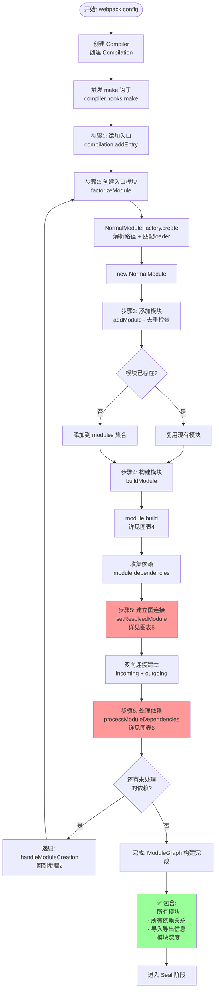
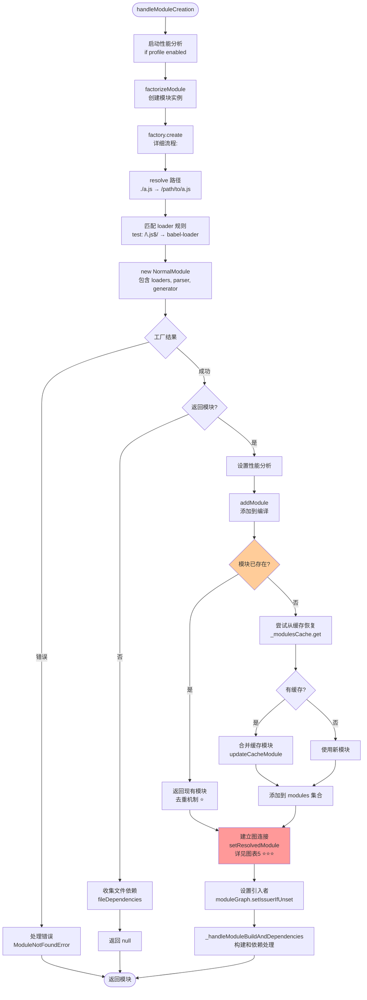
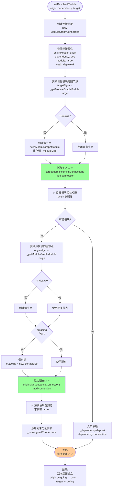
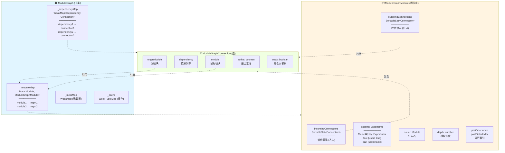
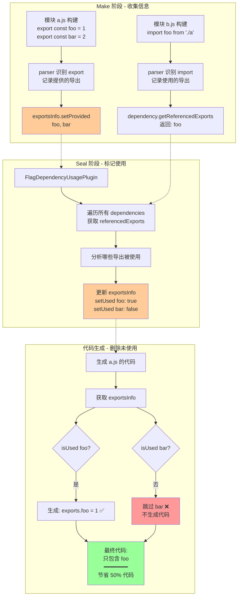
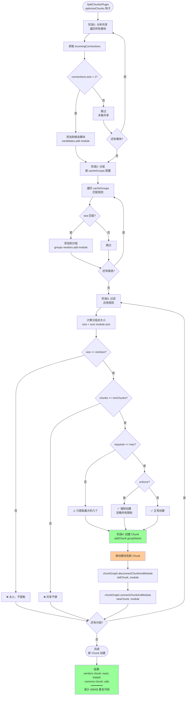
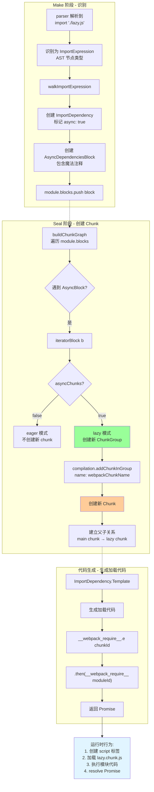

# 依赖图构建原理 - 可视化流程图

> 通过流程图完全理解 ModuleGraph 的构建过程

## 📋 图表目录

1. [主流程图 - 依赖图构建概览](#图表-1主流程图---依赖图构建概览)
2. [详细流程 - 入口处理](#图表-2详细流程---入口处理)
3. [详细流程 - 模块创建](#图表-3详细流程---模块创建)
4. [详细流程 - 模块构建与AST解析](#图表-4详细流程---模块构建与ast解析)
5. [详细流程 - 建立图连接](#图表-5详细流程---建立图连接)
6. [详细流程 - 依赖处理与递归](#图表-6详细流程---依赖处理与递归)
7. [数据结构关系图](#图表-7数据结构关系图)
8. [Tree Shaking 应用流程](#图表-8tree-shaking-应用流程)

---

## 图表 1：主流程图 - 依赖图构建概览

> 从 addEntry 到 ModuleGraph 完成的整体流程



---

## 图表 2：详细流程 - 入口处理

> addEntry 的详细步骤

```mermaid
graph TD
    Start([compilation.addEntry]) --> Extract[提取参数<br/>context, entry, options]

    Extract --> Normalize[规范化选项<br/>options = object or name]

    Normalize --> Call_addEntryItem[调用 _addEntryItem]

    Call_addEntryItem --> GetEntry{获取入口数据<br/>entryData}

    GetEntry -->|不存在| CreateNew[创建新入口数据<br/>entryData = {<br/>  dependencies: [],<br/>  includeDeps: [],<br/>  options: {...}<br/>}]

    GetEntry -->|已存在| MergeOptions[合并选项<br/>处理冲突]

    CreateNew --> AddDep
    MergeOptions --> CheckConflict{选项冲突?}
    CheckConflict -->|是| Error[抛出错误<br/>Conflicting options]
    CheckConflict -->|否| AddDep[添加依赖到列表<br/>entryData.dependencies]

    AddDep --> SaveEntry[保存到 entries Map<br/>entries.set name, entryData]

    SaveEntry --> HookAdd[触发 addEntry 钩子]

    HookAdd --> CallTree[调用 addModuleTree<br/>开始构建模块树]

    CallTree --> ValidateDep{验证依赖对象}
    ValidateDep -->|无效| ErrorDep[错误: 无效依赖]
    ValidateDep -->|有效| GetFactory[获取模块工厂<br/>dependencyFactories.get]

    GetFactory --> FactoryExists{工厂存在?}
    FactoryExists -->|否| ErrorFactory[错误: 无工厂]
    FactoryExists -->|是| CallCreate[调用 handleModuleCreation<br/>进入图表3]

    CallCreate --> Success[成功回调<br/>succeedEntry 钩子]
    Success --> End([完成])

    Error --> End
    ErrorDep --> End
    ErrorFactory --> End

    style CallTree fill:#ffcc99
    style CallCreate fill:#99ccff
```

---

## 图表 3：详细流程 - 模块创建

> handleModuleCreation 的核心逻辑



---

## 图表 4：详细流程 - 模块构建与AST解析

> module.build() 和 parser.parse() 的详细过程

```mermaid
graph TD
    Start([module.build]) --> Reset[重置模块状态<br/>清空 dependencies<br/>清空 errors/warnings]

    Reset --> InitBuild[初始化 buildInfo<br/>buildMeta = {}]

    InitBuild --> DoBuild[_doBuild<br/>执行 loader]

    DoBuild --> CreateContext[创建 loaderContext<br/>提供 loader API]
    CreateContext --> RunLoaders[runLoaders<br/>loader-runner]

    RunLoaders --> Pitching[Pitching 阶段<br/>从左到右]
    Pitching --> ReadFile[读取源文件<br/>fs.readFile]
    ReadFile --> Normal[Normal 阶段<br/>从右到左]

    Normal --> Loader3[loader3 source]
    Loader3 --> Loader2[loader2 transformed]
    Loader2 --> Loader1[loader1 final]

    Loader1 --> CreateSource[创建 Source 对象<br/>RawSource / SourceMapSource]

    CreateSource --> CheckAST{loader 返回<br/>预解析 AST?}
    CheckAST -->|是| UseAST[使用 loader 的 AST<br/>跳过 parse]
    CheckAST -->|否| NeedParse[需要解析]

    NeedParse --> Parse[parser.parse<br/>JavascriptParser]

    Parse --> AcornParse[acorn.parse<br/>生成 AST]
    AcornParse --> DetectMode[第1轮: detectMode<br/>检测严格模式]
    DetectMode --> PreWalk[第2轮: preWalkStatements<br/>收集声明]
    PreWalk --> BlockPreWalk[第3轮: blockPreWalkStatements<br/>块级作用域]
    BlockPreWalk --> Walk[第4轮: walkStatements<br/>识别依赖 ⭐⭐⭐]

    Walk --> ImportStmt{遇到 import?}
    ImportStmt -->|是| CreateHarmony[创建 HarmonyImportDependency<br/>添加到 dependencies]

    Walk --> RequireCall{遇到 require?}
    RequireCall -->|是| CreateCommonJs[创建 CommonJsRequireDependency<br/>添加到 dependencies]

    Walk --> ImportCall{遇到 import?}
    ImportCall -->|是| CreateImport[创建 ImportDependency<br/>+ AsyncDependenciesBlock<br/>添加到 blocks]

    Walk --> ExportStmt{遇到 export?}
    ExportStmt -->|是| CreateExport[创建 HarmonyExportDependency<br/>记录导出信息]

    CreateHarmony --> DepsCollected
    CreateCommonJs --> DepsCollected
    CreateImport --> DepsCollected
    CreateExport --> DepsCollected
    UseAST --> DepsCollected

    DepsCollected[依赖收集完成<br/>module.dependencies]

    DepsCollected --> SortDeps[排序依赖<br/>按源码位置]
    SortDeps --> InitHash[生成 buildHash]
    InitHash --> CreateSnapshot[创建文件快照<br/>用于 watch 模式]

    CreateSnapshot --> End([构建完成<br/>返回 module])

    style Walk fill:#ff9999
    style CreateImport fill:#ffcc99
```

---

## 图表 5：详细流程 - 建立图连接

> setResolvedModule 的详细实现（依赖图构建的核心！）



---

## 图表 6：详细流程 - 依赖处理与递归

> processModuleDependencies 的递归机制

```mermaid
graph TD
    Start([processModuleDependencies<br/>module]) --> Init[初始化数据结构<br/>sortedDependencies = []<br/>dependencies = Map]

    Init --> InitCache[初始化缓存变量<br/>factoryCacheKey<br/>listCacheKey1/2]

    InitCache --> InitCounter[初始化计数器<br/>inProgressSorting = 1<br/>inProgressTransitive = 1]

    InitCounter --> StartLoop[开始遍历<br/>queue = module]

    StartLoop --> PopBlock{队列非空?}
    PopBlock -->|否| AllDone[遍历完成]
    PopBlock -->|是| GetBlock[block = queue.pop]

    GetBlock --> HasDeps{block.dependencies?}
    HasDeps -->|是| LoopDeps[遍历 dependencies]
    HasDeps -->|否| CheckBlocks

    LoopDeps --> ProcessDep[processDependency<br/>设置父级引用]

    ProcessDep --> CheckCache{检查缓存}
    CheckCache -->|命中| UseCache[使用缓存模块]
    CheckCache -->|未命中| Resolve[processDependencyForResolving<br/>依赖分组]

    Resolve --> GetIdent[获取资源标识<br/>resourceIdent]
    GetIdent --> GetCategory[获取类别<br/>category = 'esm']
    GetCategory --> GetConstructor[获取构造函数<br/>HarmonyImportDependency]

    GetConstructor --> Cache1{缓存级别1<br/>构造函数相同?}
    Cache1 -->|是| SuperFast[⚡超快路径<br/>直接使用 listCacheValue]
    Cache1 -->|否| Cache2{缓存级别2<br/>工厂相同?}

    Cache2 -->|是| Fast[⚡快路径<br/>使用 factoryCacheValue]
    Cache2 -->|否| Slow[慢路径<br/>Map.get factory]

    SuperFast --> AddToGroup
    Fast --> AddToGroup
    Slow --> AddToGroup[添加到依赖组<br/>sortedDependencies.push]

    UseCache --> NextDep
    AddToGroup --> NextDep{还有依赖?}
    NextDep -->|是| LoopDeps
    NextDep -->|否| CheckBlocks

    CheckBlocks{block.blocks?}
    CheckBlocks -->|是| AddBlocks[添加嵌套块到队列]
    CheckBlocks -->|否| PopBlock
    AddBlocks --> PopBlock

    AllDone --> CallbackSort[onDependenciesSorted]

    CallbackSort --> CheckEmpty{有依赖组?}
    CheckEmpty -->|否| Finish[直接完成]
    CheckEmpty -->|是| IncreasePara[增加队列并行度]

    IncreasePara --> LoopGroups[遍历 sortedDependencies]

    LoopGroups --> CallHandle[🔄 递归调用<br/>handleModuleCreation<br/>回到图表3]

    CallHandle --> CountDown[计数器 - 1]
    CountDown --> AllComplete{所有完成?}
    AllComplete -->|否| Wait[等待...]
    AllComplete -->|是| DecreasePara[恢复队列并行度]

    DecreasePara --> Finish([完成<br/>所有依赖已处理])

    style CallHandle fill:#ff9999
    style SuperFast fill:#99ff99
    style AddToGroup fill:#ffcc99
```

---

## 图表 7：数据结构关系图

> ModuleGraph 的核心数据结构



---

## 图表 8：Tree Shaking 应用流程

> 如何利用依赖图实现 Tree Shaking



---

## 图表 9：代码分割流程

> SplitChunksPlugin 如何利用依赖图



---

## 图表 10：模块去重机制

> addModule 的去重逻辑

```mermaid
graph TD
    Start([addModule<br/>newModule]) --> GetId[获取唯一标识符<br/>identifier = module.identifier<br/>格式: type|path]

    GetId --> Example[示例:<br/>javascript/auto|/path/to/a.js]

    Example --> Lookup[查找已存在模块<br/>existing = _modules.get identifier]

    Lookup --> Exists{模块已存在?}

    Exists -->|是| ReturnExist[⭐ 返回现有模块<br/>不重复添加]

    Exists -->|否| TryCache[尝试从缓存恢复<br/>cached = _modulesCache.get identifier]

    TryCache --> HasCache{有缓存?}

    HasCache -->|是| Restore[恢复缓存模块<br/>cached.updateCacheModule newModule]
    HasCache -->|否| UseNew[使用新模块]

    Restore --> Merge[合并:<br/>工厂数据来自 newModule<br/>构建数据来自 cached]

    Merge --> UseCache[使用 cached 模块]

    UseCache --> AddMap
    UseNew --> AddMap[添加到 _modules Map<br/>添加到 modules Set]

    AddMap --> SetGraph[设置 moduleGraph 引用<br/>向后兼容]

    SetGraph --> Return([返回模块<br/>可能是 new/existing/cached])

    ReturnExist --> Scenario[场景示例:<br/>a.js import './common'<br/>b.js import './common'<br/>━━━━━━━<br/>common 只创建一次<br/>a 和 b 共享同一实例]

    style ReturnExist fill:#99ff99
    style UseCache fill:#ffcc99
    style Scenario fill:#e1f5ff
```

---

## 图表 11：循环依赖检测

> 如何检测和处理循环依赖

```mermaid
graph TD
    Start([检测循环依赖<br/>DFS 算法]) --> Init[初始化<br/>visiting = Set<br/>visited = Set<br/>cycles = []]

    Init --> StartDFS[对每个模块<br/>执行 DFS]

    StartDFS --> Visit[访问 module]

    Visit --> InVisiting{在 visiting 中?}

    InVisiting -->|是| Found[🔴 检测到环!<br/>记录循环路径]

    InVisiting -->|否| InVisited{在 visited 中?}

    InVisited -->|是| Skip[已访问<br/>跳过]

    InVisited -->|否| AddVisiting[添加到 visiting<br/>标记正在访问]

    AddVisiting --> GetOut[获取出边<br/>getOutgoingConnections]

    GetOut --> LoopOut[遍历出边<br/>for conn of connections]

    LoopOut --> RecurDFS[递归 DFS<br/>visit conn.module]

    RecurDFS --> MoreOut{还有出边?}
    MoreOut -->|是| LoopOut
    MoreOut -->|否| RemoveVisiting[从 visiting 移除]

    RemoveVisiting --> AddVisited[添加到 visited<br/>标记已完成]

    AddVisited --> NextModule{还有模块?}
    NextModule -->|是| StartDFS
    NextModule -->|否| Report

    Found --> Report[报告循环依赖<br/>Warning: a → b → c → a]

    Skip --> NextModule

    Report --> Handle[处理策略:<br/>⚠️ 警告但不阻止<br/>✅ 调整加载顺序<br/>✅ 使用延迟执行]

    Handle --> End([完成])

    style Found fill:#ff9999
    style Handle fill:#ffcc99
```

---

## 图表 12：动态导入处理

> import() 如何创建新 Chunk



---

## 使用说明

### 如何阅读这些流程图

**学习路径**：
1. 先看 **图表1 - 主流程图**（整体概览）
2. 按需查看详细流程图（深入细节）
3. 理解数据结构关系图（图表7）
4. 学习应用场景（图表8-12）

**流程图说明**：
- 🔴 红色：核心步骤
- 🟢 绿色：完成/成功
- 🟡 黄色：重要节点
- ⭐ 星标：特别重要

**节点类型**：
- `[矩形]`: 处理步骤
- `{菱形}`: 判断条件
- `([圆角])`: 开始/结束
- `subgraph`: 分组/阶段

---

## 关键要点速查

### ModuleGraph 核心

```
两个核心 Map：
├─ _dependencyMap: Dependency → Connection (WeakMap)
└─ _moduleMap: Module → ModuleGraphModule (Map)

双向连接：
├─ incoming: 谁依赖我 (Tree Shaking)
└─ outgoing: 我依赖谁 (递归构建)
```

### 构建核心

```
递归三要素：
1. factorizeModule - 创建模块
2. setResolvedModule - 建立连接 ⭐⭐⭐
3. processModuleDependencies - 递归处理

去重机制：
identifier = type|path
_modules.get(identifier) → 复用已存在
```

### 性能优化

```
三级缓存：
├─ 超快路径: 99% (构造函数相同)
├─ 快路径: 0.9% (工厂相同)
└─ 慢路径: 0.1% (Map 查找)

内存优化：
├─ WeakMap: 自动 GC
├─ 懒创建: 节省 50% 内存
└─ 去重: 避免重复构建
```

---

**相关文档**：
- 05-依赖图构建原理详解.md（文字详解）
- 04-Webpack核心运行流程详解.md（完整流程）
- 08-构建阶段（Make）.md（Make 阶段）

**相关代码**（已添加详细逐行注释）：
- lib/ModuleGraph.js（80% 注释）
- lib/Compilation.js（85% 注释，核心方法 100%）
- lib/NormalModuleFactory.js（85% 注释）

