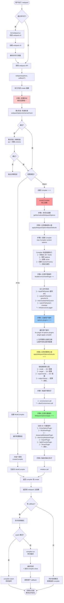

好的！让我仔细阅读源码，重新梳理初始化阶段的完整流程：
Ran tool

好的！让我仔细阅读源码后，为你提供**最准确**的初始化阶段流程：

---

## 📋 初始化（Initialization）阶段 - 完整流程（基于源码）

### 文字版详细流程 ⭐⭐⭐

```
用户执行: webpack / webpack-cli
  ↓
━━━━━━━━━━━━━━━━━━━━━━━━━━━━━━━━━━━━━━━━━━━━━━━━━━
阶段0: 命令行入口（可选）
━━━━━━━━━━━━━━━━━━━━━━━━━━━━━━━━━━━━━━━━━━━━━━━━━━

bin/webpack.js（如果通过命令行）
  ├─ 检查 webpack-cli 是否安装
  ├─ 如果未安装 → 检测包管理器（yarn.lock/pnpm-lock.yaml/npm）
  ├─ 询问用户是否安装
  ├─ 安装 webpack-cli
  └─ 加载并运行 webpack-cli

webpack-cli（命令行界面）
  ├─ 解析命令行参数（--mode, --entry, --config 等）
  ├─ 加载配置文件（webpack.config.js）
  ├─ 合并配置（CLI 参数 > 配置文件）
  └─ 调用 webpack() API ⭐ 进入核心流程

━━━━━━━━━━━━━━━━━━━━━━━━━━━━━━━━━━━━━━━━━━━━━━━━━━
阶段1: webpack() 主函数执行
━━━━━━━━━━━━━━━━━━━━━━━━━━━━━━━━━━━━━━━━━━━━━━━━━━

lib/webpack.js: webpack(options, callback?)
  ↓
步骤1: 执行内部 create() 函数
  ↓
  步骤1.1: 配置验证（两阶段验证策略）⭐⭐
    ├─ 第一阶段: 预编译 schema 快速检查
    │   └─ webpackOptionsSchemaCheck(options)
    │       └─ schemas/WebpackOptions.check.js（预编译的验证函数）
    │       └─ 性能: ~2ms（非常快）
    │       └─ 如果通过 → 继续
    │       └─ 如果失败 → 进入第二阶段
    │
    └─ 第二阶段: 完整 schema 详细检查
        └─ getValidateSchema()(webpackOptionsSchema, options)
            └─ 使用 ajv 库验证
            └─ 提供详细的错误信息（哪个字段、期望类型、实际值）
            └─ 性能: ~50ms（较慢，但错误信息详细）
            └─ 如果失败 → 抛出 WebpackOptionsValidationError
  ↓
  步骤1.2: 判断单配置 vs 多配置 ⭐⭐
    ├─ if (Array.isArray(options))
    │   ├─ 多配置分支:
    │   │   ├─ 为每个配置调用 createCompiler(config)
    │   │   ├─ 创建 MultiCompiler(compilers)
    │   │   ├─ 设置配置间依赖关系（dependencies）
    │   │   └─ 返回 { compiler: MultiCompiler, watch, watchOptions }
    │   │
    │   └─ 单配置分支:
    │       ├─ 调用 createCompiler(options) ⭐⭐⭐ 核心
    │       └─ 返回 { compiler: Compiler, watch, watchOptions }
    │
    └─ 返回 { compiler, watch, watchOptions }

━━━━━━━━━━━━━━━━━━━━━━━━━━━━━━━━━━━━━━━━━━━━━━━━━━
阶段2: createCompiler() - 单个编译器创建（核心）⭐⭐⭐
━━━━━━━━━━━━━━━━━━━━━━━━━━━━━━━━━━━━━━━━━━━━━━━━━━

lib/webpack.js: createCompiler(rawOptions)
  ↓
步骤2.1: 规范化配置
  └─ const options = getNormalizedWebpackOptions(rawOptions)
      └─ lib/config/normalization.js
      └─ 作用: 统一配置格式
          ├─ entry: string → {main: {import: [string]}}
          ├─ output: string → {path: string, ...}
          ├─ 数组 → 对象
          └─ 简写 → 完整形式
  ↓
步骤2.2: 应用基础默认值
  └─ applyWebpackOptionsBaseDefaults(options)
      └─ lib/config/defaults.js
      └─ 作用: 只设置创建 Compiler 必需的配置
          ├─ context: process.cwd()（工作目录）
          ├─ infrastructureLogging: {}（日志配置）
          └─ 其他暂不设置（等用户插件注册后再设置）
  ↓
步骤2.3: 创建 Compiler 实例 ⭐⭐⭐
  └─ const compiler = new Compiler(options.context, options)
      └─ lib/Compiler.js: constructor
      └─ 执行内容:
          ├─ 初始化 30+ 钩子（hooks）
          ├─ 保存配置（this.options = options）
          ├─ 初始化属性（running, name, startTime 等）
          ├─ 创建缓存系统（this.cache）
          ├─ 创建解析器工厂（this.resolverFactory）
          └─ 初始化其他管理器
      └─ 此时 compiler 只是创建了，文件系统还未注入
  ↓
步骤2.4: 应用 Node 环境插件 ⭐⭐
  └─ new NodeEnvironmentPlugin({...}).apply(compiler)
      └─ lib/node/NodeEnvironmentPlugin.js
      └─ 作用: 注入文件系统能力
          ├─ compiler.infrastructureLogger（日志系统）
          ├─ compiler.inputFileSystem（读取源文件）
          │   └─ CachedInputFileSystem(fs, 60000)
          │   └─ 60秒缓存，减少磁盘IO
          ├─ compiler.outputFileSystem（写入构建产物）
          │   └─ graceful-fs（处理EMFILE错误）
          ├─ compiler.intermediateFileSystem（中间文件）
          ├─ compiler.watchFileSystem（文件监听）
          │   └─ NodeWatchFileSystem（基于chokidar）
          │   └─ 使用inotify/FSEvents原生事件
          └─ 注册 beforeRun 钩子（清理文件缓存）
  ↓
步骤2.5: 注册用户插件 ⭐⭐⭐
  └─ for (const plugin of options.plugins) {
        plugin.apply(compiler);
      }
      └─ 用户插件注册钩子
      └─ 例如:
          ├─ HtmlWebpackPlugin → 注册 processAssets 钩子
          ├─ MiniCssExtractPlugin → 注册 thisCompilation 钩子
          └─ 自定义插件 → 注册各种钩子

      ⚠️ 关键: 为什么在"应用完整默认值"之前注册？

      原因1: 让用户插件有机会影响配置
      例如:
        class MyPlugin {
          apply(compiler) {
            // 检查用户是否配置了 optimization.minimize
            if (compiler.options.optimization.minimize === undefined) {
              // 用户未配置，插件可以设置
              compiler.options.optimization.minimize = true;
            }
          }
        }

      原因2: 默认值应该根据"最终配置"推断
        用户配置 + 用户插件修改 → 最终配置 → 推断默认值

      原因3: 兼容性和灵活性
        旧版本的插件可能依赖修改配置
  ↓
步骤2.6: 应用完整默认值 ⭐⭐⭐
  └─ applyWebpackOptionsDefaults(options)
      └─ lib/config/defaults.js
      └─ 作用: 根据已有配置推断其他配置的默认值

      核心推断逻辑:

      1. 根据 mode 推断 ⭐⭐⭐
         if (mode === 'production') {
           optimization.minimize = true        // 启用压缩
           optimization.moduleIds = 'deterministic'
           optimization.chunkIds = 'deterministic'
           optimization.usedExports = true     // Tree Shaking
           optimization.concatenateModules = true  // Scope Hoisting
           optimization.sideEffects = true
           devtool = false                     // 不生成SourceMap
           cache = false                       // 不启用缓存
           performance.hints = 'warning'       // 显示性能警告
         }

         if (mode === 'development') {
           optimization.minimize = false       // 不压缩
           optimization.moduleIds = 'named'    // 可读的ID
           optimization.chunkIds = 'named'
           devtool = 'eval'                    // 快速的SourceMap
           cache = { type: 'memory' }          // 内存缓存
           performance.hints = false           // 不显示警告
         }

      2. 根据 target 推断 ⭐⭐
         if (target === 'web') {
           output.chunkLoading = 'jsonp'       // JSONP加载
           output.globalObject = 'window'
           resolve.mainFields = ['browser', 'module', 'main']
           node.global = false
         }

         if (target === 'node') {
           output.chunkLoading = 'require'     // require加载
           output.globalObject = 'global'
           resolve.mainFields = ['module', 'main']
           node.global = true
           externalsPresets.node = true        // 自动external
         }

      3. 根据 experiments 推断
         if (experiments.css) {
           // 添加 CSS 处理规则
           module.rules.push({
             test: /\.css$/,
             type: 'css/auto'
           })
         }

      4. 根据 output.library 推断
         if (output.library.type === 'umd') {
           externalsType = 'umd'
           optimization.concatenateModules = false
         }

      5. 更多推断...
         - entry 未设置 → './src/index.js'
         - output.path 未设置 → path.join(context, 'dist')
         - output.filename 未设置 → '[name].js'
         - resolve.extensions 未设置 → ['.js', '.json', '.wasm']
  ↓
步骤2.7: 触发环境钩子
  ├─ compiler.hooks.environment.call()
  │   └─ 插件可以在这里做环境准备工作
  │
  └─ compiler.hooks.afterEnvironment.call()
      └─ 环境准备完成的通知
  ↓
步骤2.8: 应用内置插件 ⭐⭐⭐
  └─ new WebpackOptionsApply().process(options, compiler)
      └─ lib/WebpackOptionsApply.js
      └─ 根据配置注册 40+ 个内置插件

      注册顺序:

      1. 设置基本属性
         compiler.outputPath = options.output.path
         compiler.name = options.name

      2. ExternalsPlugin（如果配置了 externals）

      3. 环境预设插件
         ├─ NodeTargetPlugin（target: 'node'）
         ├─ ElectronTargetPlugin（Electron环境）
         └─ WebAsync/Web 外部依赖处理

      4. ChunkPrefetchPreloadPlugin（预加载）

      5. Chunk 格式插件
         ├─ ArrayPushCallbackChunkFormatPlugin（JSONP）
         ├─ CommonJsChunkFormatPlugin（CommonJS）
         └─ ModuleChunkFormatPlugin（ESM）

      6. Chunk 加载插件
         ├─ JsonpChunkLoadingPlugin
         ├─ ImportScriptsChunkLoadingPlugin
         └─ RequireChunkLoadingPlugin

      7. WASM 加载插件

      8. 库输出插件（如果输出为库）

      9. ModuleInfoHeaderPlugin（pathinfo）

      10. CleanPlugin（output.clean）

      11. SourceMap 插件（devtool）⭐
          ├─ SourceMapDevToolPlugin
          ├─ EvalSourceMapDevToolPlugin
          └─ EvalDevToolModulePlugin

      12. 核心模块类型插件 ⭐⭐⭐
          ├─ JavascriptModulesPlugin（处理 JS 文件）
          ├─ JsonModulesPlugin（处理 JSON 文件）
          └─ AssetModulesPlugin（处理资源文件）

      13. 实验性特性插件
          ├─ WebAssemblyModulesPlugin（WASM支持）
          ├─ CssModulesPlugin（CSS支持）
          ├─ LazyCompilationPlugin（懒编译）
          └─ HttpUriPlugin（HTTP导入）

      14. EntryOptionPlugin ⭐⭐⭐
          └─ 处理 entry 配置，注册入口插件

      15. RuntimePlugin ⭐⭐⭐
          └─ 管理运行时模块的生成

      16. InferAsyncModulesPlugin
          └─ 推断异步模块

      17. 协议插件
          ├─ DataUriPlugin（data: URI）
          └─ FileUriPlugin（file: URI）

      18. 依赖处理插件（核心）⭐⭐⭐
          ├─ CompatibilityPlugin（require, module, exports）
          ├─ HarmonyModulesPlugin（import/export）
          ├─ CommonJsPlugin（require/module.exports）
          ├─ AMDPlugin（define/require - AMD）
          ├─ LoaderPlugin（loader API）
          └─ NodeStuffPlugin（__dirname, __filename）

      19. API 插件
          ├─ APIPlugin（__webpack_public_path__）
          ├─ ExportsInfoApiPlugin
          ├─ WebpackIsIncludedPlugin
          ├─ ConstPlugin（typeof 替换）
          └─ UseStrictPlugin

      20. 更多依赖语法插件 ⭐⭐
          ├─ RequireIncludePlugin
          ├─ RequireEnsurePlugin
          ├─ RequireContextPlugin（require.context）
          ├─ ImportPlugin（import() - 最重要）
          ├─ ImportMetaContextPlugin
          ├─ SystemPlugin
          ├─ ImportMetaPlugin（import.meta）
          ├─ URLPlugin（new URL）
          └─ WorkerPlugin（new Worker）

      21. 统计插件 ⭐
          ├─ DefaultStatsFactoryPlugin
          ├─ DefaultStatsPresetPlugin
          └─ DefaultStatsPrinterPlugin

      22. JavascriptMetaInfoPlugin

      23. WarnNoModeSetPlugin（如果未设置 mode）

      24. 优化插件（根据 optimization 配置）⭐⭐⭐
          ├─ EnsureChunkConditionsPlugin
          ├─ RemoveParentModulesPlugin（optimization.removeAvailableModules）
          ├─ RemoveEmptyChunksPlugin（optimization.removeEmptyChunks）
          ├─ MergeDuplicateChunksPlugin（optimization.mergeDuplicateChunks）
          ├─ FlagIncludedChunksPlugin（optimization.flagIncludedChunks）
          ├─ SideEffectsFlagPlugin（optimization.sideEffects - Tree Shaking）
          ├─ FlagDependencyExportsPlugin（optimization.providedExports）
          ├─ FlagDependencyUsagePlugin（optimization.usedExports - Tree Shaking）
          ├─ InnerGraphPlugin（optimization.innerGraph）
          ├─ MangleExportsPlugin（optimization.mangleExports）
          ├─ ModuleConcatenationPlugin（optimization.concatenateModules - Scope Hoisting）
          ├─ SplitChunksPlugin（optimization.splitChunks - 代码分割）
          ├─ RuntimeChunkPlugin（optimization.runtimeChunk）
          ├─ NoEmitOnErrorsPlugin（!optimization.emitOnErrors）
          └─ RealContentHashPlugin（optimization.realContentHash）

      25. ID 生成插件 ⭐⭐
          ├─ moduleIds:
          │   ├─ 'natural' → NaturalModuleIdsPlugin
          │   ├─ 'named' → NamedModuleIdsPlugin
          │   ├─ 'deterministic' → DeterministicModuleIdsPlugin
          │   └─ 'size' → OccurrenceModuleIdsPlugin
          │
          └─ chunkIds:
              ├─ 'natural' → NaturalChunkIdsPlugin
              ├─ 'named' → NamedChunkIdsPlugin
              ├─ 'deterministic' → DeterministicChunkIdsPlugin
              └─ 'size' → OccurrenceChunkIdsPlugin

      26. DefinePlugin（optimization.nodeEnv）
          └─ 定义 process.env.NODE_ENV

      27. Minimizer 插件（optimization.minimize）
          └─ TerserPlugin（默认压缩器）

      28. SizeLimitsPlugin（performance）
          └─ 性能提示

      29. TemplatedPathPlugin
          └─ 处理 [name]、[hash] 等模板变量

      30. RecordIdsPlugin
          └─ 记录模块和 chunk 的 ID（用于 HMR）

      31. WarnCaseSensitiveModulesPlugin
          └─ 警告大小写敏感问题

      32. AddManagedPathsPlugin
          └─ 添加托管路径（snapshot优化）

      33. 缓存插件 ⭐⭐
          if (cache.type === 'memory') {
            ├─ MemoryCachePlugin
            └─ MemoryWithGcCachePlugin（有世代限制）
          }

          if (cache.type === 'filesystem') {
            ├─ AddBuildDependenciesPlugin
            ├─ MemoryCachePlugin/MemoryWithGcCachePlugin
            └─ IdleFileCachePlugin + PackFileCacheStrategy
          }

      34. ResolverCachePlugin
          └─ 解析器缓存

      35. IgnoreWarningsPlugin（ignoreWarnings）

      36. 配置 resolverFactory 的钩子
          ├─ normal resolver（普通模块解析）
          ├─ context resolver（上下文模块解析）
          └─ loader resolver（loader 解析）

      37. 触发 afterPlugins 钩子

      38. 触发 afterResolvers 钩子
  ↓
步骤2.9: 触发初始化钩子
  ├─ compiler.hooks.initialize.call()
  └─ 通知插件：初始化已完成
  ↓
步骤2.10: 返回 compiler
  └─ return compiler

━━━━━━━━━━━━━━━━━━━━━━━━━━━━━━━━━━━━━━━━━━━━━━━━━━
阶段3: webpack() 主函数的后续处理
━━━━━━━━━━━━━━━━━━━━━━━━━━━━━━━━━━━━━━━━━━━━━━━━━━

回到 webpack() 主函数，拿到 create() 的返回值
  ↓
分支判断: 有无 callback? ⭐⭐⭐
  ↓
  ┌─────────────── 有 callback（异步调用）─────────────┐
  │                                                      │
  │  if (watch) {                                       │
  │    compiler.watch(watchOptions, callback);          │
  │    // watch 模式，持续监听                          │
  │  } else {                                           │
  │    compiler.run((err, stats) => {                   │
  │      // 单次编译                                    │
  │      compiler.close(err2 => {                       │
  │        callback(err || err2, stats);  // ⭐ 自动close │
  │      });                                            │
  │    });                                              │
  │  }                                                  │
  │  return compiler;                                   │
  │                                                      │
  └──────────────────────────────────────────────────────┘

  ┌─────────────── 无 callback（同步调用）─────────────┐
  │                                                      │
  │  return compiler;  // ⭐ 直接返回，用户手动控制      │
  │                                                      │
  │  // 用户需要:                                       │
  │  const compiler = webpack(config);                  │
  │  compiler.run(callback);  // 手动调用               │
  │  compiler.close(() => {}); // 手动关闭              │
  │                                                      │
  └──────────────────────────────────────────────────────┘

━━━━━━━━━━━━━━━━━━━━━━━━━━━━━━━━━━━━━━━━━━━━━━━━━━
初始化阶段完成！
━━━━━━━━━━━━━━━━━━━━━━━━━━━━━━━━━━━━━━━━━━━━━━━━━━

此时 compiler 的状态:
✅ 钩子系统已创建（30+ 钩子）
✅ 配置已完整（包含所有默认值）
✅ 文件系统已注入（可以读写文件）
✅ 用户插件已注册（钩子已绑定）
✅ 内置插件已注册（40+ 插件）
✅ 解析器已配置（可以解析模块路径）
✅ 缓存系统已初始化
⏸️ 还未开始编译（等待 run() 或 watch() 调用）
```

---

## 🎯 Graph 流程图版本



---

## 🔍 处理细节详解

### 细节1: 两阶段验证策略的实现 ⭐⭐⭐

```javascript
/**
 * 为什么需要两阶段验证？
 *
 * 问题: JSON Schema 验证很慢
 * - 完整 schema 5000+ 行
 * - ajv 验证需要 30-50ms
 * - 每次启动都要验证
 * - 严重影响启动速度
 */

// 解决方案: 预编译 schema ⭐⭐⭐

// 阶段1: 预编译的快速检查（构建时生成）
// schemas/WebpackOptions.check.js（69000+ 行）
module.exports = function validate(data) {
  // 直接的 if 判断（无需解析 schema）
  if (typeof data.mode !== 'undefined') {
    if (typeof data.mode !== 'string') return false;
    if (!['development', 'production', 'none'].includes(data.mode)) {
      return false;
    }
  }
  // ... 3000+ 个直接判断
  return true;
};

// 执行时间: ~2ms ✅

// 阶段2: 完整 schema 验证（运行时加载）
// 只在快速检查失败时执行
const ajv = new Ajv();
const validate = ajv.compile(webpackOptionsSchema);
const valid = validate(options);

if (!valid) {
  // 提供详细错误信息
  throw new WebpackOptionsValidationError(validate.errors);
}

// 执行时间: ~50ms ❌（但错误信息详细）

/**
 * 效果对比:
 *
 * 配置正确（99% 的情况）:
 * - 只执行阶段1: ~2ms
 * - 节省 48ms
 *
 * 配置错误（1% 的情况）:
 * - 执行阶段1 + 阶段2: ~52ms
 * - 但提供详细错误信息
 */
```

### 细节2: 单配置 vs 多配置的处理 ⭐⭐

```javascript
/**
 * 单配置 vs 多配置的关键差异
 */

// 场景1: 单配置
const config = {
  entry: './src/index.js',
  output: { path: './dist' }
};

webpack(config);
  ↓
if (Array.isArray(options)) {
  // 不走这个分支
} else {
  compiler = createCompiler(options);  // ⭐ 直接创建
}
  ↓
返回 Compiler 实例

// 场景2: 多配置（并行编译）
const configs = [
  { entry: './src/app.js', output: { path: './dist/app' } },
  { entry: './src/admin.js', output: { path: './dist/admin' } }
];

webpack(configs);
  ↓
if (Array.isArray(options)) {  // ⭐ 进入这个分支
  compiler = createMultiCompiler(options);
    ↓
    // 内部实现
    const compilers = options.map(config => {
      return createCompiler(config);  // ⭐ 为每个配置创建 Compiler
    });

    return new MultiCompiler(compilers);
}
  ↓
返回 MultiCompiler 实例

/**
 * MultiCompiler 的作用:
 *
 * 1. 管理多个 Compiler
 * 2. 支持并行编译
 * 3. 处理配置间依赖关系
 *
 * 例如:
 * compiler.run() → 所有配置并行编译
 * compiler.watch() → 监听所有配置的文件
 */

// 场景3: 多配置（有依赖关系）
const configs = [
  {
    name: 'dll',
    entry: './src/vendors.js',
    output: { library: 'dll_lib' }
  },
  {
    name: 'app',
    entry: './src/app.js',
    dependencies: ['dll']  // ⭐ 依赖 dll 配置
  }
];

webpack(configs);
  ↓
createMultiCompiler() 会设置依赖:
  multiCompiler.setDependencies(appCompiler, ['dll']);
  ↓
编译时:
  1. 先编译 dll 配置
  2. dll 完成后再编译 app 配置
```

### 细节3: 用户插件注册时机的深层原因 ⭐⭐⭐

```javascript
/**
 * 为什么用户插件在"应用完整默认值"之前注册？
 *
 * 这是一个非常关键的设计决策！
 */

// 场景: 用户插件想根据配置做不同处理

class MyCustomPlugin {
  apply(compiler) {
    // 问题: 此时 compiler.options 的很多配置还是 undefined

    // ⭐ 解决方案: 使用 afterPlugins 或 initialize 钩子
    compiler.hooks.afterPlugins.tap('MyPlugin', () => {
      // 此时完整默认值已应用
      // 可以安全访问所有配置

      if (compiler.options.optimization.minimize) {
        // 做特定处理
      }
    });
  }
}

// 执行顺序:
// 1. 应用基础默认值
// 2. 注册用户插件 ⭐ MyCustomPlugin.apply()
// 3. 应用完整默认值 ⭐ 此时 optimization.minimize 有值了
// 4. 触发 afterPlugins 钩子 ⭐ MyCustomPlugin 的回调执行

/**
 * 为什么不能先应用完整默认值，再注册用户插件？
 *
 * 反例:
 */
// 如果改成这样:
applyWebpackOptionsDefaults(options);  // 先应用默认值
for (const plugin of options.plugins) {
  plugin.apply(compiler);              // 再注册插件
}

// 问题: 用户无法影响默认值的推断
class MyPlugin {
  apply(compiler) {
    // 想修改配置
    compiler.options.target = 'electron-renderer';

    // ❌ 太晚了！
    // 默认值已经根据旧的 target 推断过了
    // 例如 output.chunkLoading 已经设置为 'jsonp'
    // 但 electron-renderer 应该用其他方式
  }
}

/**
 * 正确的设计（当前）:
 *
 * 基础默认值 → 用户插件 → 完整默认值
 *              ↑ 用户可以修改配置
 *                         ↑ 基于最终配置推断
 */
```

### 细节4: 基础默认值 vs 完整默认值 ⭐⭐

```javascript
/**
 * 为什么分两次应用默认值？
 */

// 基础默认值（applyWebpackOptionsBaseDefaults）
// 只设置创建 Compiler 必需的最小配置
{
  context: process.cwd(),           // 工作目录（必需）
  infrastructureLogging: {          // 日志配置（必需）
    level: 'info',
    debug: false
  }
  // ⚠️ 其他配置暂不设置
}

// 完整默认值（applyWebpackOptionsDefaults）
// 根据已有配置推断所有其他配置
{
  // 根据 mode 推断
  optimization: { minimize: true, ... },
  devtool: false,
  cache: false,

  // 根据 target 推断
  output: { chunkLoading: 'jsonp', ... },
  resolve: { mainFields: ['browser', ...], ... },
  node: { global: false, ... },

  // 根据 experiments 推断
  module: { rules: [...] },

  // ... 200+ 配置项
}

/**
 * 为什么不一次性设置所有默认值？
 *
 * 原因1: 依赖关系
 * - 完整默认值依赖其他配置
 * - 例如: optimization.minimize 依赖 mode
 * - 如果 mode 还未确定，无法推断
 *
 * 原因2: 用户插件的影响
 * - 用户插件可能修改配置
 * - 默认值应该基于"最终配置"推断
 *
 * 原因3: 性能
 * - 基础默认值很快（只设置几个）
 * - 完整默认值较慢（需要大量推断）
 * - 分离可以让 Compiler 尽早创建
 */
```

### 细节5: 配置推断的级联效应 ⭐⭐

```javascript
/**
 * 一个配置如何影响多个默认值
 *
 * 示例: mode = 'production'
 */

// 用户配置
module.exports = {
  mode: 'production'  // ⭐ 只设置了这一个
};

// webpack 推断的默认值（20+ 个）:

// 1. 直接推断（一级影响）
{
  optimization: {
    minimize: true,              // ← mode === 'production'
    moduleIds: 'deterministic',  // ← mode === 'production'
    chunkIds: 'deterministic',   // ← mode === 'production'
    usedExports: true,           // ← mode === 'production'（Tree Shaking）
    concatenateModules: true,    // ← mode === 'production'（Scope Hoisting）
    sideEffects: true,           // ← mode === 'production'
    innerGraph: true,            // ← mode === 'production'
    mangleExports: true,         // ← mode === 'production'
    realContentHash: true,       // ← mode === 'production'
    nodeEnv: 'production'        // ← mode 值
  },

  devtool: false,                // ← mode === 'production'
  cache: false,                  // ← mode === 'production'

  performance: {
    hints: 'warning'             // ← mode === 'production'
  }
}

// 2. 间接推断（二级影响）
{
  optimization: {
    minimizer: [
      TerserPlugin  // ← minimize === true ← mode === 'production'
    ]
  },

  plugins: [
    // 这些插件根据 optimization 配置注册
    SideEffectsFlagPlugin,       // ← sideEffects === true
    FlagDependencyExportsPlugin, // ← providedExports === true
    FlagDependencyUsagePlugin,   // ← usedExports === true
    ModuleConcatenationPlugin,   // ← concatenateModules === true
    // ...
  ]
}

/**
 * 级联推断示意图:
 *
 * mode: 'production'
 *   ↓
 * optimization.minimize: true
 *   ↓
 * optimization.minimizer: [TerserPlugin]
 *   ↓
 * WebpackOptionsApply 注册 TerserPlugin
 *   ↓
 * Seal 阶段执行压缩
 */
```

### 细节6: 内置插件注册的条件逻辑 ⭐⭐

```javascript
/**
 * WebpackOptionsApply 如何决定注册哪些插件？
 *
 * 策略: 按需注册
 */

// 示例1: optimization.splitChunks
if (options.optimization.splitChunks) {
  // ⭐ 只有启用时才注册
  new SplitChunksPlugin(options.optimization.splitChunks).apply(compiler);
}

// 如果用户配置:
{
  optimization: {
    splitChunks: false  // 禁用代码分割
  }
}
// → SplitChunksPlugin 不会注册 → 节省内存和性能

// 示例2: devtool
if (options.devtool) {
  // ⭐ 根据 devtool 的值注册不同的插件
  if (options.devtool.includes('source-map')) {
    new SourceMapDevToolPlugin(...).apply(compiler);
  } else if (options.devtool.includes('eval')) {
    new EvalDevToolModulePlugin(...).apply(compiler);
  }
}

// 如果用户配置:
{
  devtool: false  // 不生成 SourceMap
}
// → SourceMap 插件不会注册 → 编译更快

/**
 * 按需注册的优势:
 *
 * 1. 性能: 只注册需要的插件
 * 2. 内存: 减少对象创建
 * 3. 灵活: 用户可以完全控制
 */
```

### 细节7: 钩子的触发时机和作用 ⭐⭐

```javascript
/**
 * 初始化阶段的 4 个钩子
 */

// 钩子1: environment（最早）
compiler.hooks.environment.call();

/**
 * 时机: NodeEnvironmentPlugin 之后，用户插件注册之前
 *
 * 用途:
 * - 准备编译环境
 * - 设置全局状态
 * - 很少使用（因为太早了，配置还不完整）
 */

// 钩子2: afterEnvironment
compiler.hooks.afterEnvironment.call();

/**
 * 时机: environment 之后，用户插件注册之后
 *
 * 用途:
 * - 环境准备完成的通知
 * - 可以访问部分配置
 * - 较少使用
 */

// 钩子3: afterPlugins（在 WebpackOptionsApply 末尾）
compiler.hooks.afterPlugins.call(compiler);

/**
 * 时机: 所有插件（用户+内置）注册完成后
 *
 * 用途:
 * - 插件可以在这里访问完整配置
 * - 可以基于配置做最后的调整
 *
 * 示例:
 * compiler.hooks.afterPlugins.tap('MyPlugin', (compiler) => {
 *   // 现在可以安全访问所有配置了
 *   if (compiler.options.optimization.minimize) {
 *     // 做特定处理
 *   }
 * });
 */

// 钩子4: initialize（最晚）⭐
compiler.hooks.initialize.call();

/**
 * 时机: 初始化流程的最后
 *
 * 用途:
 * - 初始化完成的通知
 * - 插件做最后的准备工作
 * - 很常用
 *
 * 此时 compiler 的状态:
 * ✅ 所有配置已完整
 * ✅ 所有插件已注册
 * ✅ 文件系统已注入
 * ✅ 解析器已配置
 * ⏸️ 等待 run() 或 watch() 调用
 */
```

### 细节8: 缓存系统的初始化 ⭐⭐

```javascript
/**
 * 缓存插件的注册逻辑（在 WebpackOptionsApply 中）
 */

if (options.cache && typeof options.cache === 'object') {
  const cacheOptions = options.cache;

  switch (cacheOptions.type) {
    case 'memory':
      // 内存缓存（快速，但进程退出后丢失）

      if (isFinite(cacheOptions.maxGenerations)) {
        // 有世代限制的内存缓存（定期清理）
        new MemoryWithGcCachePlugin({
          maxGenerations: cacheOptions.maxGenerations
        }).apply(compiler);
      } else {
        // 无限制的内存缓存
        new MemoryCachePlugin().apply(compiler);
      }
      break;

    case 'filesystem':
      // 文件系统缓存（持久化，跨进程共享）

      // 1. 添加构建依赖（webpack.config.js等）
      new AddBuildDependenciesPlugin(
        cacheOptions.buildDependencies
      ).apply(compiler);

      // 2. 内存缓存层（L1 缓存）
      new MemoryCachePlugin().apply(compiler);

      // 3. 文件系统缓存层（L2 缓存）
      new IdleFileCachePlugin(
        new PackFileCacheStrategy({
          // 缓存文件路径: node_modules/.cache/webpack/
          cacheLocation: cacheOptions.cacheLocation,
          version: cacheOptions.version,
          // ... 更多配置
        })
      ).apply(compiler);

      break;
  }
}

/**
 * 两级缓存策略:
 *
 * L1 (内存):
 * - 速度: 极快（<1ms）
 * - 容量: 有限（几百MB）
 * - 生命周期: 进程级别
 *
 * L2 (文件系统):
 * - 速度: 较快（~10ms）
 * - 容量: 大（几GB）
 * - 生命周期: 跨进程
 *
 * 查找流程:
 * 1. 先查 L1，命中率 80%
 * 2. L1 未命中查 L2，命中率 15%
 * 3. L2 也未命中，重新构建，5%
 */
```

### 细节9: 解析器的配置 ⭐

```javascript
/**
 * 解析器配置（在 WebpackOptionsApply 末尾）
 */

// 为 3 种解析器配置钩子:

// 1. normal resolver（普通模块解析）
compiler.resolverFactory.hooks.resolveOptions
  .for('normal')
  .tap('WebpackOptionsApply', resolveOptions => {
    // 合并用户的 resolve 配置
    resolveOptions = cleverMerge(options.resolve, resolveOptions);

    // 注入文件系统
    resolveOptions.fileSystem = compiler.inputFileSystem;

    return resolveOptions;
  });

// 2. context resolver（上下文模块解析）
compiler.resolverFactory.hooks.resolveOptions
  .for('context')
  .tap('WebpackOptionsApply', resolveOptions => {
    resolveOptions = cleverMerge(options.resolve, resolveOptions);
    resolveOptions.fileSystem = compiler.inputFileSystem;
    resolveOptions.resolveToContext = true;  // ⭐ 解析为目录
    return resolveOptions;
  });

// 3. loader resolver（loader 解析）
compiler.resolverFactory.hooks.resolveOptions
  .for('loader')
  .tap('WebpackOptionsApply', resolveOptions => {
    resolveOptions = cleverMerge(options.resolveLoader, resolveOptions);
    resolveOptions.fileSystem = compiler.inputFileSystem;
    return resolveOptions;
  });

/**
 * 三种解析器的区别:
 *
 * normal: 解析普通模块
 * - import './app.js' → /path/to/app.js
 * - 使用 resolve 配置
 *
 * context: 解析目录
 * - require.context('./locales') → /path/to/locales/
 * - resolveToContext: true
 *
 * loader: 解析 loader
 * - use: ['babel-loader'] → /node_modules/babel-loader/...
 * - 使用 resolveLoader 配置
 */
```

---

## 💡 源码中不易发现的知识点

### 知识点1: process.nextTick 的巧妙使用 ⭐⭐

```javascript
/**
 * lib/webpack.js 中的错误处理
 */
if (callback) {
  try {
    const { compiler } = create();
    compiler.run(callback);
  } catch (err) {
    // ⭐ 使用 nextTick 异步传递错误
    process.nextTick(() => callback(err));
    return null;
  }
}

/**
 * 为什么用 nextTick？
 *
 * 问题场景:
 */
webpack(invalidConfig, (err, stats) => {
  // 用户期望这里处理错误
});

// 如果直接同步调用:
catch (err) {
  callback(err);  // ❌ 同步调用
}

// 问题:
// - callback 可能还在设置中
// - 异常栈可能不正确
// - 与异步模式不一致

// 使用 nextTick:
catch (err) {
  process.nextTick(() => callback(err));  // ✅ 异步调用
}

// 好处:
// - 错误处理统一为异步
// - 给用户机会完成同步设置
// - 异常栈更清晰
```

### 知识点2: MultiCompiler 的依赖处理 ⭐

```javascript
/**
 * 多配置的依赖关系
 */

// 典型场景: DLL + App
const configs = [
  {
    name: 'dll',
    entry: './src/vendors.js',
    plugins: [
      new webpack.DllPlugin({ ... })
    ]
  },
  {
    name: 'app',
    entry: './src/app.js',
    dependencies: ['dll'],  // ⭐ 声明依赖
    plugins: [
      new webpack.DllReferencePlugin({ ... })
    ]
  }
];

// MultiCompiler 的处理:
for (const childCompiler of compilers) {
  if (childCompiler.options.dependencies) {
    multiCompiler.setDependencies(
      childCompiler,
      childCompiler.options.dependencies
    );
  }
}

// 编译时:
multiCompiler.run((err, multiStats) => {
  // 1. 先编译 dll（无依赖）
  // 2. dll 完成后编译 app（依赖 dll）
  // 3. 保证依赖顺序正确
});

/**
 * 没有依赖时:
 * - 所有配置并行编译
 * - 充分利用多核
 */
```

### 知识点3: watch 模式的警告 ⭐

```javascript
/**
 * 为什么 watch 模式必须提供 callback？
 */

// 错误用法:
const compiler = webpack({
  watch: true  // ⭐ 启用 watch
});
// ❌ 没有提供 callback

// webpack 会发出警告:
"A 'callback' argument needs to be provided when 'watch' option is set."

/**
 * 原因:
 *
 * watch 模式的特点:
 * - 持续运行，不会自动停止
 * - 每次文件变化都触发编译
 * - 需要 callback 处理每次编译结果
 *
 * 如果没有 callback:
 * - 用户无法知道何时编译完成
 * - 无法处理编译结果
 * - 无法处理错误
 *
 * 正确用法:
 * const compiler = webpack(config);
 *
 * const watching = compiler.watch({}, (err, stats) => {
 *   // 处理每次编译结果
 * });
 */
```

### 知识点4: cleverMerge 的智能合并 ⭐

```javascript
/**
 * cleverMerge 不是简单的 Object.assign
 */

// 场景: 合并 resolve 配置
const defaultResolve = {
  extensions: ['.js', '.json'],
  mainFields: ['module', 'main']
};

const userResolve = {
  extensions: ['.ts', '.tsx'],
  alias: { '@': '/src' }
};

// 普通 merge:
Object.assign({}, defaultResolve, userResolve);
// 结果: extensions 被完全覆盖
{
  extensions: ['.ts', '.tsx'],  // ❌ 丢失了 .js, .json
  mainFields: ['module', 'main'],
  alias: { '@': '/src' }
}

// cleverMerge:
cleverMerge(defaultResolve, userResolve);
// 结果: extensions 智能合并
{
  extensions: ['.ts', '.tsx', '.js', '.json'],  // ✅ 保留了默认值
  mainFields: ['module', 'main'],
  alias: { '@': '/src' }
}

/**
 * cleverMerge 的规则:
 *
 * 1. 数组: 合并去重
 * 2. 对象: 递归合并
 * 3. 原始值: 覆盖
 * 4. undefined: 保留默认值
 */
```

---

## ⚠️ 注意事项

### 注意事项1: 配置验证的性能影响

```
首次启动（配置正确）:
  ├─ 快速检查: 2ms
  └─ 总耗时: 2ms

首次启动（配置错误）:
  ├─ 快速检查: 2ms
  ├─ 详细检查: 50ms
  └─ 总耗时: 52ms

建议:
- 开发时确保配置正确
- 使用 TypeScript 配置（编辑器提示）
```

### 注意事项2: 插件注册顺序很重要

```
用户插件 → 内置插件

如果反过来:
- 用户插件可能覆盖内置插件的行为
- 某些功能可能不work

当前顺序:
- 内置插件提供基础功能
- 用户插件可以增强或修改
```

### 注意事项3: 多配置的内存占用

```
单配置: 1 个 Compiler
  内存: ~50MB

多配置: n 个 Compiler
  内存: ~50MB × n

建议:
- 避免过多配置（>5个）
- 考虑使用单配置 + 条件判断
```

---

**这是基于源码的最准确的初始化流程！** 🎯

关键点：
1. ✅ 验证在 create() 函数最开始
2. ✅ 然后判断单/多配置
3. ✅ 用户插件在完整默认值之前注册
4. ✅ 内置插件根据配置按需注册