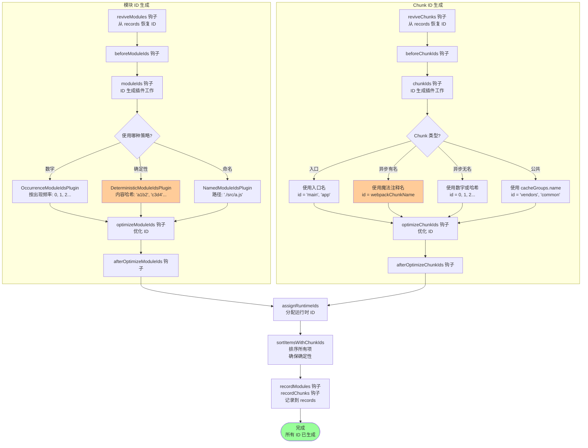
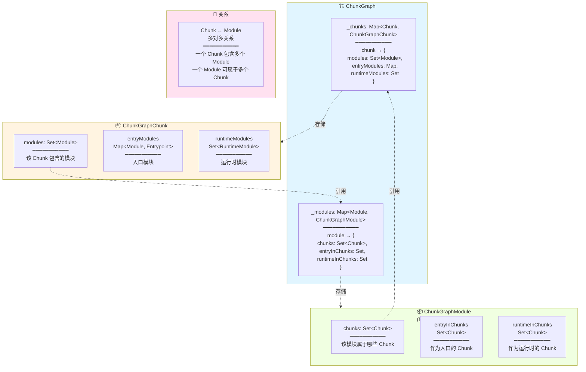
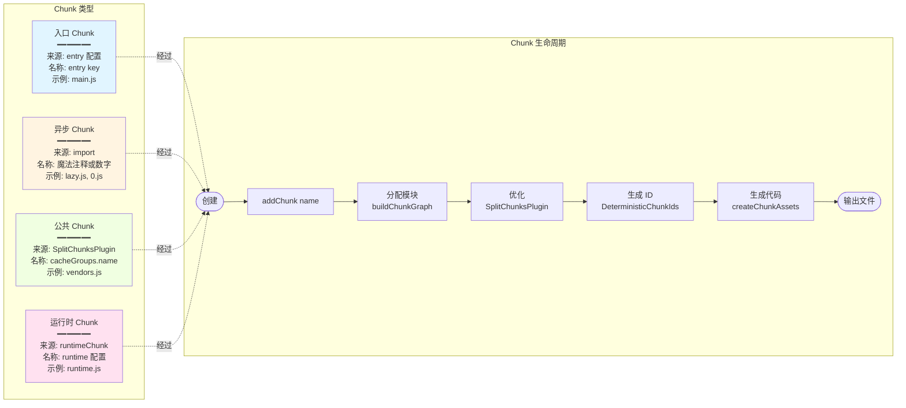
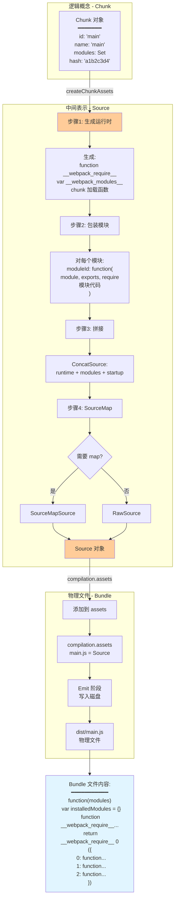
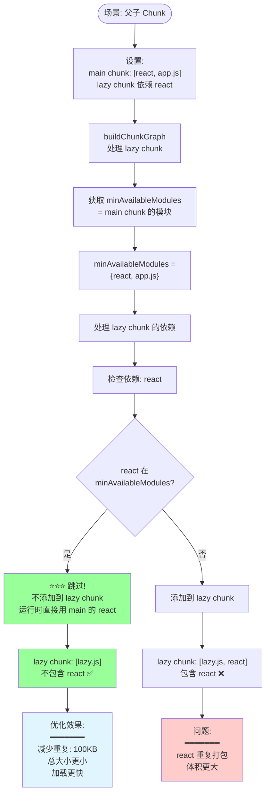
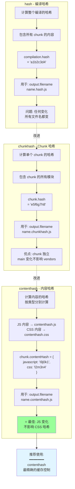

# 封装阶段（Seal）- 可视化流程图

> 通过流程图完全理解 Seal 阶段的工作原理

## 📋 图表目录

1. [主流程图 - Seal 阶段概览](#图表-1主流程图---seal-阶段概览)
2. [详细流程 - 创建 Chunk](#图表-2详细流程---创建-chunk)
3. [详细流程 - buildChunkGraph](#图表-3详细流程---buildchunkgraph)
4. [详细流程 - 优化模块（Tree Shaking）](#图表-4详细流程---优化模块tree-shaking)
5. [详细流程 - 优化 Chunk（代码分割）](#图表-5详细流程---优化-chunk代码分割)
6. [详细流程 - 生成 ID](#图表-6详细流程---生成-id)
7. [详细流程 - 代码生成](#图表-7详细流程---代码生成)
8. [详细流程 - 创建 Chunk 资源](#图表-8详细流程---创建-chunk-资源)
9. [数据结构 - ChunkGraph](#图表-9数据结构---chunkgraph)
10. [Chunk 类型和生命周期](#图表-10chunk-类型和生命周期)

---

## 图表 1：主流程图 - Seal 阶段概览

> Seal 阶段的 28 个核心步骤（< 60 节点）

```mermaid
graph TD
    Start([Make 阶段完成<br/>ModuleGraph 已构建]) --> SealStart[compilation.seal]

    SealStart --> S1[步骤1: 创建 ChunkGraph<br/>管理 Chunk↔Module 关系]

    S1 --> S2[步骤2: 触发 seal 钩子]

    S2 --> S3[步骤3: 优化依赖<br/>optimizeDependencies]

    S3 --> S4[步骤4-5: 创建入口 Chunk<br/>为每个 entry 创建 Chunk<br/>详见图表2]

    S4 --> S5[步骤6: buildChunkGraph ⭐⭐⭐<br/>分配模块到 Chunk<br/>详见图表3]

    S5 --> S6[步骤7-10: 优化模块 ⭐⭐<br/>optimizeModules 循环<br/>详见图表4]

    S6 --> S7[步骤11-12: 优化 Chunk ⭐⭐⭐<br/>optimizeChunks 循环<br/>详见图表5]

    S7 --> S8[步骤13-14: 生成模块 ID<br/>详见图表6]

    S8 --> S9[步骤15-16: 生成 Chunk ID<br/>详见图表6]

    S9 --> S10[步骤17: 分配运行时 ID]

    S10 --> S11[步骤18: 排序<br/>确保确定性输出]

    S11 --> S12[步骤19: 生成模块哈希]

    S12 --> S13[步骤20-21: 代码生成 ⭐⭐⭐<br/>codeGeneration<br/>详见图表7]

    S13 --> S14[步骤22: 处理运行时需求<br/>processRuntimeRequirements]

    S14 --> S15[步骤23: 生成内容哈希<br/>createHash]

    S15 --> S16[步骤24: 创建模块资源<br/>createModuleAssets]

    S16 --> S17[步骤25: 创建 Chunk 资源 ⭐⭐⭐<br/>createChunkAssets<br/>详见图表8]

    S17 --> S18[步骤26: 处理资源<br/>processAssets 钩子]

    S18 --> S19[步骤27-28: 总结和完成<br/>触发 afterSeal 钩子]

    S19 --> Complete([Seal 完成<br/>compilation.assets 就绪])

    Complete --> EmitReady[准备 Emit 阶段<br/>输出文件到磁盘]

    style S5 fill:#ff9999
    style S6 fill:#ff9999
    style S7 fill:#ff9999
    style S13 fill:#ff9999
    style S17 fill:#ff9999
    style Complete fill:#99ff99
```



---

## 图表 2：详细流程 - 创建 Chunk

> 从入口配置到初始 Chunk 的创建

```mermaid
graph TD
    Start([seal 开始后<br/>创建 Chunk 阶段]) --> Freeze[冻结 ModuleGraph<br/>moduleGraph.freeze<br/>不再修改模块关系]

    Freeze --> InitMap[初始化 chunkGraphInit<br/>Map&lt;Entrypoint, Module[]&gt;]

    InitMap --> LoopEntries[遍历所有入口<br/>for entry of compilation.entries]

    LoopEntries --> CreateChunk[创建入口 Chunk<br/>chunk = addChunk name]

    CreateChunk --> ChunkName[Chunk 名称 = 入口名<br/>例如: 'main', 'app']

    ChunkName --> SetFilename{自定义文件名?}
    SetFilename -->|是| CustomFile[chunk.filenameTemplate<br/>= options.filename]
    SetFilename -->|否| DefaultFile[使用默认配置]

    CustomFile --> CreateEP
    DefaultFile --> CreateEP[创建 Entrypoint<br/>new Entrypoint options]

    CreateEP --> CheckRuntime{检查运行时配置}
    CheckRuntime -->|无 dependOn/runtime| SelfRuntime[chunk 自己是运行时<br/>setRuntimeChunk chunk]
    CheckRuntime -->|有配置| SharedRuntime[使用共享运行时]

    SelfRuntime --> SetEP
    SharedRuntime --> SetEP[设置入口 chunk<br/>entrypoint.setEntrypointChunk]

    SetEP --> SaveMaps[保存到映射表<br/>namedChunkGroups<br/>entrypoints<br/>chunkGroups]

    SaveMaps --> ConnectGroup[连接 ChunkGroup 和 Chunk<br/>connectChunkGroupAndChunk]

    ConnectGroup --> ProcessDeps[处理入口依赖]

    ProcessDeps --> LoopDeps[遍历 entry.dependencies]

    LoopDeps --> GetModule[从依赖获取模块<br/>moduleGraph.getModule dep]

    GetModule --> ConnectEntry[⭐ 连接入口模块到 Chunk<br/>chunkGraph.connectChunkAndEntryModule<br/>chunk, module, entrypoint]

    ConnectEntry --> AddToInit[添加到初始化列表<br/>chunkGraphInit.set<br/>entrypoint, modules]

    AddToInit --> CalcDepth[计算模块深度<br/>assignDepths entryModules]

    CalcDepth --> MoreEntries{还有入口?}
    MoreEntries -->|是| LoopEntries
    MoreEntries -->|否| HandleDepends[处理入口间依赖<br/>dependOn 配置]

    HandleDepends --> RuntimeChunks[处理运行时 Chunk<br/>runtimeChunk 配置]

    RuntimeChunks --> Ready[准备就绪<br/>chunkGraphInit 填充完成]

    Ready --> Next([进入 buildChunkGraph])

    style ConnectEntry fill:#ff9999
    style CalcDepth fill:#ffcc99
```

---

## 图表 3：详细流程 - buildChunkGraph

> BFS 遍历分配模块到 Chunk（核心算法！）

```mermaid
graph TD
    Start([buildChunkGraph<br/>chunkGraphInit]) --> Init[初始化队列系统<br/>queue = []<br/>状态机常量]

    Init --> FillQueue[填充初始队列<br/>从入口模块开始]

    FillQueue --> CreateInfo[为每个入口创建<br/>ChunkGroupInfo<br/>包含 runtime, minAvailableModules]

    CreateInfo --> AddToQueue[入口模块添加到队列<br/>action: ADD_AND_ENTER_MODULE]

    AddToQueue --> ReverseQ[反转队列<br/>queue.reverse<br/>实现 FIFO]

    ReverseQ --> MainLoop{队列非空?}

    MainLoop -->|否| Phase2[Part 2:<br/>connectChunkGroups]

    MainLoop -->|是| PopItem[item = queue.pop]

    PopItem --> CheckAction{检查 action}

    CheckAction -->|ADD_AND_ENTER| AddModule[连接模块到 Chunk<br/>chunkGraph.connectChunkAndModule]

    AddModule --> SetIndex[设置模块索引<br/>preOrderIndex<br/>postOrderIndex]

    SetIndex --> ProcessBlock

    CheckAction -->|PROCESS_BLOCK| ProcessBlock[processBlock<br/>处理依赖块]

    ProcessBlock --> GetBlockMods[获取块的模块<br/>getBlockModules ⭐]

    GetBlockMods --> LoopMods[遍历块的模块]

    LoopMods --> CheckInChunk{模块已在<br/>chunk 中?}
    CheckInChunk -->|是| SkipMod[跳过]

    CheckInChunk -->|否| CheckAvail{模块在<br/>minAvailableModules?}

    CheckAvail -->|是| SkipAvail[⭐ 跳过<br/>父 chunk 已有<br/>避免重复]

    CheckAvail -->|否| NeedAdd[需要添加]

    NeedAdd --> CheckSync{同步依赖?}

    CheckSync -->|是| AddSync[添加到当前 Chunk<br/>action: ADD_AND_ENTER]

    CheckSync -->|否| ProcessAsync[处理异步依赖<br/>iteratorBlock]

    ProcessAsync --> CreateNewCG{需要新 ChunkGroup?}

    CreateNewCG -->|是| NewChunk[⭐⭐⭐ 创建新 Chunk<br/>addChunkInGroup]
    CreateNewCG -->|否| ReuseChunk[复用现有 Chunk]

    NewChunk --> NameChunk[设置 Chunk 名称<br/>webpackChunkName 魔法注释]

    NameChunk --> AddDelayed[添加到延迟队列<br/>queueDelayed]

    ReuseChunk --> AddDelayed

    AddSync --> AddQueue
    AddDelayed --> AddQueue[添加到队列]

    SkipMod --> MoreMods
    SkipAvail --> MoreMods
    AddQueue --> MoreMods{还有模块?}

    MoreMods -->|是| LoopMods
    MoreMods -->|否| MainLoop

    CheckAction -->|LEAVE_MODULE| UpdateAvail[更新可用模块集<br/>resultingAvailableModules]
    UpdateAvail --> MainLoop

    Phase2 --> BuildParent[建立 ChunkGroup<br/>父子关系]

    BuildParent --> SetRuntime[设置运行时<br/>chunk.runtime]

    SetRuntime --> Cleanup[清理未连接的<br/>ChunkGroup]

    Cleanup --> Done([完成<br/>所有模块已分配])

    style NewChunk fill:#ff9999
    style SkipAvail fill:#99ff99
    style Done fill:#99ff99
```

---

## 图表 4：详细流程 - 优化模块（Tree Shaking）

> optimizeModules 钩子的 Tree Shaking 实现

```mermaid
graph TD
    Start([optimizeModules 钩子<br/>while 循环]) --> Plugin1[SideEffectsFlagPlugin<br/>标记副作用]

    Plugin1 --> CheckPkg[检查 package.json<br/>sideEffects 字段]

    CheckPkg --> HasSE{有副作用?}
    HasSE -->|false| MarkSafe[⭐ 标记模块无副作用<br/>buildMeta.sideEffectFree = true]
    HasSE -->|true| MarkUnsafe[标记有副作用]

    MarkSafe --> Plugin2
    MarkUnsafe --> Plugin2[FlagDependencyUsagePlugin<br/>标记导出使用]

    Plugin2 --> LoopMods[遍历所有模块]

    LoopMods --> GetExports[获取导出信息<br/>exportsInfo = moduleGraph.getExportsInfo]

    GetExports --> GetProvided[获取提供的导出<br/>providedExports = ['foo', 'bar']]

    GetProvided --> LoopDeps[遍历使用该模块的依赖<br/>getIncomingConnections]

    LoopDeps --> GetRef[获取引用的导出<br/>dependency.getReferencedExports]

    GetRef --> Example1[示例:<br/>import foo from './a'<br/>→ referenced: ['foo']]

    Example1 --> MarkUsed[⭐⭐⭐ 标记导出为已使用<br/>exportsInfo.setUsed 'foo', true]

    MarkUsed --> MoreDeps{还有依赖?}
    MoreDeps -->|是| LoopDeps
    MoreDeps -->|否| CheckUnused[检查未使用导出<br/>'bar' 未在 referenced 中]

    CheckUnused --> MarkUnused[标记为未使用<br/>exportsInfo.setUsed 'bar', false]

    MarkUnused --> MoreMods{还有模块?}
    MoreMods -->|是| LoopMods
    MoreMods -->|否| Plugin3[ModuleConcatenationPlugin<br/>模块合并]

    Plugin3 --> CheckConcat{可以合并?}
    CheckConcat -->|是| CanMerge[条件:<br/>1. 只被一个模块依赖<br/>2. 是 ES Module<br/>3. 无副作用<br/>4. 在同一 Chunk]
    CanMerge --> DoConcat[⭐ 合并模块<br/>内联代码]

    CheckConcat -->|否| BailOut[记录原因<br/>optimizationBailout]

    DoConcat --> Changed{有变化?}
    BailOut --> Changed

    Changed -->|是| Continue[继续循环<br/>返回 true]
    Changed -->|否| OptimDone[优化完成<br/>返回 false]

    Continue --> Plugin1
    OptimDone --> Next([进入 Chunk 优化])

    style MarkUsed fill:#ff9999
    style DoConcat fill:#ffcc99
    style OptimDone fill:#99ff99
```

---

## 图表 5：详细流程 - 优化 Chunk（代码分割）

> SplitChunksPlugin 的完整工作流程

```mermaid
graph TD
    Start([optimizeChunks 钩子<br/>SplitChunksPlugin]) --> Prepare[准备阶段<br/>创建 chunk 索引映射]

    Prepare --> Analyze[阶段1: 分析共享<br/>遍历所有模块]

    Analyze --> GetChunks[获取模块所在的 chunks<br/>chunkGraph.getModuleChunks]

    GetChunks --> CheckShared{chunks.size > 1?}
    CheckShared -->|是| IsShared[⭐ 模块被共享<br/>candidates.add module]
    CheckShared -->|否| NotShared[未共享，跳过]

    IsShared --> Group[阶段2: 分组<br/>遍历 cacheGroups]
    NotShared --> NextMod1{还有模块?}
    NextMod1 -->|是| Analyze
    NextMod1 -->|否| Group

    Group --> LoopCache[遍历 cacheGroups<br/>vendors, common, etc]

    LoopCache --> TestRule{test 匹配?}
    TestRule -->|是| MatchExample[示例:<br/>test: /node_modules/<br/>匹配: react, lodash]
    MatchExample --> AddToGroup[添加到分组<br/>groups['vendors'].add module]

    TestRule -->|否| SkipGroup[跳过该组]

    AddToGroup --> NextCache{还有 cacheGroup?}
    SkipGroup --> NextCache
    NextCache -->|是| LoopCache
    NextCache -->|否| Filter[阶段3: 过滤<br/>应用规则]

    Filter --> LoopGroups[遍历分组结果]

    LoopGroups --> CalcSize[计算总大小<br/>size = sum module.size]

    CalcSize --> Rule1{size >= minSize?}
    Rule1 -->|否| Reject1[❌ 拒绝: 太小<br/>默认 20KB]
    Rule1 -->|是| Rule2{共享数 >= minChunks?}

    Rule2 -->|否| Reject2[❌ 拒绝: 共享不够]
    Rule2 -->|是| Rule3{请求数 <= maxAsyncRequests?}

    Rule3 -->|否| Partial[⚠️ 部分提取<br/>只取最大的几个]
    Rule3 -->|是| Rule4{enforce?}

    Rule4 -->|是| Force[✅ 强制创建<br/>忽略所有限制]
    Rule4 -->|否| Normal[✅ 正常创建]

    Partial --> Create
    Force --> Create
    Normal --> Create[阶段4: 创建<br/>newChunk = addChunk name]

    Reject1 --> NextGroup
    Reject2 --> NextGroup

    Create --> MoveLoop[遍历分组的模块]

    MoveLoop --> Disconnect[断开旧连接<br/>chunkGraph.disconnectChunkAndModule<br/>oldChunk, module]

    Disconnect --> Connect[建立新连接<br/>chunkGraph.connectChunkAndModule<br/>newChunk, module]

    Connect --> MoreMove{还有模块?}
    MoreMove -->|是| MoveLoop
    MoreMove -->|否| NextGroup{还有分组?}

    NextGroup -->|是| LoopGroups
    NextGroup -->|否| Done([完成<br/>新 Chunk 创建])

    Done --> Result[结果示例:<br/>main: [entry, a, b]<br/>vendors: [react, lodash] ⭐<br/>━━━━━━━<br/>减少 400KB 重复]

    style Create fill:#99ff99
    style Connect fill:#ffcc99
    style Result fill:#e1f5ff
```

---

## 图表 6：详细流程 - 生成 ID

> 模块 ID 和 Chunk ID 的生成过程



---

## 图表 7：详细流程 - 代码生成

> codeGeneration 的并行处理

```mermaid
graph TD
    Start([codeGeneration]) --> CreateResults[创建结果容器<br/>CodeGenerationResults]

    CreateResults --> CreateJobs[创建任务列表<br/>jobs = []]

    CreateJobs --> LoopModules[遍历所有模块]

    LoopModules --> GetRuntimes[获取模块的运行时集合<br/>chunkGraph.getModuleRuntimes]

    GetRuntimes --> CheckCount{运行时数量?}

    CheckCount -->|1 个| SingleRT[简单情况<br/>创建 1 个任务]

    CheckCount -->|多个| MultiRT[复杂情况<br/>哈希去重 ⭐]

    MultiRT --> HashMap[创建哈希映射<br/>Map&lt;hash, job&gt;]

    HashMap --> LoopRT[遍历运行时]

    LoopRT --> GetHash[获取模块哈希<br/>chunkGraph.getModuleHash<br/>module, runtime]

    GetHash --> CheckHash{哈希已存在?}

    CheckHash -->|是| AddToJob[⭐ 添加到现有任务<br/>job.runtimes.push runtime<br/>优化: 共享代码生成]

    CheckHash -->|否| CreateJob[创建新任务<br/>module, hash, runtime]

    AddToJob --> MoreRT
    CreateJob --> MoreRT{还有运行时?}
    MoreRT -->|是| LoopRT
    MoreRT -->|否| NextModule

    SingleRT --> AddJob[jobs.push]
    AddJob --> NextModule{还有模块?}

    NextModule -->|是| LoopModules
    NextModule -->|否| Run[_runCodeGenerationJobs<br/>并行执行]

    Run --> Parallel[asyncLib.eachLimit<br/>并行度: 100]

    Parallel --> CheckDeps{有代码生成依赖?}

    CheckDeps -->|是| DepsSatisfied{依赖已生成?}
    DepsSatisfied -->|否| Delay[延迟到下一轮<br/>delayedJobs.push]
    DepsSatisfied -->|是| Generate

    CheckDeps -->|否| Generate[_codeGenerationModule<br/>生成代码]

    Generate --> CheckCache{缓存命中?}
    CheckCache -->|是| FromCache[从缓存获取 ⭐<br/>60-80% 命中率]
    CheckCache -->|否| CallGen[调用 module.codeGeneration]

    CallGen --> GenSource[生成 Source 对象<br/>包装模块代码]

    GenSource --> CollectReq[收集运行时需求<br/>runtimeRequirements]

    CollectReq --> SaveResult[保存结果<br/>codeGenerationResults.set]

    FromCache --> NextJob
    SaveResult --> NextJob{还有任务?}

    NextJob -->|是| Parallel
    NextJob -->|否| CheckDelayed{有延迟任务?}

    CheckDelayed -->|是| CheckCircular{全部延迟?}
    CheckCircular -->|是| Error[❌ 循环依赖错误]
    CheckCircular -->|否| NextIter[下一轮迭代<br/>jobs = delayedJobs]

    NextIter --> Run
    Delay --> NextJob

    CheckDelayed -->|否| Stats[输出统计<br/>75% from cache<br/>25% generated]

    Stats --> Done([代码生成完成])

    style AddToJob fill:#99ff99
    style FromCache fill:#99ff99
    style Done fill:#99ff99
```

---

## 图表 8：详细流程 - 创建 Chunk 资源

> createChunkAssets - Chunk 到 Bundle 的转换 ⭐⭐⭐

```mermaid
graph TD
    Start([createChunkAssets<br/>Chunk → Bundle]) --> LoopChunks[遍历所有 chunks]

    LoopChunks --> GetModules[获取 chunk 的模块<br/>chunkGraph.getChunkModules]

    GetModules --> CalcFilename[计算文件名<br/>应用占位符]

    CalcFilename --> Placeholders[替换占位符:<br/>name → chunk.name<br/>hash → compilation.hash<br/>chunkhash → chunk.hash<br/>contenthash → chunk.contentHash]

    Placeholders --> Example[示例:<br/>name.chunkhash.js<br/>→ main.a1b2c3d4.js]

    Example --> Render[渲染 Chunk<br/>JavascriptModulesPlugin]

    Render --> GenRuntime[步骤1: 生成运行时代码<br/>__webpack_require__<br/>__webpack_modules__<br/>chunk 加载函数]

    GenRuntime --> WrapModules[步骤2: 包装每个模块]

    WrapModules --> LoopMods[遍历 chunk.modules]

    LoopMods --> GetCode[获取模块代码<br/>codeGenerationResults.get]

    GetCode --> WrapFunc[包装为函数:<br/>moduleId: function(<br/>  module, exports,<br/>  __webpack_require__<br/> 模块代码<br/>)]

    WrapFunc --> ApplyTree{应用 Tree Shaking?}

    ApplyTree -->|是| CheckUsed[检查导出使用<br/>exportsInfo.isUsed]
    CheckUsed --> GenUsed[只生成已使用的导出<br/>跳过未使用的]

    ApplyTree -->|否| GenAll[生成所有代码]

    GenUsed --> NextMod
    GenAll --> NextMod{还有模块?}

    NextMod -->|是| LoopMods
    NextMod -->|否| Concat[步骤3: 拼接代码]

    Concat --> CreateSource[创建 Source 对象<br/>ConcatSource]

    CreateSource --> Structure[代码结构:<br/>━━━━━━━<br/>// runtime<br/> function webpack_require...<br/>━━━━━━━<br/>// modules<br/> 0: function...<br/> 1: function...<br/>━━━━━━━<br/>// startup<br/> webpack_require 0]

    Structure --> ApplySourceMap{需要 SourceMap?}

    ApplySourceMap -->|是| AddSourceMap[添加 SourceMap<br/>SourceMapSource]
    ApplySourceMap -->|否| UseRaw[RawSource]

    AddSourceMap --> SaveAsset
    UseRaw --> SaveAsset[保存到 assets<br/>compilation.assets filename = source]

    SaveAsset --> NextChunk{还有 chunk?}

    NextChunk -->|是| LoopChunks
    NextChunk -->|否| Done([完成<br/>所有 bundle 已生成])

    Done --> AssetsReady[compilation.assets = <br/>main.js: Source<br/>vendors.js: Source<br/>lazy.js: Source]

    style WrapFunc fill:#ffcc99
    style GenUsed fill:#ff9999
    style SaveAsset fill:#99ff99
    style AssetsReady fill:#e1f5ff
```

---

## 图表 9：数据结构 - ChunkGraph

> ChunkGraph 的核心数据结构和关系



---

## 图表 10：Chunk 类型和生命周期

> 不同类型 Chunk 的创建和使用



---

## 图表 11：processAssets 多阶段处理

> 资源处理的 15 个阶段

```mermaid
graph TD
    Start([processAssets 钩子<br/>处理所有资源]) --> Stage1[ADDITIONAL<br/>添加额外资源]

    Stage1 --> Stage2[PRE_PROCESS<br/>预处理]

    Stage2 --> Stage3[DERIVED<br/>派生资源]

    Stage3 --> Stage4[ADDITIONS<br/>添加到现有资源]

    Stage4 --> Stage5[OPTIMIZE<br/>优化开始]

    Stage5 --> Stage6[OPTIMIZE_COUNT<br/>优化数量]

    Stage6 --> Stage7[OPTIMIZE_COMPATIBILITY<br/>兼容性优化]

    Stage7 --> Stage8[OPTIMIZE_SIZE ⭐⭐<br/>优化大小 压缩]

    Stage8 --> Terser[TerserPlugin<br/>压缩 JS]
    Terser --> CSS[CssMinimizerPlugin<br/>压缩 CSS]
    CSS --> Compress[CompressionPlugin<br/>gzip 压缩]

    Compress --> Stage9[DEV_TOOLING<br/>开发工具]

    Stage9 --> Stage10[OPTIMIZE_INLINE<br/>内联优化]

    Stage10 --> Stage11[SUMMARIZE<br/>总结]

    Stage11 --> Stage12[OPTIMIZE_HASH<br/>优化哈希]

    Stage12 --> Stage13[OPTIMIZE_TRANSFER<br/>优化传输]

    Stage13 --> Stage14[ANALYSE<br/>分析]

    Stage14 --> Stage15[REPORT<br/>报告]

    Stage15 --> Freeze[冻结 assets<br/>Object.freeze<br/>不允许再修改]

    Freeze --> Done([完成<br/>资源处理完成])

    style Stage8 fill:#ff9999
    style Freeze fill:#ffcc99
    style Done fill:#99ff99
```



---

## 图表 12：Chunk → Bundle 转换

> 从逻辑 Chunk 到物理文件的完整转换



---

## 图表 13：minAvailableModules 优化

> 如何避免模块重复包含



---

## 图表 14：哈希生成流程

> 三种哈希的计算和使用



---

## 使用指南

### 如何阅读流程图

**学习路径**：
```
1. 主流程图（图表1）
   ↓ 了解 28 个步骤

2. 详细流程图（图表2-8）
   ↓ 深入每个关键步骤

3. 数据结构图（图表9-10）
   ↓ 理解 ChunkGraph

4. 优化原理图（图表11-14）
   ↓ 理解具体优化
```

**阅读技巧**：
- 🔴 红色节点：最重要，必须理解
- 🟢 绿色节点：成功/完成状态
- 🟡 黄色节点：重要但非核心
- ⭐ 星标：特别关键的步骤

### 核心流程图重点

| 图表 | 重点内容 | 学习时间 |
|------|---------|---------|
| 图表1 | 28 步骤概览 | 5 分钟 |
| 图表3 | buildChunkGraph BFS | 10 分钟 ⭐⭐⭐ |
| 图表4 | Tree Shaking 实现 | 8 分钟 ⭐⭐ |
| 图表5 | 代码分割实现 | 10 分钟 ⭐⭐⭐ |
| 图表7 | 代码生成机制 | 10 分钟 ⭐⭐ |
| 图表8 | Chunk → Bundle | 10 分钟 ⭐⭐⭐ |

---

## 关键要点速查

### Seal 阶段核心

```
输入: ModuleGraph（依赖图）
输出: compilation.assets（资源文件）

核心步骤:
1. 创建 ChunkGraph
2. 创建入口 Chunk
3. buildChunkGraph (BFS 分配) ⭐⭐⭐
4. 优化模块 (Tree Shaking) ⭐⭐
5. 优化 Chunk (代码分割) ⭐⭐⭐
6. 生成 ID
7. 代码生成 ⭐⭐⭐
8. 创建资源 ⭐⭐⭐
```

### ChunkGraph vs ModuleGraph

```
ModuleGraph:
- Module ↔ Module 关系
- 依赖关系
- Tree Shaking

ChunkGraph:
- Chunk ↔ Module 关系
- 包含关系
- 代码分割
```

### Chunk → Bundle 转换

```
Chunk (逻辑)
  ↓ createChunkAssets
Source (代码)
  ↓ emit
Bundle (文件)

1 Chunk = 1 Source = 1 Bundle
```

---

## 配合文档

**文字详解**：
- 09-封装阶段（Seal）.md（白话讲解）
- 04-Webpack核心运行流程详解.md（完整流程）

**代码注释**：
- lib/Compilation.js:seal()（100% 注释）
- lib/buildChunkGraph.js（80% 注释）
- lib/Chunk.js（100% 注释）
- lib/ChunkGraph.js（60% 注释）

**实践练习**：
- 在关键步骤设置断点
- 打印 ChunkGraph 结构
- 观察 Chunk 创建过程
- 追踪模块分配逻辑

---

## 总结

### 通过这些流程图你将理解

✅ **Seal 阶段的完整流程**
- 28 个步骤的作用
- 每个步骤的输入输出
- 步骤之间的关系

✅ **核心算法**
- buildChunkGraph 的 BFS 遍历
- minAvailableModules 优化
- 代码生成的并行处理

✅ **优化机制**
- Tree Shaking 的三阶段
- 代码分割的四阶段
- 哈希的三种类型

✅ **数据转换**
- ModuleGraph → ChunkGraph
- Chunk → Source → Bundle
- 逻辑 → 代码 → 文件

---

**看懂这些流程图 = 理解 Seal 阶段原理！** 🎉

