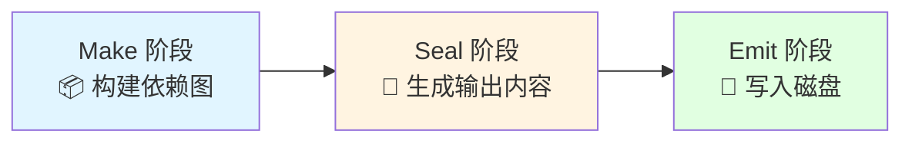

# Seal 阶段 vs Emit 阶段 - 准确理解

> 很多人容易混淆这两个阶段，这份文档帮你彻底搞清楚！

---

## 一、快速回答你的问题 ⭐⭐⭐

### 你的原始描述：
> "根据入口和模块之间的依赖关系，组装成一个个包含多个模块的 Chunk，再把每个 Chunk 转换成一个单独的文件加入到输出列表，这步是可以修改输出内容的最后机会"

### ✅ 准确答案：

**这个描述包含了两个阶段：**

```
你的描述 = Seal 阶段（90%）+ Emit 阶段（10%）

具体拆分：

✅ "根据依赖关系组装 Chunk"           → Seal 阶段
✅ "把 Chunk 转换成单独文件"          → Seal 阶段（生成 assets 内容）
⚠️ "加入到输出列表"                  → Seal 阶段末尾（加入 compilation.assets）
❌ "可以修改输出内容的最后机会"      → 这是 Emit 阶段的 emit 钩子！
```

---

## 二、完整的三阶段流程



### 完整时间线

```
┌─────────────────────────────────────────────────────────────────┐
│                    Webpack 编译完整流程                          │
└─────────────────────────────────────────────────────────────────┘

1️⃣ Make 阶段（构建模块）
┌──────────────────────────────────────────────────────────┐
│ 从入口开始                                                 │
│   ↓                                                       │
│ 解析文件 → 执行 loader → 解析 AST → 识别依赖             │
│   ↓                                                       │
│ 递归处理所有依赖                                          │
│   ↓                                                       │
│ 完成：ModuleGraph（模块依赖图）                          │
└──────────────────────────────────────────────────────────┘
                        ↓
                   compilation.seal()
                        ↓
2️⃣ Seal 阶段（封装优化）⭐ 你的描述主要在这里
┌──────────────────────────────────────────────────────────┐
│ ✅ 1. 创建 Chunk（根据入口和依赖关系）                    │
│ ✅ 2. buildChunkGraph（分配模块到 Chunk）                │
│ ✅ 3. 优化模块（Tree Shaking）                           │
│ ✅ 4. 优化 Chunk（Code Splitting）                       │
│ ✅ 5. 生成模块/Chunk ID                                  │
│ ✅ 6. 生成代码（codeGeneration）                         │
│ ✅ 7. 处理资源（processAssets 钩子）← 修改内容的主要时机  │
│ ✅ 8. 生成 Chunk 文件（createChunkAssets）               │
│    - 把 Chunk 转换成代码字符串                            │
│    - 创建 Source 对象                                     │
│ ✅ 9. 加入输出列表（compilation.assets）                 │
│    - assets['main.js'] = Source 对象                      │
│    - 注意：还没写入磁盘，只是内存中的对象！                │
│   ↓                                                       │
│ 完成：compilation.assets = { 'main.js': Source, ... }    │
└──────────────────────────────────────────────────────────┘
                        ↓
                  compilation.emitAssets()
                        ↓
3️⃣ Emit 阶段（输出文件）⭐ "最后机会"在这里
┌──────────────────────────────────────────────────────────┐
│ ⚠️ 1. 触发 emit 钩子 ← "修改输出的最后机会"               │
│    - 可以修改 compilation.assets                          │
│    - 可以添加/删除/修改文件                               │
│    - 这是写入磁盘前的最后机会！                           │
│   ↓                                                       │
│ 💾 2. 遍历 assets，写入磁盘                               │
│    - fs.writeFile('dist/main.js', source.source())       │
│   ↓                                                       │
│ ✅ 3. 触发 afterEmit 钩子                                 │
│   ↓                                                       │
│ 完成：文件真正写入 dist/ 目录                             │
└──────────────────────────────────────────────────────────┘
```

---

## 三、关键区别详解

### 3.1 Seal 阶段的核心工作 ⭐⭐⭐

```javascript
// lib/Compilation.js: seal() 方法

seal(callback) {
  // 🔒 开始封装，不再接受新模块
  this.sealed = true;

  // ===== 阶段 1: 创建 Chunk 容器 =====
  /**
   * 根据入口配置创建初始 Chunk
   *
   * 输入: entry: { main: './src/index.js' }
   * 输出: Chunk { name: 'main', files: [] }
   */
  for (const [name, config] of this.entries) {
    const chunk = this.addChunk(name);
    // ... 创建 Entrypoint
  }

  // ===== 阶段 2: 分配模块到 Chunk ⭐⭐⭐ =====
  /**
   * buildChunkGraph - 核心算法
   *
   * 问题: 现在有模块图，怎么分配到 Chunk？
   *
   * 输入:
   *   ModuleGraph: entry → a → common
   *                entry → b → common
   *
   * 输出:
   *   ChunkGraph:
   *     - main chunk: [entry, a, b, common]
   *     - lazy chunk: [lazy.js]
   */
  buildChunkGraph(
    this,
    this.chunkGraph,
    this.codeGenerationResults,
    this.moduleGraph
  );

  // ===== 阶段 3-6: 优化与生成 =====
  this.hooks.optimize.call();                    // 优化开始
  this.hooks.optimizeModules.call(this.modules); // Tree Shaking
  this.hooks.optimizeChunks.call(this.chunks);   // Code Splitting
  this.hooks.optimizeChunkIds.call(this.chunks); // 生成 ID
  this.codeGeneration(callback);                 // 生成代码

  // ===== 阶段 7: 处理资源（主要修改时机）⭐⭐⭐ =====
  /**
   * processAssets 钩子 - 处理和修改资源
   *
   * 【插件注册示例】
   * compiler.hooks.compilation.tap('Plugin', (compilation) => {
   *   compilation.hooks.processAssets.tap({
   *     name: 'MyPlugin',
   *     stage: Compilation.PROCESS_ASSETS_STAGE_OPTIMIZE,
   *   }, (assets) => {
   *     // ⭐ 可以修改/添加/删除资源
   *     assets['new-file.js'] = new RawSource('...');
   *   });
   * });
   *
   * 【执行时机】
   * 此时 Chunk 已经生成代码，但还未写入磁盘
   * 可以：
   * - 压缩代码（TerserPlugin）
   * - 优化图片（ImageMinimizerPlugin）
   * - 生成 HTML（HtmlWebpackPlugin）
   * - 添加 Banner
   */
  this.hooks.processAssets.call(this.assets);

  // ===== 阶段 8: 生成 Chunk 资源 ⭐⭐⭐ =====
  /**
   * createChunkAssets - 把 Chunk 转换成文件
   *
   * 【做什么】
   * 1. 渲染 Chunk 为代码字符串
   * 2. 创建 Source 对象
   * 3. 加入到 this.assets
   *
   * 【示例】
   */
  this.createChunkAssets();

  // 内部实现：
  for (const chunk of this.chunks) {
    // 1. 渲染 Chunk
    const source = this.renderChunk(chunk);  // 生成代码字符串

    // 2. 生成文件名
    const filename = this.getPath(
      this.outputOptions.filename,
      { chunk }
    );  // 'main.js'

    // 3. 添加到 assets ⭐⭐⭐
    this.assets[filename] = source;

    // ⚠️ 注意：此时只是加入到内存对象
    // 还没写入磁盘！
  }

  // ===== 阶段 9: Seal 完成 =====
  /**
   * 此时 compilation.assets 的内容：
   *
   * {
   *   'main.js': CachedSource {
   *     _source: ConcatSource { ... },
   *     _cachedSource: '(function() {...})()',
   *     _cachedSize: 12345
   *   },
   *   'vendors.js': CachedSource { ... },
   *   'styles.css': RawSource { ... }
   * }
   *
   * ⚠️ 重要：
   * - 文件内容已生成（Source 对象）
   * - 但文件还在内存中
   * - 还没有写入 dist/ 目录
   */

  this.hooks.seal.call();
  callback();
}
```

### 3.2 Emit 阶段的核心工作 ⭐⭐⭐

```javascript
// lib/Compiler.js: emitAssets() 方法

emitAssets(compilation, callback) {
  // ===== 准备输出目录 =====
  const outputPath = this.outputPath;  // '/path/to/dist'

  // ===== 阶段 1: emit 钩子（最后修改机会）⭐⭐⭐ =====
  /**
   * 这是写入磁盘前的最后机会！
   *
   * 【插件示例】
   */
  this.hooks.emit.callAsync(compilation, (err) => {
    // 插件可以在这里做最后的修改：

    // 示例 1: 修改文件内容
    compilation.assets['main.js'] = new RawSource(
      compilation.assets['main.js'].source().replace(/foo/g, 'bar')
    );

    // 示例 2: 添加新文件
    compilation.assets['manifest.json'] = new RawSource(
      JSON.stringify({ version: '1.0.0' })
    );

    // 示例 3: 删除文件
    delete compilation.assets['unwanted.js'];

    // ⚠️ 重点：
    // - 这是修改 compilation.assets 的最后机会
    // - 下一步就要写入磁盘了
    // - 写入后就无法修改了！
  });

  // ===== 阶段 2: 遍历 assets，写入磁盘 ⭐⭐⭐ =====
  /**
   * 将内存中的 assets 对象写入真实文件
   */
  asyncLib.forEachLimit(
    Object.keys(compilation.assets),  // ['main.js', 'vendors.js', ...]
    15,  // 并发度：同时写入 15 个文件
    (file, callback) => {
      // 获取 Source 对象
      const source = compilation.assets[file];

      // 生成完整路径
      const targetPath = path.join(outputPath, file);
      // '/path/to/dist/main.js'

      // 获取文件内容
      const content = source.source();  // 实际代码字符串

      // 创建目录（如果不存在）
      this.outputFileSystem.mkdir(
        path.dirname(targetPath),
        { recursive: true },
        (err) => {
          if (err) return callback(err);

          // 💾 写入文件！⭐⭐⭐
          this.outputFileSystem.writeFile(
            targetPath,
            content,
            callback
          );
        }
      );
    },
    (err) => {
      // ===== 阶段 3: afterEmit 钩子 =====
      /**
       * 文件已写入磁盘
       * 可以做一些清理或通知工作
       */
      this.hooks.afterEmit.callAsync(compilation, (err) => {
        callback(err);
      });
    }
  );
}
```

---

## 四、对比表格

| 对比维度 | Seal 阶段 | Emit 阶段 |
|---------|----------|----------|
| **主要任务** | 生成输出内容 | 写入磁盘 |
| **输入** | ModuleGraph（模块图） | compilation.assets |
| **输出** | compilation.assets（内存对象） | dist/ 目录的实际文件 |
| **核心工作** | • 创建 Chunk<br/>• buildChunkGraph<br/>• 优化（Tree Shaking、Code Splitting）<br/>• 生成代码<br/>• 生成文件内容 | • 触发 emit 钩子<br/>• 写入文件到磁盘 |
| **修改时机** | **processAssets 钩子**（主要）<br/>多个优化阶段 | **emit 钩子**（最后机会） |
| **数据位置** | 内存中（compilation.assets） | 磁盘上（dist/） |
| **是否可逆** | ✅ 可以多次修改 | ❌ 写入后无法撤销 |
| **插件示例** | • TerserPlugin（压缩）<br/>• HtmlWebpackPlugin（生成 HTML）<br/>• MiniCssExtractPlugin（提取 CSS） | • CleanWebpackPlugin（清理目录）<br/>• CopyWebpackPlugin（复制文件）<br/>• 上传到 CDN 的插件 |

---

## 五、"修改输出内容的最后机会"详解 ⭐⭐⭐

### 5.1 修改时机对比

```javascript
// ===== 时机 1: Seal 阶段的 processAssets 钩子 =====
/**
 * 【时机】创建 assets 后，写入磁盘前
 * 【特点】主要的修改时机，支持多个阶段
 * 【用途】压缩、优化、转换资源
 */
compilation.hooks.processAssets.tap({
  name: 'MyPlugin',
  stage: Compilation.PROCESS_ASSETS_STAGE_OPTIMIZE,
}, (assets) => {
  // ⭐ 这里是主要的修改时机
  // 大部分优化插件都在这里工作

  for (const [filename, source] of Object.entries(assets)) {
    // 压缩代码
    const code = source.source();
    const minified = minify(code);
    assets[filename] = new RawSource(minified);
  }
});

// ===== 时机 2: Emit 阶段的 emit 钩子 =====
/**
 * 【时机】写入磁盘的最后一刻
 * 【特点】真正的"最后机会"
 * 【用途】最终的添加/删除文件，不涉及内容转换
 */
compiler.hooks.emit.tap('MyPlugin', (compilation) => {
  // ⭐ 这是写入磁盘前的最后机会

  // 添加额外文件（如 manifest）
  compilation.assets['manifest.json'] = new RawSource(
    JSON.stringify({
      files: Object.keys(compilation.assets),
      timestamp: Date.now()
    })
  );

  // 删除不需要的文件
  delete compilation.assets['unwanted.js'];
});
```

### 5.2 processAssets 的多个阶段

```javascript
/**
 * processAssets 钩子有多个阶段，按顺序执行：
 */

// 阶段常量（按执行顺序）
Compilation.PROCESS_ASSETS_STAGE_ADDITIONAL      = -2000  // 添加额外资源
Compilation.PROCESS_ASSETS_STAGE_PRE_PROCESS     = -1000  // 预处理
Compilation.PROCESS_ASSETS_STAGE_DERIVED         = -200   // 派生资源（如 SourceMap）
Compilation.PROCESS_ASSETS_STAGE_ADDITIONS       = -100   // 添加现有资源
Compilation.PROCESS_ASSETS_STAGE_NONE            = 0      // 默认阶段
Compilation.PROCESS_ASSETS_STAGE_OPTIMIZE        = 100    // 优化资源 ⭐ 主要
Compilation.PROCESS_ASSETS_STAGE_OPTIMIZE_COUNT  = 200    // 优化资源数量
Compilation.PROCESS_ASSETS_STAGE_OPTIMIZE_COMPATIBILITY = 300  // 兼容性优化
Compilation.PROCESS_ASSETS_STAGE_OPTIMIZE_SIZE   = 400    // 优化大小 ⭐ 压缩
Compilation.PROCESS_ASSETS_STAGE_DEV_TOOLING     = 500    // 开发工具
Compilation.PROCESS_ASSETS_STAGE_OPTIMIZE_INLINE = 700    // 内联优化
Compilation.PROCESS_ASSETS_STAGE_SUMMARIZE       = 1000   // 总结
Compilation.PROCESS_ASSETS_STAGE_OPTIMIZE_HASH   = 2500   // 优化哈希
Compilation.PROCESS_ASSETS_STAGE_OPTIMIZE_TRANSFER = 3000 // 优化传输（如 gzip）
Compilation.PROCESS_ASSETS_STAGE_ANALYSE         = 4000   // 分析
Compilation.PROCESS_ASSETS_STAGE_REPORT          = 5000   // 报告

// 插件使用示例：
compilation.hooks.processAssets.tap({
  name: 'TerserPlugin',
  stage: Compilation.PROCESS_ASSETS_STAGE_OPTIMIZE_SIZE  // 在优化大小阶段
}, (assets) => {
  // 压缩 JS 文件
});

compilation.hooks.processAssets.tap({
  name: 'HtmlWebpackPlugin',
  stage: Compilation.PROCESS_ASSETS_STAGE_ADDITIONAL  // 在添加资源阶段
}, (assets) => {
  // 生成 HTML 文件
});
```

---

## 六、实际例子：完整流程

### 场景：一个简单的项目

**源码**：
```javascript
// src/index.js
import { add } from './math.js';
console.log(add(1, 2));

// src/math.js
export function add(a, b) { return a + b; }
export function sub(a, b) { return a - b; }  // ⚠️ 未使用
```

**配置**：
```javascript
module.exports = {
  entry: './src/index.js',
  output: {
    filename: '[name].[contenthash].js',
    path: path.resolve(__dirname, 'dist')
  },
  optimization: {
    usedExports: true,  // Tree Shaking
    minimize: true      // 压缩
  }
};
```

### 流程演示

```
========== Make 阶段 ==========
✅ 解析 index.js
✅ 解析 math.js
✅ 构建 ModuleGraph

ModuleGraph:
  index.js → math.js
    依赖: HarmonyImportDependency { specifiers: ['add'] }

  math.js:
    exports: { add: used ✓, sub: unused ✗ }

========== Seal 阶段 ==========

步骤 1: 创建 Chunk
  ✅ new Chunk('main')

步骤 2: buildChunkGraph
  ✅ main chunk 包含: [index.js, math.js]

步骤 3: 优化模块（Tree Shaking）
  ✅ 分析 math.js 的导出
  ✅ 发现 sub() 未使用
  ✅ 标记 sub() 为可删除

  math.js:
    exports: {
      add: { used: true, provided: true },
      sub: { used: false, provided: true }  ← 会被删除
    }

步骤 4: 优化 Chunk（Code Splitting）
  ✅ 无动态导入，不分割

步骤 5: 生成 ID
  ✅ index.js → module id: 1
  ✅ math.js  → module id: 2
  ✅ main chunk → chunk id: 'main'

步骤 6: 生成代码
  ✅ index.js 生成:
    ```javascript
    const math = require(2);  // 替换 import
    console.log(math.add(1, 2));
    ```

  ✅ math.js 生成（Tree Shaking 后）:
    ```javascript
    exports.add = function(a, b) { return a + b; };
    // sub() 已被删除 ✓
    ```

步骤 7: processAssets（多阶段处理）

  阶段 ADDITIONAL:
    ✅ HtmlWebpackPlugin:
       - 生成 index.html
       - compilation.assets['index.html'] = ...

  阶段 OPTIMIZE:
    ✅ 其他优化插件...

  阶段 OPTIMIZE_SIZE:
    ✅ TerserPlugin（压缩）:
       ```javascript
       // 压缩前
       exports.add = function(a, b) { return a + b; };

       // 压缩后
       exports.add=(a,b)=>a+b;
       ```

步骤 8: createChunkAssets
  ✅ 渲染 main chunk:
    ```javascript
    (function() {
      var modules = {
        1: function(exports, require) {
          const math = require(2);
          console.log(math.add(1,2));
        },
        2: function(exports) {
          exports.add=(a,b)=>a+b;
        }
      };
      // ... webpack runtime
    })();
    ```

  ✅ 计算 contenthash: 'a1b2c3d4'
  ✅ 生成文件名: 'main.a1b2c3d4.js'

  ✅ 加入 assets:
    ```javascript
    compilation.assets = {
      'main.a1b2c3d4.js': CachedSource { ... },
      'index.html': RawSource { ... }
    };
    ```

步骤 9: Seal 完成
  ✅ compilation.sealed = true
  ✅ 文件内容已生成（在内存中）
  ⚠️ 但还没写入磁盘！

========== Emit 阶段 ==========

步骤 1: emit 钩子（最后机会）
  ✅ CleanWebpackPlugin:
     - 清理旧的 dist/ 目录

  ✅ WebpackManifestPlugin:
     - 添加 manifest.json:
       ```javascript
       compilation.assets['manifest.json'] = new RawSource(
         JSON.stringify({
           'main.js': 'main.a1b2c3d4.js'
         })
       );
       ```

  ⚠️ 这是修改 assets 的最后机会！

步骤 2: 写入磁盘
  💾 fs.writeFile('dist/main.a1b2c3d4.js', ...)
  💾 fs.writeFile('dist/index.html', ...)
  💾 fs.writeFile('dist/manifest.json', ...)

步骤 3: afterEmit 钩子
  ✅ 文件已写入
  ✅ 触发通知（如上传到 CDN）

========== 最终结果 ==========

dist/
├── main.a1b2c3d4.js  (压缩后，Tree Shaking 过)
├── index.html        (HtmlWebpackPlugin 生成)
└── manifest.json     (WebpackManifestPlugin 生成)
```

---

## 七、常见误区

### ❌ 误区 1：Seal 阶段会写入文件

```javascript
// 错误理解
seal() {
  // ... 生成 assets
  fs.writeFile('dist/main.js', ...);  // ❌ Seal 不写文件
}

// 正确理解
seal() {
  // ... 生成 assets
  this.assets['main.js'] = source;  // ✅ 只是加入内存对象
}
```

### ❌ 误区 2：emit 钩子是唯一的修改时机

```javascript
// 不完整的理解
compiler.hooks.emit.tap('MyPlugin', (compilation) => {
  // 只知道这里可以修改
});

// 完整的理解
// 1. processAssets 钩子（主要修改时机，多阶段）
compilation.hooks.processAssets.tap({ ... }, (assets) => {
  // ⭐ 大部分修改在这里
});

// 2. emit 钩子（最后机会）
compiler.hooks.emit.tap('MyPlugin', (compilation) => {
  // ⭐ 最后的添加/删除文件
});
```

### ❌ 误区 3：Seal 后无法修改

```javascript
// 错误理解
seal(callback) {
  this.sealed = true;  // ❌ 认为此后无法修改
  callback();
}

// 正确理解
seal(callback) {
  this.sealed = true;  // ⚠️ 只是不能添加新模块
  // ... 但可以修改 assets
  this.hooks.processAssets.call(this.assets);  // ✅ 可以修改
  callback();
}

// emit 钩子仍然可以修改
compiler.hooks.emit.tap('Plugin', (compilation) => {
  compilation.assets['new.js'] = ...;  // ✅ 仍然可以
});
```

---

## 八、总结 ⭐⭐⭐

### 你的原始描述的准确拆分

```
"根据入口和模块之间的依赖关系，组装成一个个包含多个模块的 Chunk"
→ ✅ Seal 阶段（buildChunkGraph）

"再把每个 Chunk 转换成一个单独的文件"
→ ✅ Seal 阶段（createChunkAssets）

"加入到输出列表"
→ ✅ Seal 阶段末尾（compilation.assets）

"这步是可以修改输出内容的最后机会"
→ ⚠️ 准确来说：
   - processAssets 钩子是主要修改时机（Seal 阶段）
   - emit 钩子是写入磁盘前的最后机会（Emit 阶段）
```

### 准确的描述应该是

**Seal 阶段**：
- 根据入口和模块之间的依赖关系，组装成一个个包含多个模块的 Chunk
- 优化模块和 Chunk
- 生成代码
- 把每个 Chunk 转换成文件内容（Source 对象）
- 加入到输出列表（compilation.assets）
- **这是修改输出内容的主要时机（processAssets 钩子）**

**Emit 阶段**：
- **触发 emit 钩子（修改输出的最后机会）**
- 将 compilation.assets 写入磁盘
- 文件真正输出到 dist/ 目录

### 核心要点

1. **Seal 做什么**：生成输出内容（在内存中）
2. **Emit 做什么**：写入磁盘（从内存到文件系统）
3. **修改时机**：
   - 主要时机：processAssets 钩子（Seal 阶段）
   - 最后机会：emit 钩子（Emit 阶段）
4. **关键区别**：assets 在内存 vs 文件在磁盘

---

## 附录：相关源码位置

```
✅ Seal 阶段实现：
   lib/Compilation.js: seal() 方法（已有详细注释）

✅ Emit 阶段实现：
   lib/Compiler.js: emitAssets() 方法（已有详细注释）

✅ buildChunkGraph 实现：
   lib/buildChunkGraph.js（已有详细注释）

✅ processAssets 钩子定义：
   lib/Compilation.js: hooks.processAssets

✅ emit 钩子定义：
   lib/Compiler.js: hooks.emit
```

**通过这份文档，你应该完全理解 Seal 和 Emit 的区别了！** 🎉
