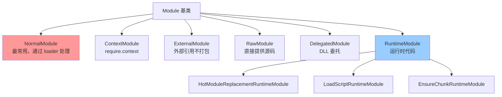

# 深度问题解答 - Webpack 架构设计原理

> 解答关于 webpack 架构设计的深层问题

---

## 📋 目录

1. [Webpack 整体架构树状图](#一webpack-整体架构树状图)
2. [为什么需要 webpack-cli？](#二为什么需要-webpack-cli)
3. [包管理器自动检测原理](#三包管理器自动检测原理)
4. [webpack 的代码生成机制](#四webpack-的代码生成机制)
5. [六大核心阶段的来源](#五六大核心阶段的来源)

---

## 一、Webpack 整体架构树状图

### 1.1 完整的文件树状结构 ⭐⭐⭐

```
webpack/
│
├─📁 bin/ ........................... 命令行入口目录
│  └─ webpack.js ................... [核心] 检测并加载 webpack-cli，支持多包管理器
│
├─📁 lib/ ........................... 核心源码目录（540+ 文件）
│  │
│  ├─ webpack.js ................... [核心] webpack() 工厂函数，创建 Compiler，注册插件
│  ├─ index.js ..................... [入口] 主导出文件，导出所有公共 API
│  │
│  ├─ Compiler.js .................. [核心] 全局编译器，管理生命周期，30+ 钩子
│  ├─ Compilation.js ............... [核心] 单次编译实例，管理模块/Chunk/资源，50+ 钩子
│  │
│  ├─ NormalModuleFactory.js ....... [核心] 模块工厂，解析路径，匹配 loader 规则
│  ├─ NormalModule.js .............. [核心] 普通模块，执行 loader，解析 AST，收集依赖
│  │
│  ├─ ModuleGraph.js ............... [核心] 模块依赖图，存储模块关系，支持 Tree Shaking
│  ├─ ChunkGraph.js ................ [核心] Chunk 依赖图，管理模块到 Chunk 的分配
│  ├─ buildChunkGraph.js ........... [核心] 构建 Chunk 图算法，BFS 遍历，处理代码分割
│  │
│  ├─ Chunk.js ..................... [数据] Chunk 类，表示一个输出文件（bundle）
│  ├─ ChunkGroup.js ................ [数据] Chunk 组，管理 Chunk 的加载关系
│  ├─ Entrypoint.js ................ [数据] 入口点，特殊的 ChunkGroup
│  │
│  ├─ Module.js .................... [基类] 模块抽象基类，定义模块通用接口
│  ├─ Dependency.js ................ [基类] 依赖抽象基类，表示模块间的引用关系
│  ├─ DependenciesBlock.js ......... [基类] 依赖块，管理嵌套依赖（如 import()）
│  │
│  ├─ WebpackOptionsApply.js ....... [配置] 应用内置插件，根据配置注册功能插件
│  ├─ WebpackOptionsDefaulter.js ... [配置] 应用默认配置值（已废弃，被 defaults.js 替代）
│  │
│  ├─ HotModuleReplacementPlugin.js  [插件] HMR 核心插件，生成 hot-update 文件
│  ├─ ProgressPlugin.js ............ [插件] 进度显示插件，输出编译进度
│  ├─ DefinePlugin.js .............. [插件] 定义全局常量，替换代码中的变量
│  │
│  ├─ Template.js .................. [工具] 代码模板工具，生成运行时代码
│  ├─ RuntimeGlobals.js ............ [常量] 运行时全局变量名（__webpack_require__ 等）
│  ├─ RuntimeModule.js ............. [基类] 运行时模块基类，生成运行时代码片段
│  │
│  ├─📁 javascript/ ................. JavaScript 模块处理目录
│  │  ├─ JavascriptParser.js ....... [核心] JS 解析器，使用 acorn 解析 AST，识别依赖
│  │  ├─ JavascriptGenerator.js .... [核心] JS 代码生成器，生成最终代码
│  │  ├─ JavascriptModulesPlugin.js  [核心] JS 模块插件，渲染 bundle 结构，IIFE 包装
│  │  └─ ... ...................... （10+ 文件）
│  │
│  ├─📁 dependencies/ ............... 依赖类型目录（115+ 文件）
│  │  ├─ HarmonyImportDependency.js  [类型] ESM import 依赖
│  │  ├─ CommonJsRequireDependency.js [类型] CommonJS require 依赖
│  │  ├─ ImportDependency.js ........ [类型] 动态 import() 依赖
│  │  ├─ ModuleHotAcceptDependency.js [类型] HMR accept 依赖
│  │  └─ ... ...................... （100+ 种依赖类型）
│  │
│  ├─📁 optimize/ ................... 优化插件目录（19 文件）
│  │  ├─ SplitChunksPlugin.js ...... [插件] 代码分割，提取公共模块
│  │  ├─ ModuleConcatenationPlugin.js [插件] Scope Hoisting，合并模块
│  │  ├─ FlagDependencyUsagePlugin.js [插件] 标记依赖使用情况（Tree Shaking）
│  │  └─ ...
│  │
│  ├─📁 cache/ ...................... 缓存系统目录（9 文件）
│  │  ├─ Cache.js .................. [核心] 缓存管理器，支持内存和文件系统缓存
│  │  ├─ MemoryCachePlugin.js ...... [插件] 内存缓存插件
│  │  ├─ IdleFileCachePlugin.js .... [插件] 文件缓存插件，持久化到磁盘
│  │  └─ ...
│  │
│  ├─📁 hmr/ ........................ HMR 相关目录（5 文件）
│  │  ├─ HotModuleReplacementRuntimeModule.js [运行时] 生成 HMR 运行时代码
│  │  ├─ HotModuleReplacement.runtime.js [运行时] module.hot API 实现
│  │  ├─ JavascriptHotModuleReplacement.runtime.js JSONP 热更新实现
│  │  └─ ...
│  │
│  ├─📁 runtime/ .................... 运行时模块目录（29 文件）
│  │  ├─ LoadScriptRuntimeModule.js  [运行时] 动态加载 script 标签
│  │  ├─ EnsureChunkRuntimeModule.js [运行时] __webpack_require__.e 实现
│  │  ├─ GetChunkFilenameRuntimeModule.js 获取 chunk 文件名
│  │  └─ ... ...................... （25+ 运行时功能）
│  │
│  ├─📁 node/ ....................... Node.js 环境支持（11 文件）
│  │  ├─ NodeEnvironmentPlugin.js .. [插件] 注入 Node.js 文件系统
│  │  ├─ NodeTargetPlugin.js ....... [插件] Node.js 目标环境配置
│  │  └─ ...
│  │
│  ├─📁 web/ ........................ Web 环境支持（5 文件）
│  │  ├─ JsonpChunkLoadingRuntimeModule.js JSONP 加载 chunk
│  │  └─ ...
│  │
│  ├─📁 wasm/ ....................... WebAssembly 支持
│  ├─📁 wasm-async/ ................. 异步 WASM 支持
│  ├─📁 wasm-sync/ .................. 同步 WASM 支持
│  │
│  ├─📁 container/ .................. 模块联邦（Module Federation）
│  ├─📁 sharing/ .................... 模块共享
│  │
│  ├─📁 asset/ ...................... 资源模块（Asset Modules）
│  ├─📁 json/ ....................... JSON 模块支持
│  ├─📁 css/ ........................ CSS 模块支持（实验性）
│  │
│  ├─📁 ids/ ........................ ID 生成策略（12 文件）
│  │  ├─ HashedModuleIdsPlugin.js .. [插件] 基于内容 hash 的模块 ID
│  │  ├─ DeterministicChunkIdsPlugin.js 确定性 chunk ID
│  │  └─ ...
│  │
│  ├─📁 library/ .................... 库模式支持（9 文件）
│  │  ├─ UmdLibraryPlugin.js ....... [插件] UMD 格式库
│  │  ├─ CommonJsLibraryPlugin.js .. [插件] CommonJS 格式库
│  │  └─ ...
│  │
│  ├─📁 config/ ..................... 配置处理（4 文件）
│  │  ├─ defaults.js ............... [核心] 默认配置逻辑，1800+ 行
│  │  ├─ normalization.js .......... [核心] 配置规范化
│  │  └─ ...
│  │
│  ├─📁 util/ ....................... 工具函数目录（47+ 文件）
│  │  ├─ fs.js ..................... [工具] 文件系统工具
│  │  ├─ hash/ ..................... 哈希算法（md4、xxhash64）
│  │  ├─ comparators.js ............ [工具] 排序比较函数
│  │  ├─ createHash.js ............. [工具] 创建哈希对象
│  │  └─ ...
│  │
│  ├─📁 serialization/ .............. 序列化系统（15 文件）
│  │  ├─ ObjectMiddleware.js ....... [核心] 对象序列化，支持持久化缓存
│  │  ├─ Serializer.js ............. [核心] 序列化器主类
│  │  └─ ...
│  │
│  ├─📁 stats/ ...................... 统计信息（5 文件）
│  │  ├─ StatsFactory.js ........... [核心] 统计信息工厂
│  │  ├─ StatsPrinter.js ........... [核心] 统计信息打印器
│  │  └─ ...
│  │
│  ├─📁 logging/ .................... 日志系统（4 文件）
│  │  ├─ Logger.js ................. [核心] 日志记录器
│  │  └─ ...
│  │
│  ├─ FileSystemInfo.js ............ [工具] 文件系统信息管理，处理时间戳和依赖
│  ├─ RequestShortener.js .......... [工具] 路径缩短，优化日志输出
│  ├─ Stats.js ..................... [数据] 编译统计信息封装
│  ├─ Watching.js .................. [功能] Watch 模式管理，监听文件变化
│  │
│  └─ ... .......................... （还有 100+ 核心文件）
│
├─📁 hot/ ........................... HMR 客户端运行时
│  ├─ dev-server.js ................ [核心] WebSocket 客户端，接收更新通知
│  ├─ emitter.js ................... [工具] 事件发射器，用于模块间通信
│  ├─ poll.js ...................... [模式] 轮询模式 HMR（Node.js）
│  ├─ signal.js .................... [模式] 信号模式 HMR（Node.js）
│  └─ log.js ....................... [工具] HMR 日志工具
│
├─📁 schemas/ ....................... JSON Schema 验证
│  ├─ WebpackOptions.json .......... [Schema] webpack 配置的完整 Schema
│  └─ plugins/ ..................... 各插件配置的 Schema
│
├─📁 declarations/ .................. TypeScript 类型声明
│  ├─ index.d.ts ................... [类型] 主类型文件
│  ├─ WebpackOptions.d.ts .......... [类型] 配置对象类型
│  └─ LoaderContext.d.ts ........... [类型] loader 上下文类型
│
├─📁 tooling/ ....................... 工具脚本目录
│  ├─ generate-runtime-code.js ..... [工具] 生成优化的运行时代码（压缩、ES5 转换）
│  ├─ generate-wasm-code.js ........ [工具] 生成 WASM 相关代码
│  └─ decode-debug-hash.js ......... [工具] 调试哈希值
│
├─📁 examples/ ...................... 示例项目目录（50+ 示例）
│  ├─ code-splitting/ .............. 代码分割示例
│  ├─ module-federation/ ........... 模块联邦示例
│  └─ ... .......................... （演示各种功能）
│
├─📁 test/ .......................... 测试目录（5800+ 测试文件）
│  ├─ cases/ ....................... 基础测试用例
│  ├─ configCases/ ................. 配置相关测试
│  ├─ statsCases/ .................. 统计信息测试
│  └─ hotCases/ .................... HMR 测试
│
├─📁 benchmark/ ..................... 性能基准测试
│  └─ benchmark.js ................. 性能测试脚本
│
├─📁 assembly/ ...................... AssemblyScript 实现的哈希算法
│  └─ hash/ ........................ 高性能哈希（md4、xxhash64）
│
├─ package.json .................... [配置] npm 包配置，依赖管理
├─ tsconfig.json ................... [配置] TypeScript 配置
├─ README.md ....................... 项目说明文档
└─ LICENSE ......................... MIT 许可证
```

### 1.2 lib/ 目录核心文件详细标注

```
lib/
│
├─── 【入口与控制层】 ──────────────────────────────────────
│
├─ webpack.js ...................... [入口] 创建 Compiler，9 步初始化流程，插件注册中心
├─ Compiler.js ..................... [控制] 全局编译器，管理整个生命周期，文件系统，缓存
├─ Compilation.js .................. [控制] 单次编译管理，模块构建，Chunk 生成，资源输出
│
├─── 【模块构建层】 ────────────────────────────────────────
│
├─ NormalModuleFactory.js .......... [工厂] 创建普通模块，路径解析，loader 匹配核心
├─ ContextModuleFactory.js ......... [工厂] 创建上下文模块（require.context）
├─ NormalModule.js ................. [模块] 最常用模块类型，执行 loader，解析 AST 依赖
├─ ContextModule.js ................ [模块] 上下文模块，动态 require 支持
├─ ExternalModule.js ............... [模块] 外部模块，运行时引用（不打包）
├─ RawModule.js .................... [模块] 原始模块，直接提供源码（无需构建）
├─ DelegatedModule.js .............. [模块] 委托模块（DLL 插件使用）
│
├─── 【依赖图层】 ──────────────────────────────────────────
│
├─ ModuleGraph.js .................. [核心] 模块依赖图，存储节点和边，O(1) 查询
├─ ModuleGraphConnection.js ........ [数据] 依赖连接，表示模块间的引用关系
├─ ModuleGraphModule.js ............ [数据] 模块图节点，存储模块的图信息
├─ ChunkGraph.js ................... [核心] Chunk 依赖图，管理模块-Chunk 映射
├─ buildChunkGraph.js .............. [算法] BFS 构建 Chunk 图，处理代码分割
│
├─── 【Chunk 层】 ──────────────────────────────────────────
│
├─ Chunk.js ........................ [数据] Chunk 类，表示输出文件，管理文件名和 hash
├─ ChunkGroup.js ................... [数据] Chunk 组，管理加载顺序和父子关系
├─ Entrypoint.js ................... [数据] 入口点，特殊的 ChunkGroup，关联入口配置
├─ HotUpdateChunk.js ............... [数据] 热更新 Chunk，HMR 专用
├─ ChunkTemplate.js ................ [模板] Chunk 模板（已废弃）
│
├─── 【解析层】 ────────────────────────────────────────────
│
├─ Parser.js ....................... [基类] 解析器抽象基类
├─ Generator.js .................... [基类] 代码生成器抽象基类
├─ ResolverFactory.js .............. [工厂] 创建路径解析器，基于 enhanced-resolve
├─ RuleSet.js ...................... [核心] 规则匹配系统，处理 module.rules 配置
│
├─── 【运行时层】 ──────────────────────────────────────────
│
├─ RuntimeGlobals.js ............... [常量] 定义所有运行时全局变量名
├─ RuntimeModule.js ................ [基类] 运行时模块基类，各种 __webpack_require__.* 实现
├─ Template.js ..................... [工具] 代码模板工具，拼接代码字符串
├─ JavascriptMetaInfoPlugin.js ..... [插件] 注入 __dirname、__filename 等
│
├─── 【优化层】 ────────────────────────────────────────────
│
├─ FlagDependencyExportsPlugin.js .. [插件] 分析导出信息，支持 Tree Shaking
├─ FlagDependencyUsagePlugin.js .... [插件] 标记哪些导出被使用
├─ SideEffectsFlagPlugin.js ........ [插件] 处理 sideEffects 配置
├─ MangleExportsPlugin.js .......... [插件] 压缩导出名称
│
├─── 【输出层】 ────────────────────────────────────────────
│
├─ FileSystemInfo.js ............... [核心] 文件系统信息，管理时间戳，检测文件变化
├─ Stats.js ........................ [数据] 编译统计信息，格式化输出
├─ MainTemplate.js ................. [模板] 主模板（已废弃，被 JavascriptModulesPlugin 替代）
├─ ChunkTemplate.js ................ [模板] Chunk 模板（已废弃）
│
├─── 【错误处理层】 ────────────────────────────────────────
│
├─ WebpackError.js ................. [基类] webpack 错误基类
├─ ModuleBuildError.js ............. [错误] 模块构建错误
├─ ModuleNotFoundError.js .......... [错误] 模块未找到错误
├─ ModuleParseError.js ............. [错误] 模块解析错误
│
├─── 【缓存与序列化】 ──────────────────────────────────────
│
├─ Cache.js ........................ [核心] 缓存门面，统一缓存接口
├─ CacheFacade.js .................. [核心] 缓存外观模式实现
├─ FileSystemInfo.js ............... [核心] 文件系统快照，支持增量构建
│
└─── 【配置与应用】 ────────────────────────────────────────
    │
    ├─ WebpackOptionsApply.js ...... [核心] 应用内置插件，700+ 行配置逻辑
    ├─ WebpackOptionsValidationError.js 配置验证错误
    └─ validateSchema.js ........... [工具] JSON Schema 验证工具
```

### 1.3 模块类型分层



---

## 二、为什么需要 webpack-cli？

### 2.1 webpack 与 webpack-cli 的分离设计 ⭐⭐⭐

```mermaid
graph TD
    User[用户执行 webpack 命令] --> Bin[bin/webpack.js]

    Bin --> CheckCLI{webpack-cli<br/>已安装?}

    CheckCLI -->|否| DetectPM[检测包管理器<br/>yarn.lock → yarn<br/>pnpm-lock.yaml → pnpm<br/>默认 → npm]

    DetectPM --> AskUser{询问用户<br/>是否安装?}

    AskUser -->|否| Exit[退出 exitCode=1]
    AskUser -->|是| Install[自动安装<br/>npm install -D webpack-cli]

    Install --> RunCLI
    CheckCLI -->|是| RunCLI[运行 webpack-cli]

    RunCLI --> CheckType{package.json<br/>type="module"?}

    CheckType -->|是| ImportESM[import webpack-cli<br/>ESM 模块]
    CheckType -->|否| RequireCJS[require webpack-cli<br/>CommonJS 模块]

    ImportESM --> CLI[webpack-cli 启动]
    RequireCJS --> CLI

    CLI --> ParseArgs[解析命令行参数<br/>--config --mode --entry...]
    CLI --> LoadConfig[加载配置文件<br/>webpack.config.js]
    CLI --> CallWebpack[调用 webpack API<br/>webpack config]
    CLI --> OutputStats[输出统计信息<br/>彩色日志、进度条]

    style Bin fill:#ff9999
    style RunCLI fill:#99ccff
    style CLI fill:#99ff99
```

### 2.2 为什么要分离？⭐⭐⭐

#### 原因 1: 职责分离（单一职责原则）

```javascript
/**
 * webpack 核心 = 纯编译引擎
 *
 * 【只做】
 * - 模块解析
 * - loader 转换
 * - 依赖分析
 * - 代码生成
 * - 文件输出
 *
 * 【不做】
 * - 命令行参数解析 ❌
 * - 配置文件加载 ❌
 * - 彩色日志输出 ❌
 * - 交互式界面 ❌
 */

/**
 * webpack-cli = 命令行界面
 *
 * 【只做】
 * - 命令行参数解析（--config、--mode）
 * - 配置文件加载（webpack.config.js）
 * - 彩色日志和进度条
 * - 脚手架功能（webpack init）
 *
 * 【不做】
 * - 模块编译逻辑 ❌
 * - 依赖解析 ❌
 * - 代码生成 ❌
 */

// 好处：
// 1. webpack 核心保持简洁（只关注编译）
// 2. CLI 可以独立更新（不影响核心）
// 3. 可以有多个 CLI 实现
```

#### 原因 2: API 使用场景 ⭐⭐

```javascript
/**
 * 场景1: 命令行使用（需要 CLI）
 */
// 终端执行
$ webpack --mode production --entry ./src/index.js

// bin/webpack.js → 检测 webpack-cli → 运行 CLI
// CLI 解析参数，调用 webpack() API

/**
 * 场景2: Node.js API 使用（不需要 CLI）⭐
 */
// build.js
const webpack = require('webpack');
const config = require('./webpack.config.js');

// 直接调用 API，无需 CLI
webpack(config, (err, stats) => {
  if (err) {
    console.error(err);
    return;
  }

  console.log(stats.toString({
    colors: true
  }));
});

// 场景3: webpack-dev-server 使用（不需要 CLI）
const webpack = require('webpack');
const WebpackDevServer = require('webpack-dev-server');

const compiler = webpack(config);
const server = new WebpackDevServer(compiler, options);

server.listen(8080);

/**
 * 总结：
 * - 命令行使用 → 需要 CLI
 * - API 使用 → 不需要 CLI
 * - 分离设计让两种场景都能正常工作
 */
```

#### 原因 3: 灵活性 ⭐

```javascript
/**
 * 可以有多个 CLI 实现
 */

// 官方 CLI
npm install webpack-cli

// 社区 CLI（曾经存在）
npm install webpack-command  // 已废弃

// 自定义 CLI
// 只要实现参数解析，调用 webpack() API 即可

/**
 * bin/webpack.js 的设计允许这种灵活性
 * 只检查 webpack-cli，但不硬编码
 */
```

### 2.3 webpack-cli 是必须的吗？⭐⭐

**答案：不是必须的！**

```javascript
// ===== 场景1: 使用命令行 =====
// 必须安装 webpack-cli
$ webpack --mode production
// ✅ 需要 CLI 解析命令行参数

// ===== 场景2: 使用 Node.js API =====
// 不需要 webpack-cli
const webpack = require('webpack');
webpack({ /* config */ }, callback);
// ✅ 直接调用 API，无需 CLI

// ===== 场景3: 使用 webpack-dev-server =====
// 不需要 webpack-cli
const webpack = require('webpack');
const WebpackDevServer = require('webpack-dev-server');
const compiler = webpack(config);
const server = new WebpackDevServer(compiler);
// ✅ dev-server 内部调用 webpack API

// ===== 场景4: 自定义构建脚本 =====
// 不需要 webpack-cli
// scripts/build.js
const webpack = require('webpack');
const config = {
  entry: './src/index.js',
  output: { path: './dist', filename: 'bundle.js' }
};

webpack(config).run((err, stats) => {
  console.log('构建完成');
});

// package.json
{
  "scripts": {
    "build": "node scripts/build.js"  // ✅ 不使用 CLI
  }
}
```

### 2.4 webpack-cli 的具体作用

```javascript
/**
 * webpack-cli 提供的功能
 */

// 1. 命令行参数解析
$ webpack --mode production --entry ./src/index.js --output-path ./dist

// CLI 解析为:
const config = {
  mode: 'production',
  entry: './src/index.js',
  output: {
    path: './dist'
  }
};

// 2. 配置文件加载
$ webpack --config webpack.prod.js

// CLI 加载配置文件:
const config = require('./webpack.prod.js');

// 3. 多配置支持
$ webpack --config-name app --config-name admin

// CLI 处理多配置:
webpack([appConfig, adminConfig]);

// 4. 初始化项目
$ webpack init

// CLI 提供交互式脚手架

// 5. 信息输出
$ webpack --json > stats.json

// CLI 格式化输出为 JSON

// 6. 进度显示
// CLI 自动添加 ProgressPlugin
// 显示彩色进度条

// 7. Watch 模式
$ webpack --watch

// CLI 调用 compiler.watch()
```

---

## 三、包管理器自动检测原理

### 3.1 为什么需要检测包管理器？⭐⭐⭐

```javascript
/**
 * 问题：webpack 需要关心用户使用什么包管理器吗？
 *
 * 答案：必须关心！
 */

// 场景：用户首次运行 webpack 命令，但没有安装 webpack-cli

// ❌ 错误方式：硬编码使用 npm
$ npm install -D webpack-cli  // 问题：用户可能用的是 yarn 或 pnpm

// 结果问题：
// 1. 生成多个 lock 文件冲突
//    - package-lock.json (npm)
//    - yarn.lock (yarn)
//    - pnpm-lock.yaml (pnpm)
//
// 2. 依赖树不一致
//    - yarn/pnpm 的依赖解析算法与 npm 不同
//    - 可能导致版本冲突
//
// 3. 用户体验差
//    - 用户明明用的是 yarn，却被强制用 npm 安装

// ✅ 正确方式：自动检测包管理器
// 根据 lock 文件判断用户使用的包管理器
// 使用相同的包管理器安装 webpack-cli
```

### 3.2 检测逻辑源码解析 ⭐⭐⭐

```javascript
/**
 * 位置: bin/webpack.js
 *
 * 【检测策略】
 * 1. 检查项目根目录的 lock 文件
 * 2. 根据 lock 文件类型判断包管理器
 * 3. 默认使用 npm
 */

// ===== 完整的检测逻辑 =====
let packageManager;

// 步骤1: 检查 yarn.lock
if (fs.existsSync(path.resolve(process.cwd(), "yarn.lock"))) {
  packageManager = "yarn";
}
// 步骤2: 检查 pnpm-lock.yaml
else if (fs.existsSync(path.resolve(process.cwd(), "pnpm-lock.yaml"))) {
  packageManager = "pnpm";
}
// 步骤3: 默认使用 npm
else {
  packageManager = "npm";
}

// ===== 构建安装命令 =====
/**
 * 不同包管理器的命令格式不同
 */
const installOptions = [
  packageManager === "yarn" ? "add" : "install",  // yarn add vs npm install
  "-D"  // 安装到 devDependencies
];

// 最终命令:
// yarn:  yarn add -D webpack-cli
// npm:   npm install -D webpack-cli
// pnpm:  pnpm install -D webpack-cli

// ===== 执行安装 =====
runCommand(packageManager, installOptions.concat(cli.package));
/**
 * 实际执行的命令取决于检测结果
 *
 * 示例1: 项目有 yarn.lock
 * → 执行: yarn add -D webpack-cli
 * → 更新: yarn.lock
 *
 * 示例2: 项目有 pnpm-lock.yaml
 * → 执行: pnpm install -D webpack-cli
 * → 更新: pnpm-lock.yaml
 *
 * 示例3: 项目没有 lock 文件
 * → 执行: npm install -D webpack-cli
 * → 生成: package-lock.json
 */
```

### 3.3 包管理器特性对比

```javascript
/**
 * 不同包管理器的特点
 */

// ===== npm (Node Package Manager) =====
/**
 * 【特点】
 * - Node.js 官方包管理器
 * - 最广泛使用
 * - lock 文件: package-lock.json
 *
 * 【安装命令】
 * npm install package        # 安装到 dependencies
 * npm install -D package     # 安装到 devDependencies
 * npm install -g package     # 全局安装
 */

// ===== yarn (Yet Another Resource Negotiator) =====
/**
 * 【特点】
 * - Facebook 开发
 * - 速度更快（并行下载）
 * - 确定性安装（yarn.lock 更严格）
 * - lock 文件: yarn.lock
 *
 * 【安装命令】
 * yarn add package           # 安装到 dependencies
 * yarn add -D package        # 安装到 devDependencies
 * yarn global add package    # 全局安装
 *
 * 【版本】
 * - Yarn Classic (v1): 传统 node_modules
 * - Yarn Berry (v2+): Plug'n'Play (PnP)
 */

// ===== pnpm (Performant npm) =====
/**
 * 【特点】
 * - 节省磁盘空间（硬链接共享）
 * - 速度快（增量安装）
 * - 严格的依赖管理（幽灵依赖问题）
 * - lock 文件: pnpm-lock.yaml
 *
 * 【安装命令】
 * pnpm install package       # 安装到 dependencies
 * pnpm install -D package    # 安装到 devDependencies
 * pnpm add -g package        # 全局安装
 */

/**
 * webpack 检测这些包管理器的原因：
 *
 * 1. 尊重用户选择
 *    - 用户可能有特定的包管理器偏好
 *    - 团队可能有统一的包管理器规范
 *
 * 2. 避免 lock 文件冲突
 *    - 混用包管理器会生成多个 lock 文件
 *    - 导致依赖版本不一致
 *
 * 3. 保持依赖树一致
 *    - 不同包管理器的解析算法不同
 *    - 使用相同的包管理器确保依赖树一致
 *
 * 4. 更好的用户体验
 *    - 自动使用用户习惯的包管理器
 *    - 无需手动指定
 */
```

### 3.4 Yarn PnP 特殊处理

```javascript
/**
 * Yarn Plug'n'Play (PnP) 模式
 *
 * 【什么是 PnP？】
 * Yarn 2+ 的依赖管理方式，不使用 node_modules
 */

// 传统模式（node_modules）
project/
├─ node_modules/
│  ├─ webpack/
│  ├─ webpack-cli/
│  └─ ...
└─ package.json

// PnP 模式（无 node_modules）
project/
├─ .yarn/
│  └─ cache/  ← 依赖缓存（全局共享）
├─ .pnp.cjs   ← 依赖映射表
└─ package.json

/**
 * PnP 的优势：
 * - 安装速度极快（无需复制文件）
 * - 磁盘占用极少（全局缓存）
 * - 依赖关系严格（无法访问未声明的依赖）
 */

// webpack 的 PnP 支持
const isInstalled = packageName => {
  // ⭐ 如果使用 PnP，直接认为已安装
  if (process.versions.pnp) {
    return true;
  }

  // 否则，检查 node_modules
  // ...
};

/**
 * 为什么 PnP 返回 true？
 *
 * 1. PnP 不使用 node_modules，无法通过文件系统检查
 * 2. PnP 通过 .pnp.cjs 文件管理依赖
 * 3. 如果 process.versions.pnp 存在，说明在 PnP 环境中
 * 4. 在 PnP 环境中，require() 会自动解析依赖
 */
```

---

## 四、webpack 的代码生成机制

### 4.1 为什么 webpack 需要"代码生成"？⭐⭐⭐

```javascript
/**
 * 问题：webpack 不需要"构建"自己，为什么有代码生成步骤？
 *
 * 答案：webpack 有两种代码生成
 */

// ===== 类型1: 运行时代码生成（给用户的 bundle）⭐⭐⭐ =====
/**
 * 这是 webpack 编译过程中最核心的代码生成
 *
 * 【目的】
 * 为用户的应用生成最终的 bundle 代码
 */

// 用户源码:
import { add } from './math.js';
console.log(add(1, 2));

// webpack 生成的 bundle（简化）:
(function(modules) {
  // ⭐ 这是 webpack 生成的运行时代码
  var __webpack_require__ = function(moduleId) {
    // 模块缓存
    if (cache[moduleId]) return cache[moduleId].exports;

    // 执行模块
    var module = { exports: {} };
    modules[moduleId](module, module.exports, __webpack_require__);

    // 缓存模块
    cache[moduleId] = module;
    return module.exports;
  };

  // 入口模块
  __webpack_require__(0);
})({
  // ⭐ 这是用户模块的转换代码
  0: function(module, exports, __webpack_require__) {
    var math = __webpack_require__(1);
    console.log(math.add(1, 2));
  },
  1: function(module, exports) {
    exports.add = function(a, b) { return a + b; };
  }
});

/**
 * webpack 生成了什么？
 *
 * 1. 运行时代码（__webpack_require__）
 * 2. 模块包装代码（function(module, exports, require) {...}）
 * 3. 模块映射对象（{ 0: ..., 1: ... }）
 * 4. IIFE 结构（立即执行函数）
 */

// ===== 类型2: webpack 自身的工具代码生成 ⭐ =====
/**
 * 这是为了优化 webpack 自己的源码
 *
 * 【位置】
 * tooling/generate-runtime-code.js
 *
 * 【目的】
 * 优化 webpack 源码中的运行时代码片段
 */

// webpack 源码中的运行时代码（lib/util/semver.js）:
//#region runtime code: parseVersion
exports.parseVersion = (str) => {
  // 这里是完整的版本解析逻辑
  // 包含注释、完整的变量名
  const parts = str.split('.');
  const major = parseInt(parts[0]);
  const minor = parseInt(parts[1]);
  return { major, minor };
};
//#endregion

// 生成优化后的代码（压缩、ES5 转换）:
exports.parseVersionRuntimeCode = runtimeTemplate => `
var parseVersion = ${runtimeTemplate.basicFunction("str", [
  "var t=str.split('.'),n=parseInt(t[0]),r=parseInt(t[1]);return{major:n,minor:r}"
])}
`;

/**
 * 为什么要这样做？
 *
 * 1. 减小 bundle 体积
 *    - 运行时代码会注入到每个 bundle
 *    - 压缩可以减小几 KB
 *
 * 2. 性能优化
 *    - 去除不必要的代码
 *    - 优化执行效率
 *
 * 3. 兼容性
 *    - 转换为 ES5
 *    - 支持旧版浏览器
 */
```

### 4.2 代码生成的场景详解

#### 场景1: 运行时代码生成（主要）⭐⭐⭐

```javascript
/**
 * webpack 编译过程中的代码生成
 *
 * 位置: lib/Compilation.js: codeGeneration()
 */

// 步骤1: 为每个模块生成代码
for (const module of modules) {
  const result = module.codeGeneration({
    chunkGraph,
    moduleGraph,
    runtimeTemplate,
    runtime
  });

  // result.sources = {
  //   'javascript': ConcatSource { ... }
  // }
}

// 步骤2: 生成运行时代码
for (const chunk of chunks) {
  // 添加运行时模块
  compilation.addRuntimeModule(chunk, new LoadScriptRuntimeModule());
  compilation.addRuntimeModule(chunk, new HotModuleReplacementRuntimeModule());
}

// 步骤3: 渲染 chunk 为完整的 bundle
const source = JavascriptModulesPlugin.renderMain({
  chunk,
  chunkGraph,
  runtimeTemplate,
  moduleGraph
});

/**
 * 生成的代码包含：
 *
 * 1. IIFE 包装
 *    (function() { ... })();
 *
 * 2. 模块定义对象
 *    var __webpack_modules__ = { ... };
 *
 * 3. 模块缓存
 *    var __webpack_module_cache__ = {};
 *
 * 4. require 函数
 *    function __webpack_require__(moduleId) { ... }
 *
 * 5. 运行时辅助函数
 *    __webpack_require__.d = defineProperty;
 *    __webpack_require__.e = ensureChunk;
 *    __webpack_require__.n = getDefaultExport;
 *
 * 6. 入口调用
 *    __webpack_require__(0);
 */
```

#### 场景2: 工具代码生成（次要）⭐

```javascript
/**
 * webpack 开发过程中的代码优化
 *
 * 位置: tooling/generate-runtime-code.js
 *
 * 【使用时机】
 * webpack 开发者修改源码后，运行工具生成优化代码
 */

// 命令
$ node tooling/generate-runtime-code.js --write

// 处理流程:
// 1. 扫描源码中的 //#region runtime code: xxx 标记
// 2. 提取函数代码
// 3. 使用 terser 压缩
// 4. 转换为 ES5
// 5. 写回源文件

// 示例: lib/util/semver.js

// 开发时编写（可读性好）:
//#region runtime code: parseVersion
exports.parseVersion = (str) => {
  const parts = str.split('.');
  const major = parseInt(parts[0], 10);
  const minor = parseInt(parts[1], 10);
  const patch = parseInt(parts[2], 10);
  return { major, minor, patch };
};
//#endregion

// 工具生成（优化后）:
//#region runtime code: parseVersion
exports.parseVersionRuntimeCode = runtimeTemplate => `var parseVersion = ${
  runtimeTemplate.basicFunction("t", [
    "var n=t.split('.'),r=parseInt(n[0],10),e=parseInt(n[1],10),a=parseInt(n[2],10);",
    "return{major:r,minor:e,patch:a}"
  ])
}`;
//#endregion

/**
 * 好处：
 *
 * 1. 开发时可读性好
 *    - 完整的代码，有注释
 *    - 易于维护和修改
 *
 * 2. 运行时体积小
 *    - 压缩后的代码更小
 *    - 减少用户 bundle 的大小
 *
 * 3. 兼容性好
 *    - 转换为 ES5
 *    - 支持旧版浏览器
 */
```

### 4.3 代码生成流程图

```mermaid
graph TD
    Start([webpack 编译开始]) --> Make[Make 阶段<br/>构建模块]

    Make --> Seal[Seal 阶段<br/>优化和生成]

    Seal --> CodeGen[codeGeneration<br/>⭐ 代码生成阶段]

    CodeGen --> GenModule[为每个模块生成代码<br/>module.codeGeneration]

    GenModule --> TransformSource[转换源码<br/>应